# マスター技術リファレンス (v2-modern)

**最終更新日**: 2026-02-11
**更新日**: 2026-02-11
**更新日**: 2026-02-11（`meta.server` 可観測化、`whyDangerous` 補完ロジック追加）

---

## クイックスタート / 開発早見表

### 5分でわかる v2-modern

- **何を作るもの？**: 建設現場向け「音声対話型KY（危険予知）活動」アプリ
- **主な機能**:
  - **音声対話**: ハンズフリーで危険予知活動が可能
  - **自動記録**: 会話から作業内容・危険・対策をAIが抽出
  - **PDF出力**: 捺印可能な帳票を即座に生成
- **技術スタック**:
  - **Front**: React + Vite + Zustand (状態管理)
  - **Back**: Cloudflare Workers + Hono + OpenAI API
  - **Data**: IndexedDB (クライアント保存) + KV (サーバー設定)

### 開発コマンド早見表

| 目的 | コマンド | 備考 |
|:---|:---|:---|
| **開発開始** | `npm run dev:all` | フロント・バック同時起動 |
| **テスト(全)** | `npm test` | Unit（Vitest） |
| **ビルド検証** | `npm run build` | TypeScriptチェック + Viteビルド |
| **Lint** | `npm run lint` | ESLint検査 |
| **デプロイ(Front)** | `npm run deploy:pages` | Cloudflare Pagesへ |
| **デプロイ(Back)** | `npm run deploy:workers` | Cloudflare Workersへ |
| **実費テスト** | `npm run test:cost:ops` | 本番APIで課金テスト |

---

## 目次

0. [クイックスタート / 開発早見表](#クイックスタート--開発早見表)
1. [概要と技術スタック](#概要と技術スタック)
2. [アーキテクチャ図](#アーキテクチャ図)
3. [フロントエンド詳細](#フロントエンドsrcの詳細)
4. [バックエンド詳細](#バックエンドworkersの詳細)
5. [テスト体制](#テストtestsの詳細)
6. [データフロー](#主要なデータフロー)
7. [KYデータモデル](#kyデータモデルドメイン定義)
8. [エラーハンドリング](#エラーハンドリング)
9. [運用情報](#セキュリティと運用)
10. [監視と統計](#永続化と監視)
11. [設定値と上限](#設定値と上限)
12. [性能と再試行ポリシー](#性能と再試行ポリシー)
13. [対応環境と制約](#対応環境と制約)
14. [運用手順書（障害対応）](#運用手順書障害対応)
15. [テレメトリと計測イベント](#テレメトリと計測イベント)

### 拡張セクション

1. [セッション状態遷移図](#セッション状態遷移図)
2. [エラー復旧フロー図](#エラー復旧フロー図)
3. [Zodスキーマ型定義サンプル](#zodスキーマ型定義サンプル)
4. [トラブルシューティングFAQ](#トラブルシューティングfaq)
5. [コンポーネント依存関係図](#コンポーネント依存関係図)
6. [プロンプト設計詳細](#プロンプト設計詳細)
7. [環境別設定ガイド](#環境別設定ガイド)
8. [追加リクエスト/レスポンス例](#追加リクエストレスポンス例)

---

## 概要と技術スタック

### プロジェクト構成図

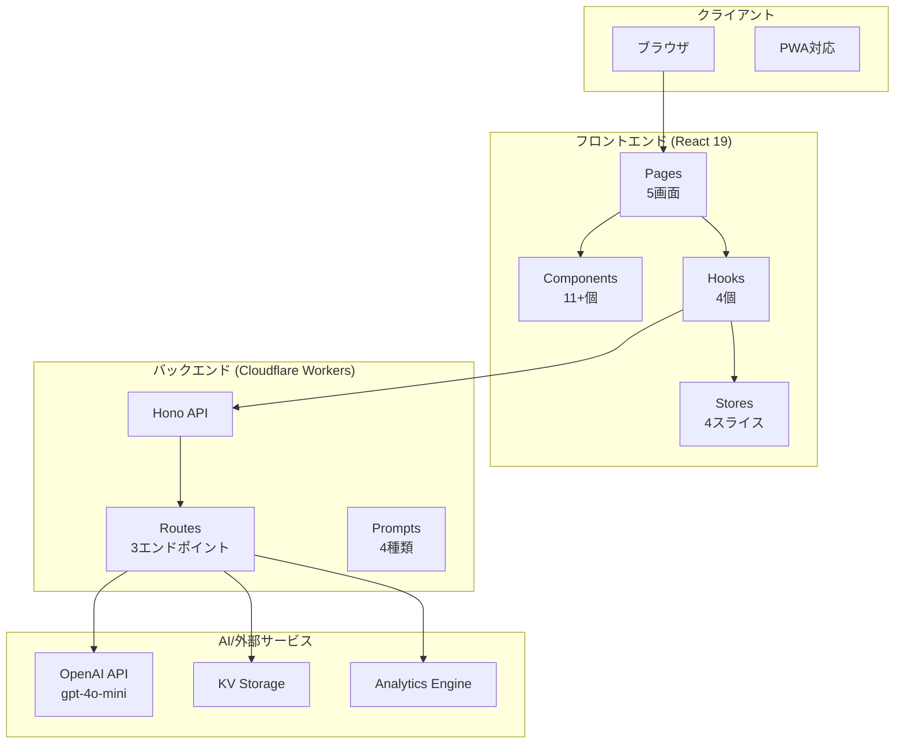

### 技術スタック一覧

| 領域 | 技術 | バージョン/説明 |
|:----|------|----------------|
| フロントエンド | **React** | 19 + TypeScript |
| ビルド | **Vite** | 高速ビルドツール |
| スタイリング | **Tailwind CSS** | ユーティリティCSS |
| UIコンポーネント | **shadcn/ui** | UIコンポーネント |
| 状態管理 | **Zustand** | 状態管理 |
| 音声 | **Web Speech API** | 音声認識/読み上げ |
| PDF | **@react-pdf/renderer** | PDF生成 |
| バックエンド | **Hono** | Cloudflare Workers |
| AI | **OpenAI** | gpt-4o-mini |
| 永続化 | **IndexedDB (Dexie)** | ローカル永続化 |

---

## ディレクトリ構造

```text
apps/v2-modern/
│
├── src/                       ← フロントエンド本体
│   ├── components/            ← UIコンポーネント (11個 + サブ)
│   │   ├── ui/                ← 共通UI (Button, Card, Input...)
│   │   ├── pdf/               ← PDF関連 (KYSheetPDF)
│   │   └── fanfare/           ← 完了演出
│   ├── hooks/                 ← カスタムフック (4個)
│   ├── pages/                 ← ページ (5個 + debug)
│   ├── stores/                ← Zustandストア
│   │   └── slices/            ← 4スライス
│   ├── lib/                   ← ユーティリティ (14ファイル)
│   ├── types/                 ← 型定義
│   └── constants/             ← 定数
│
├── workers/                   ← バックエンド (Hono API)
│   ├── routes/                ← APIルート (3個)
│   ├── prompts/               ← AIプロンプト (4個)
│   ├── lib/                   ← ユーティリティ (2個)
│   ├── middleware/            ← ミドルウェア (1個)
│   └── observability/         ← ログ・監視 (2個)
│
├── tests/                     ← テスト
│   ├── e2e/                   ← E2Eテスト (5個)
│   ├── unit/                  ← ユニットテスト (23個)
│   └── integration/           ← 統合テスト
│
├── docs/                      ← ドキュメント
│   ├── 00_overview/           ← 概要・マスター資料
│   ├── 00_planning/           ← 計画資料
│   ├── 10_planning/           ← 計画資料（旧系統）
│   ├── 20_phases/             ← フェーズ資料
│   ├── 30_design/             ← 設計
│   ├── 40_manuals/            ← マニュアル
│   └── 50_reviews/            ← レビュー
│
├── scripts/                   ← 運用スクリプト
├── reports/                   ← テストレポート
└── public/                    ← 静的ファイル
```

---

## フロントエンド（src）の詳細

### ページ遷移フロー

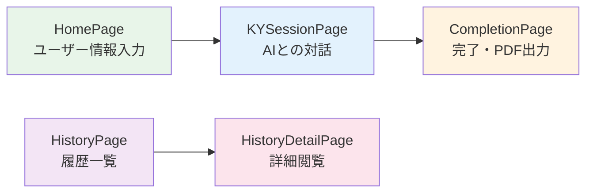

### ページ一覧

| ページ | サイズ | 機能 |
|:------|:------:|------|
| **HomePage** | 12KB | ユーザー名・現場名・天候入力 |
| **KYSessionPage** | 11KB | チャットUI・音声入力・AI対話 |
| **CompletionPage** | 19KB | 完了画面・フィードバック・PDF |
| **HistoryPage** | 6KB | 過去KY履歴一覧 |
| **HistoryDetailPage** | 10KB | 履歴詳細閲覧 |

---

### コンポーネント構成

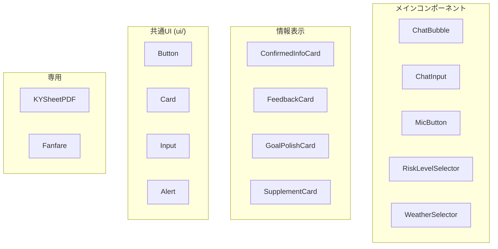

### カスタムフック

| フック | サイズ | 責務 |
|:------|:------:|------|
| **useChat** | 20KB | チャット制御・API呼び出し・エラー処理・リトライ |
| **usePDFGenerator** | 4KB | PDF生成・ダウンロード |
| **useTTS** | 5KB | 音声読み上げ制御 |
| **useVoiceRecognition** | 8KB | 音声認識制御 |

### 状態管理 (Zustand)

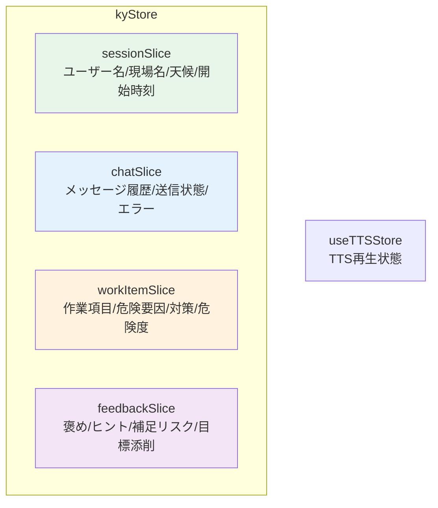

### チャット送信とリトライ制御（フロントエンド）

- **APIベースURLの解決**: `VITE_API_BASE_URL` が未指定の場合は `/api` を使用し、絶対URLの場合は末尾に `/api` を補完する。相対パスは指定値をそのまま使用する。
- **メッセージ送信の履歴制限**: クライアント側は最大12メッセージまでを送信対象とし、サーバー側では最大10往復分（20メッセージ）に制限される。
- **コンテキスト注入**: `VITE_ENABLE_CONTEXT_INJECTION` が `0` でない場合に有効。初回送信時に `buildContextInjection` で生成し、セッション単位で再利用する。
- **会話サマリ送信条件**: 直近の会話メッセージが6件以上の場合に `conversationSummary` を付与する（短い会話でのトークン増を避ける）。
- **サイレントリトライ**: `VITE_ENABLE_RETRY_SILENT=1` のときのみ有効。タイムアウト、レート制限、再試行可能なサーバーエラーで最大1回まで自動再試行する。
- **手動リトライ**: 直前メッセージの再送を許可し、エラー種別ごとに再試行可否を判断する（認証エラーは再送不可）。
- **危険度ボタンのAPI呼び出し**: 危険度（1〜5）選択時は `/api/chat` を呼ばず、ローカルで `riskLevel` と次の質問（対策入力）を反映する。

### ライブラリ (lib/)

| ファイル | 機能 |
|----------|------|
| `api.ts` | API呼び出し (postChat, postFeedback) |
| `apiBase.ts` | APIベースURL正規化 |
| `db.ts` | IndexedDB永続化 (Dexie) |
| `schema.ts` | Zodスキーマ (API応答検証) |
| `kySchemas.ts` | KYデータ構造スキーマ |
| `contextUtils.ts` | 文脈注入 |
| `historyUtils.ts` | 履歴管理 |
| `exportUtils.ts` | エクスポート |
| `validation.ts` | 抽出データ検証・作業項目完了判定 |
| `clientId.ts` | クライアントID生成 |
| `apiToken.ts` | APIトークンの保存/読込（localStorage） |
| `nonAnswer.ts` | 「なし/ありません」等の非回答判定 |
| `dateUtils.ts` | 日付ユーティリティ |
| `riskLevelVisibility.ts` | 危険度表示制御 |
| `speechRecognitionErrors.ts` | 音声認識エラー処理 |

---

## バックエンド（workers）の詳細

### API構成図

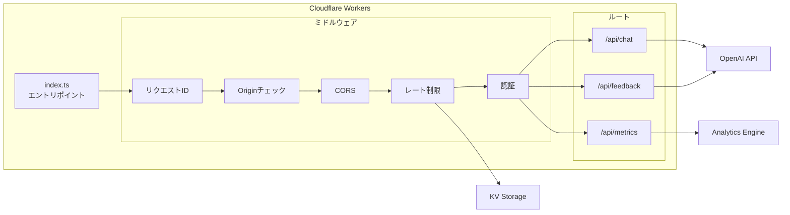

### APIエンドポイント

| ルート | サイズ | 機能 |
|:------|:------:|------|
| **chat.ts** | 32KB | AI応答 + 抽出データ返却 |
| **feedback.ts** | 13KB | KY結果フィードバック生成 |
| **metrics.ts** | 2KB | イベント記録 |

### APIガード（CORS・認証・レート制限）

| 項目 | 仕様 | 備考 |
|:--|:--|:--|
| CORS | 許可オリジンは `ALLOWED_ORIGINS` に加え、開発/本番で固定の許可一覧を適用 | `STRICT_CORS=1` の場合は https の Pages 固定URL（`*.voice-ky-*.pages.dev`）のみ許可 |
| 認証 | `Authorization: Bearer <token>` | `REQUIRE_API_TOKEN=1` か本番判定で必須化。未設定時は `AUTH_CONFIG_MISSING` を返す |
| レート制限 | 1分あたり30回（全API） | KVが無い場合はメモリフォールバック。`REQUIRE_RATE_LIMIT_KV=1` でKV必須化 |
| ヘルスチェック | `/api/health` | 認証・レート制限の必須設定不足がある場合は `degraded` を返す |

### API契約（詳細）

#### Chat API (`POST /api/chat`)

**リクエスト**

| フィールド | 型 | 必須 | 説明 |
|:--|:--|:--:|:--|
| `messages` | `{ role: "user" \| "assistant", content: string }[]` | 必須 | 会話履歴。`user` の `content` は最大1000文字、履歴合計は約1万文字まで。 |
| `sessionContext` | object | 任意 | `userName` / `siteName` / `weather` / `workItemCount` / `processPhase` / `healthCondition` を含む。 |
| `contextInjection` | string | 任意 | 追加文脈（最大1200文字）。 |
| `conversationSummary` | string | 任意 | 会話サマリ（最大1200文字）。 |

**レスポンス（成功）**

| フィールド | 型 | 説明 |
|:--|:--|:--|
| `reply` | string | 画面に表示する返答文。 |
| `extracted` | object | 抽出データ（任意、空の可能性あり）。 |
| `usage.totalTokens` | number | OpenAI利用トークン数（参考）。 |
| `meta` | object | OpenAI呼び出し回数や再試行情報（運用観測用）。 |

**レスポンス（エラー）**

| フィールド | 型 | 説明 |
|:--|:--|:--|
| `error` | string | エラーメッセージ。 |
| `code` | string | エラーコード。 |
| `requestId` | string | 追跡用ID。 |
| `retriable` | boolean | 再試行可能か。 |
| `details` | object | バリデーション失敗などの詳細（任意）。 |

**例（成功）**

```json
{
  "reply": "作業内容を教えてください。",
  "extracted": {
    "nextAction": "ask_work"
  },
  "usage": {
    "totalTokens": 321
  },
  "meta": {
    "openai": {
      "requestCount": 1,
      "httpAttempts": 1,
      "durationMs": 850
    },
    "parseRetry": {
      "attempted": false,
      "succeeded": false
    }
  }
}
```

**例（エラー）**

```json
{
  "error": "AIからの応答が不正な形式です。再試行してください。",
  "code": "AI_RESPONSE_INVALID_JSON",
  "requestId": "xxx",
  "retriable": true
}
```

**制限値と入力検証（Chat API）**

| 項目 | 制限/ルール | 目的 |
|:--|:--|:--|
| 1メッセージの最大長 | user: 1000文字 / assistant: 3000文字 | 入力の肥大化防止 |
| 会話履歴の上限 | サーバー側で最大20メッセージ（10往復） | 送信トークン抑制 |
| 合計入力文字数 | 最大10,000文字（ユーザー入力合算） | 過大入力の抑制 |
| 禁止語 | `殺す` / `死ね` / `爆弾` / `テロ` | 不適切入力の抑制 |
| コンテキスト注入 | 1200文字まで | 指示文混入リスク低減 |
| セッションコンテキスト | `userName` 80、`siteName` 120、`weather` 60 文字上限 | PII/過大入力抑制 |

**会話参照の安全化**

- 指示文に見える文字列（`system prompt` など）は `[instruction-like-text]` に置換し、参照情報として扱う。
- `conversationSummary` / `contextInjection` は参照情報として明示し、命令にしない形式で送信する。

#### Feedback API (`POST /api/feedback`)

**リクエスト**

| フィールド | 型 | 必須 | 説明 |
|:--|:--|:--:|:--|
| `sessionId` | string | 必須 | セッションID（8〜128文字）。 |
| `clientId` | string | 必須 | クライアントID（8〜128文字）。 |
| `context` | object | 任意 | `work` / `location` / `weather` / `processPhase` / `healthCondition` を含む。 |
| `extracted` | object | 任意 | `risks` / `measures` / `actionGoal` を含む。 |
| `chatDigest` | string | 任意 | 会話要約（最大1200文字）。 |

**レスポンス（成功）**

| フィールド | 型 | 説明 |
|:--|:--|:--|
| `praise` | string | 良かった点。 |
| `tip` | string | 改善のヒント。 |
| `supplements` | `{ risk: string, measure: string }[]` | 補足リスク（最大2件）。 |
| `polishedGoal` | `{ original: string, polished: string } \| null` | 行動目標の添削提案。 |
| `meta` | object | `requestId` / `cached` / `validationFallback` 等。 |

**レスポンス（エラー）**

| フィールド | 型 | 説明 |
|:--|:--|:--|
| `error.code` | string | エラーコード。 |
| `error.message` | string | エラーメッセージ。 |
| `error.retriable` | boolean | 再試行可能か。 |
| `error.requestId` | string | 追跡用ID。 |

**制限値とキャッシュ（Feedback API）**

| 項目 | 制限/ルール | 目的 |
|:--|:--|:--|
| `sessionId` / `clientId` | 8〜128文字 | IDの妥当性担保 |
| `context.work` / `context.location` | 200文字まで | 過大入力抑制 |
| `context.weather` | 100文字まで | 画面入力の過大化防止 |
| `extracted.risks` / `measures` | 20件まで、各120文字 | リスト過大化防止 |
| `extracted.actionGoal` | 120文字まで | 行動目標の短文化 |
| キャッシュTTL | 5分 | 同一セッションの再利用 |
| セッション保存TTL | 24時間 | 再送時の安全性確保 |

**フィードバックの検証とフィルタ**

- OpenAI応答が不正な場合はフォールバック文面を返し、セッションを維持する。
- 補足リスクは既存の `risks` / `measures` と重複する内容を除外し、最大2件に制限する。
- 行動目標の添削は「20文字以内」「ヨシを含む」「原文と異なる」場合のみ採用する。

#### Metrics API (`POST /api/metrics`)

**リクエスト**

| フィールド | 型 | 必須 | 説明 |
|:--|:--|:--:|:--|
| `event` | string | 必須 | `session_start` / `session_complete` / `input_length` / `web_vital` / `chat_error` / `retry_clicked` / `retry_waiting` / `retry_succeeded` / `retry_failed` |
| `timestamp` | string | 任意 | ISO 8601。未指定ならサーバー側で付与。 |
| `sessionId` | string | 任意 | セッションID。 |
| `value` | number | 任意 | 数値指標。 |
| `data` | object | 任意 | 追加情報（文字列/数値/真偽/nullのみ）。 |

**レスポンス**

```json
{ "ok": true }
```

### AIプロンプト

| プロンプト | サイズ | 用途 |
|:----------|:------:|------|
| **soloKY.ts** | 8KB | ソロKYセッション用 |
| **feedbackKY.ts** | 2KB | フィードバック生成用 |
| **supplementKY.ts** | 0.4KB | 追加リスク補足用 |
| **polishGoal.ts** | 0.4KB | 行動目標ブラッシュアップ用 |

### エラーコード

| コード | ステータス | 説明 |
|:------|:----------:|------|
| `AI_RESPONSE_INVALID_JSON` | 502 | JSONパース失敗 |
| `AI_RESPONSE_INVALID_SCHEMA` | 502 | スキーマ検証失敗 |
| `AI_UPSTREAM_ERROR` | 429/5xx | OpenAI側エラー |
| `AI_TIMEOUT` | 504 | OpenAI応答タイムアウト |
| `BANNED_WORD` | 400 | 禁止語が含まれる |
| `INPUT_TOO_LARGE` | 400 | メッセージ総量が上限超過 |
| `VALIDATION_ERROR` | 400 | リクエストスキーマ不一致 |
| `AUTH_REQUIRED` | 401 | 認証トークン未指定 |
| `AUTH_INVALID` | 401 | 認証トークン不一致 |
| `AUTH_CONFIG_MISSING` | 503 | 認証設定不足（本番要件に未達） |
| `OPENAI_KEY_MISSING` | 500 | OpenAI APIキー未設定 |
| `OPENAI_AUTH_ERROR` | 502 | OpenAI側の認証失敗 |
| `OPENAI_BAD_REQUEST` | 502 | OpenAIへのリクエスト不正 |
| `OPENAI_UPSTREAM_ERROR` | 502 | OpenAI上流エラー（非特定） |
| `CHAT_PROCESSING_ERROR` | 500 | チャット処理中の予期しない例外 |
| `INVALID_REQUEST` | 400 | フィードバックAPIの入力不正 |
| `TIMEOUT` | 408 | フィードバックAPIのタイムアウト |
| `INTERNAL_ERROR` | 500 | フィードバックAPIの内部エラー |

---

## テスト（tests）の詳細

### テストカバレッジ

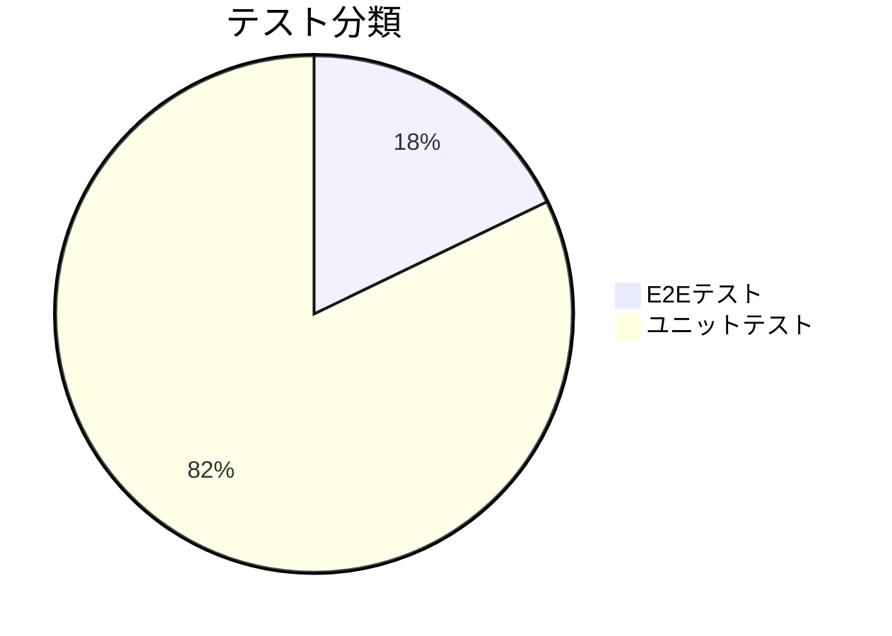

### E2Eテスト (5件)

| テスト | 内容 |
|:------|------|
| **real-cost-scenario** | 実費テスト（本番API使用） |
| **ky-session-e2e** | KYセッションフルフロー |
| **live-ai-chat** | AIチャット機能 |
| **ios_compatibility** | iOS互換性 |
| **pdf-visual** | PDFビジュアル確認 |

### ユニットテスト (23件)

| 分類 | テストファイル |
|:----|---------------|
| API | api.chatError, api.feedbackError, apiBase |
| ストア | kyStore |
| コンポーネント | completionPage, micButton.errorClear |
| フック | useChat.retry, useChat.shortcuts |
| ユーティリティ | historyUtils, contextInjection, riskLevelVisibility, speechRecognitionErrors |
| バックエンド | rateLimit, openaiHttpError, logger, securityMode, metrics |
| スキーマ | schema, kySchemas.extracted, kySchemas.workItem, validation.nonAnswer |

---

## 主要なデータフロー

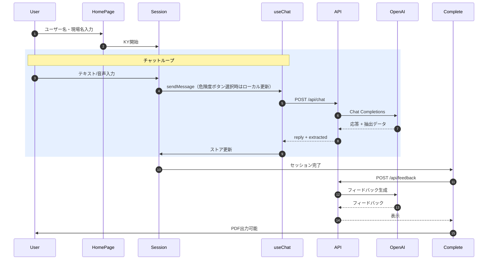

---

## KYデータモデル（ドメイン定義）

### 抽出データ（AIが返す要素）

| フィールド | 型 | 説明 |
|:--|:--|:--|
| `workDescription` | string | 作業内容。 |
| `hazardDescription` | string | 危険内容。 |
| `riskLevel` | 1〜5 | 危険度。 |
| `whyDangerous` | string[] | 危険の理由。 |
| `countermeasures` | `{ category: "ppe" \| "behavior" \| "equipment", text: string }[]` | 対策。 |
| `actionGoal` | string | 行動目標。 |
| `nextAction` | `"ask_work" \| "ask_hazard" \| "ask_why" \| "ask_countermeasure" \| "ask_risk_level" \| "ask_more_work" \| "ask_goal" \| "confirm" \| "completed"` | 次に尋ねる内容。 |

### 作業項目（WorkItem）

| フィールド | 型 | 説明 |
|:--|:--|:--|
| `id` | string (uuid) | 作業項目ID。 |
| `workDescription` | string | 作業内容。 |
| `hazardDescription` | string | 危険内容。 |
| `riskLevel` | 1〜5 | 危険度。 |
| `whyDangerous` | string[] | 危険の理由。 |
| `countermeasures` | Countermeasure[] | 対策一覧。 |

### セッション（SoloKYSession）

| フィールド | 型 | 説明 |
|:--|:--|:--|
| `id` | string (uuid) | セッションID。 |
| `userName` / `siteName` / `weather` | string | 基本情報。 |
| `temperature` | number \| null | 気温。 |
| `processPhase` | string \| null | 作業工程。 |
| `healthCondition` | string \| null | 体調。 |
| `workStartTime` / `workEndTime` | string (ISO 8601) | 作業開始/終了時刻。 |
| `createdAt` | string (ISO 8601) | セッション作成日時。 |
| `environmentRisk` | string \| null | 環境リスク。 |
| `workItems` | WorkItem[] | 作業項目一覧。 |
| `actionGoal` | string \| null | 行動目標。 |
| `pointingConfirmed` | boolean \| null | 指差し確認。 |
| `allMeasuresImplemented` | boolean \| null | 対策実施確認。 |
| `hadNearMiss` | boolean \| null | ヒヤリハット。 |
| `nearMissNote` | string \| null | ヒヤリハット備考。 |
| `completedAt` | string (ISO 8601) \| null | 完了日時。 |

---

## エラーハンドリング

### Chat APIエラー

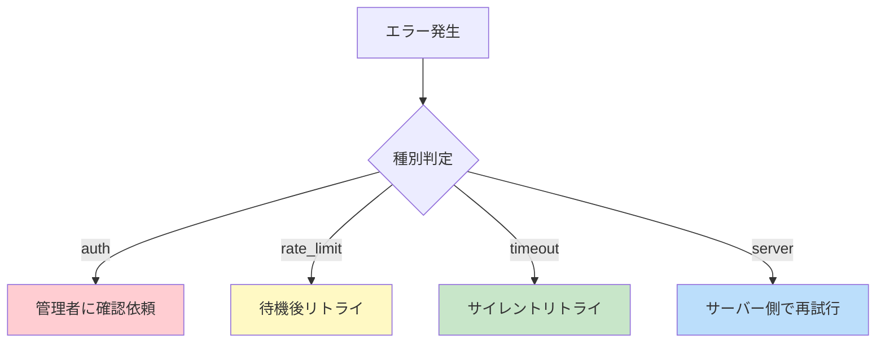

### 音声機能エラー

| エラー | 原因 | 対策 |
|:------|------|------|
| `not-allowed` | マイク権限拒否 | テキスト入力に誘導 |
| `audio-capture` | 音声取得失敗 | テキスト入力に誘導 |
| `end timeout` | onend未発火 | フォールバックタイムアウト |

### Chat APIの主な原因と対策（詳細）

| 区分 | 主な原因 | 対策 |
|:--|:--|:--|
| 入力検証 | 禁止語、文字数超過、スキーマ不一致 | 入力内容の明示エラー表示、文字数制限ガイド、バリデーション修正。 |
| 認証 | トークン未設定/不一致、設定不足 | `Authorization: Bearer <token>` を確認し、本番では `API_TOKEN` と `REQUIRE_API_TOKEN` を有効化。 |
| CORS | オリジンが許可リスト外 | `ALLOWED_ORIGINS` を更新し、`STRICT_CORS` の設定を確認。 |
| レート制限 | 1分あたり30回を超過 | `Retry-After` に従い待機して再試行。 |
| OpenAI応答 | JSON破損、スキーマ不一致 | `json_schema(strict)` で構造を固定し、失敗時は `AI_RESPONSE_INVALID_JSON` / `AI_RESPONSE_INVALID_SCHEMA` を返して再送案内。 |
| OpenAI設定 | APIキー未設定、認証失敗 | `OPENAI_API_KEY` の設定と権限を確認。 |
| 通信・タイムアウト | ネットワーク障害、上流タイムアウト | 通信状態を案内し、再試行（必要なら待機）を促す。 |
| サーバー内部 | 予期しない例外 | 監視ログと `requestId` を用いて原因追跡、再現条件を特定。 |

### Feedback APIの主な原因と対策（詳細）

| 区分 | 主な原因 | 対策 |
|:--|:--|:--|
| 入力検証 | スキーマ不一致 | クライアントの送信データを確認し修正。 |
| キャッシュ/保存 | KVのJSONパース失敗 | キャッシュを無効化し再作成、KVデータの破損有無を確認。 |
| OpenAI応答 | JSONパース/スキーマ失敗 | フォールバック応答を返し、時間をおいて再試行。 |
| タイムアウト | OpenAIの応答遅延 | タイムアウトを調整し、再試行の案内を追加。 |
| 機能停止 | `ENABLE_FEEDBACK=0` | 204が返るため、運用上の停止フラグを確認。 |
| サーバー内部 | 予期しない例外 | エラーログを確認し、`requestId` で追跡。 |

---

## セキュリティと運用

### 環境変数

| 変数名 | 必須 | 説明 |
|:------|:----:|------|
| `OPENAI_API_KEY` | 必須 | OpenAI APIキー |
| `API_TOKEN` | 本番 | API認証トークン |
| `REQUIRE_API_TOKEN` | - | 1で常時必須化 |
| `STRICT_CORS` | - | 1で厳格CORS |
| `REQUIRE_RATE_LIMIT_KV` | - | 1でKV必須化 |
| `ALLOWED_ORIGINS` | - | 許可オリジンの追加（カンマ区切り） |
| `OPENAI_TIMEOUT_MS` | - | Chat APIのタイムアウト（1,000〜120,000ms） |
| `OPENAI_RETRY_COUNT` | - | OpenAI HTTP再試行回数（0〜2、既定1） |
| `ENABLE_CONTEXT_INJECTION` | - | 0でコンテキスト注入を無効化 |
| `ENABLE_FEEDBACK` | - | 0でFeedback APIを無効化（204を返す） |
| `RATE_LIMIT_KV` | 本番 | レート制限用KVバインディング |
| `FEEDBACK_KV` | 推奨 | フィードバックキャッシュ/保存用KV |
| `ANALYTICS_DATASET` | 推奨 | Analytics Engine バインディング |
| `SENTRY_DSN` | 推奨 | Sentry DSN |
| `SENTRY_ENV` | 推奨 | Sentry環境名（production/prod 等） |
| `SENTRY_RELEASE` | 推奨 | リリース識別子 |
| `ENVIRONMENT` | 推奨 | 実行環境（production/prod 等） |

### フロントエンド環境変数

| 変数名 | 必須 | 説明 |
|:------|:----:|------|
| `VITE_API_BASE_URL` | - | APIベースURL（未指定時は `/api`） |
| `VITE_API_TOKEN` | - | 実費テスト/事前チェック用途（ブラウザ常用は非推奨） |
| `VITE_REQUIRE_API_TOKEN` | - | 1でクライアント側も認証必須扱い |
| `VITE_ENABLE_CONTEXT_INJECTION` | - | 0でコンテキスト注入を無効化 |
| `VITE_ENABLE_RETRY_SILENT` | - | 1でサイレントリトライを有効化（未指定時は無効） |
| `VITE_TELEMETRY_ENABLED` | - | 0でテレメトリ送信を停止 |
| `VITE_TELEMETRY_SAMPLE_RATE` | - | 0〜1でサンプリング率を指定 |
| `VITE_TELEMETRY_ENDPOINT` | - | 計測送信先を上書き |
| `VITE_WAIT_NOTICE_AFTER_MS` | - | 応答待機メッセージ表示までの時間（ms、既定15,000） |

### 認証・レート制限の運用詳細

| 項目 | 内容 |
|:--|:--|
| 認証方式 | `Authorization: Bearer <token>`。サーバー側 `API_TOKEN` と一致させる。 |
| 認証必須条件 | `REQUIRE_API_TOKEN=1` もしくは本番環境判定で必須化。 |
| レート制限 | 1分あたり30回（全API）。 |
| `Retry-After` | 429時に秒数を返却。クライアントは待機後に再試行。 |
| 代替ストア | KVが無い場合はメモリフォールバック（開発用途）。 |
| KV必須 | `REQUIRE_RATE_LIMIT_KV=1` もしくは本番環境判定で必須化。 |

### 運用コマンド一覧

```bash
# 開発サーバー起動
npm run dev:all

# ビルド
npm run build

# デプロイ
npm run deploy:workers
npm run deploy:pages

# セキュリティ運用
npm run security:ops

# 実費テスト
npm run test:cost:ops

# レポート整理
npm run reports:prune
```

---

## 永続化と監視

### データ永続化

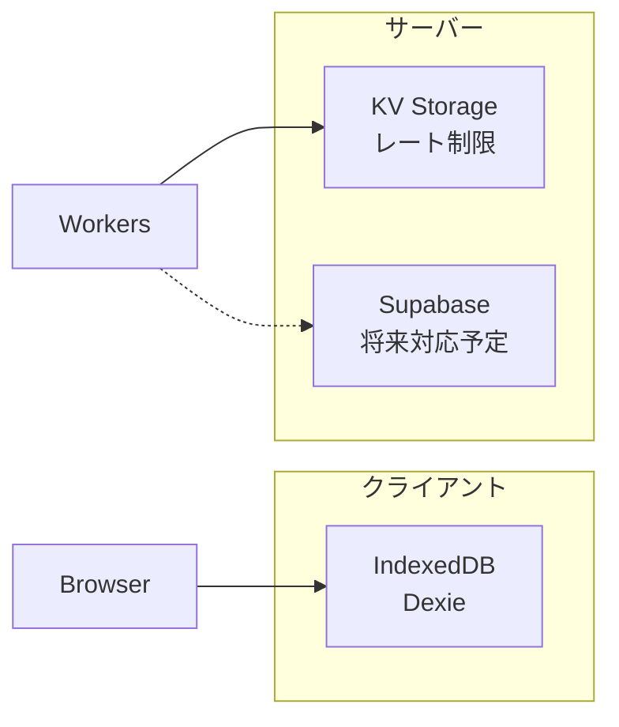

### 観測・監視

| 層 | ツール |
|:--|--------|
| **フロントエンド** | Sentry + Web Vitals + telemetry |
| **バックエンド** | 構造化ログ + Sentry + Analytics Engine |

### ログとメトリクスの設計詳細

| 項目 | 内容 |
|:--|:--|
| 構造化ログ | `timestamp` / `level` / `service` / `message` / `reqId` / `status` / `latencyMs` を基本に出力。 |
| 機密情報マスク | `authorization` / `api_key` / `password` などは `[redacted]` に置換。メール・電話番号・長い番号もマスク。 |
| マスク対象の具体例 | `sk-` で始まるキー、`Bearer <token>`、メールアドレス、電話番号、7桁以上の連番を検出して置換。 |
| 例外的に許可 | `tokenFingerprint` は短い非可逆ハッシュとしてログ出力を許可。 |
| 代表的な計測 | API応答時間、再試行回数、`chat_error` や `retry_*` の件数。 |
| 監視の対策 | 失敗率上昇時はレート制限/上流障害を疑い、`requestId` で追跡する。 |

---

## 設定値と上限

### Chat API（サーバー側）

| 項目 | 値 | 備考 |
|:--|:--|:--|
| 最大履歴 | 10往復（20メッセージ） | サーバー側で履歴を制限 |
| 合計入力上限 | 10,000文字 | ユーザー入力の合算 |
| 禁止語 | `殺す` / `死ね` / `爆弾` / `テロ` | 入力時に即時エラー |
| OpenAIモデル | `gpt-4o-mini` | `json_schema(strict)` で構造化出力 |
| 最大トークン | 700 | Chat応答の上限 |
| 温度 | 0.3 | 安定応答優先 |
| タイムアウト | 25,000ms（未指定時） | `OPENAI_TIMEOUT_MS` で上書き可能 |
| HTTP再試行回数 | 1回（既定） | `OPENAI_RETRY_COUNT`（0〜2）で上書き可能 |

### Chat API（クライアント側）

| 項目 | 値 | 備考 |
|:--|:--|:--|
| 送信履歴上限 | 12メッセージ | 直近のメッセージのみ送信 |
| サマリ送信 | 6件以上で付与 | 会話が短いときは省略 |

### Feedback API

| 項目 | 値 | 備考 |
|:--|:--|:--|
| OpenAIモデル | `gpt-4o-mini` | JSON出力指定 |
| 最大トークン | 400 | フィードバック出力上限 |
| 温度 | 0.6 | 表現の揺れを許容 |
| タイムアウト | 6,000ms | 固定 |
| キャッシュTTL | 5分 | `feedback-cache:<sessionId>` |
| セッション保存TTL | 24時間 | `feedback-session:<sessionId>` |
| 行動目標添削 | 20文字以内 + 「ヨシ」含有 | 同一文は無効化 |

### レート制限

| 項目 | 値 | 備考 |
|:--|:--|:--|
| 制限 | 1分あたり30回 | 全API共通 |
| 返却ヘッダ | `X-RateLimit-Limit` / `X-RateLimit-Remaining` | 利用状況を可視化 |

---

## 性能と再試行ポリシー

### OpenAI呼び出しの再試行

- **HTTP 5xx / 429**: 既定1回まで再試行（指数バックオフ + ジッター、`OPENAI_RETRY_COUNT` で0〜2を指定）。
- **ネットワーク/タイムアウト**: 同様に既定1回まで再試行。
- **Retry-After**: 上流が返す場合は尊重し、チャットAPIは `Retry-After` を付与する。

### Chat APIのリカバリ戦略

- **JSONパース失敗**: 追加のJSON修復/再生成は行わず、`AI_RESPONSE_INVALID_JSON` を返す（`json_schema(strict)` 前提）。
- **スキーマ不一致**: `AI_RESPONSE_INVALID_SCHEMA` を返し、短い待機で再送を促す。
- **タイムアウト**: `AI_TIMEOUT` を返し、`Retry-After: 2` を付与する。
- **実行ポリシー可観測化**: 成功/JSON不正/Schema不正レスポンスには `meta.server` を付与し、デプロイ反映を機械判定できるようにする。
  - `policyVersion`: `2026-02-11-a-b-observability-1`
  - `responseFormat`: `json_schema_strict`
  - `parseRecoveryEnabled`: `false`
  - `openaiRetryCount`: 実行時 `OPENAI_RETRY_COUNT` の解決値

### フロントエンドのリトライ制御

- **サイレントリトライ**: `VITE_ENABLE_RETRY_SILENT=1` のときのみ有効。タイムアウト/レート制限/再試行可能なサーバーエラーで最大1回。
- **待機時間**: `Retry-After` を優先し、上限10秒で待機。ジッターを加えて同時再送を抑制。
- **手動リトライ**: 認証エラー以外では再送可能とし、失敗時はエラーを表示する。

### Feedback APIの例外対応

- **OpenAI上流エラー**: 失敗時はフォールバック文面を返す（UX優先）。
- **タイムアウト**: `TIMEOUT` を返し、再送可能とする。

---

## 対応環境と制約

| 項目 | 内容 | 補足 |
|:--|:--|:--|
| 音声入力 | Web Speech API が必要 | 非対応環境ではテキスト入力へ誘導 |
| PDF出力 | `@react-pdf/renderer` に依存 | 印刷用途ではプレビュー確認が必要 |
| iOS互換性 | E2Eで検証対象 | `ios_compatibility` テストで確認 |
| オリジン制限 | CORSで拒否される場合がある | `ALLOWED_ORIGINS` と `STRICT_CORS` に依存 |
| 認証必須化 | 本番または `REQUIRE_API_TOKEN=1` で有効 | 未設定時は `AUTH_CONFIG_MISSING` |

---

## 運用手順書（障害対応）

1. **ヘルスチェック**
   - `/api/health` を確認し、`degraded` の場合は `issues` を確認する。
2. **認証エラー**
   - `AUTH_REQUIRED` / `AUTH_INVALID` が出る場合は `API_TOKEN` と `Authorization` を一致させる。
   - `AUTH_CONFIG_MISSING` の場合は `REQUIRE_API_TOKEN` と `API_TOKEN` の整合性を確認する。
3. **オリジン拒否（CORS）**
   - 403 が出る場合は `ALLOWED_ORIGINS` と `STRICT_CORS` を確認し、想定URLを許可する。
4. **レート制限**
   - 429 が多発する場合は `Retry-After` に従い待機し、必要なら上限値と送信頻度を見直す。
   - `RATE_LIMIT_KV_REQUIRED` の場合は KV バインディング設定を確認する。
5. **OpenAI設定**
   - `OPENAI_KEY_MISSING` は `OPENAI_API_KEY` の未設定が原因。環境変数を補う。
   - `OPENAI_AUTH_ERROR` / `OPENAI_BAD_REQUEST` はキーやモデル設定、入力内容を確認する。
6. **デプロイ反映確認（A/B）**
   - `npm run test:cost:preflight` で `chat meta.server` 検証を通す（`policyVersion` / `responseFormat` / `parseRecoveryEnabled` / `openaiRetryCount`）。
   - 不一致時は Pages の配信バンドルと Workers のデプロイ先不整合を優先確認する。
7. **ログと追跡**
   - `x-request-id` をキーにログや Sentry を追跡し、再現条件と失敗点を特定する。
8. **フィードバックの異常**
   - `ENABLE_FEEDBACK=0` の場合は 204 が返るため、機能停止状態を確認する。
   - 連続失敗時はフォールバック応答が返るため、上流障害を疑う。

---

## テレメトリと計測イベント

### 送信イベント一覧

- `session_start` / `session_complete`
- `input_length`
- `web_vital`
- `chat_error`
- `retry_clicked` / `retry_waiting` / `retry_succeeded` / `retry_failed`

### 送信方式

- **認証トークンが無い場合**: `sendBeacon` を使用して非同期送信する。
- **認証トークンがある場合**: `fetch` で `Authorization: Bearer` を付与して送信する。
- **送信先**: `VITE_TELEMETRY_ENDPOINT` を優先し、未指定時は `/api/metrics` に送信する。
- **サンプリング**: `VITE_TELEMETRY_SAMPLE_RATE` で 0〜1 の範囲で制御する。

---

## 統計サマリ

| カテゴリ | 数量 |
|:--------|:----:|
| ページ | 5 + debug |
| コンポーネント | 11 + サブ |
| カスタムフック | 4 |
| ストアスライス | 4 |
| APIルート | 3 |
| AIプロンプト | 4 |
| E2Eテスト | 5 |
| ユニットテスト | 16 |

---

## まとめ

v2は **フロントエンドのチャット体験・音声機能・PDF出力** と **バックエンドのAPI/エラー処理/セキュリティ** が一体化した構成です。

- **21件のテスト** で品質担保
- **4カテゴリのドキュメント** で知識管理
- **多層セキュリティ** で本番運用対応
- **音声/テキスト両対応** で現場での使いやすさを実現

---

## 拡張セクション

以下は本リファレンスの追加詳細情報です。

---

## セッション状態遷移図

### フェーズ遷移（4R法に基づく）

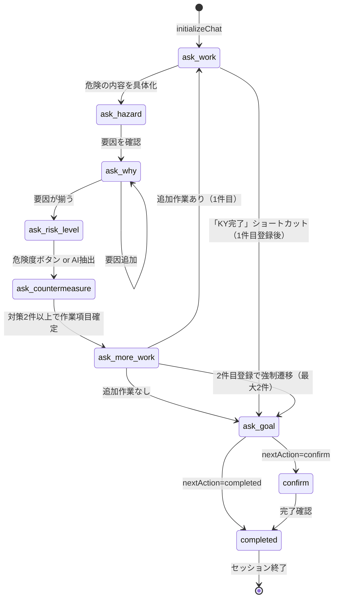

### ストア状態遷移（kyStore）

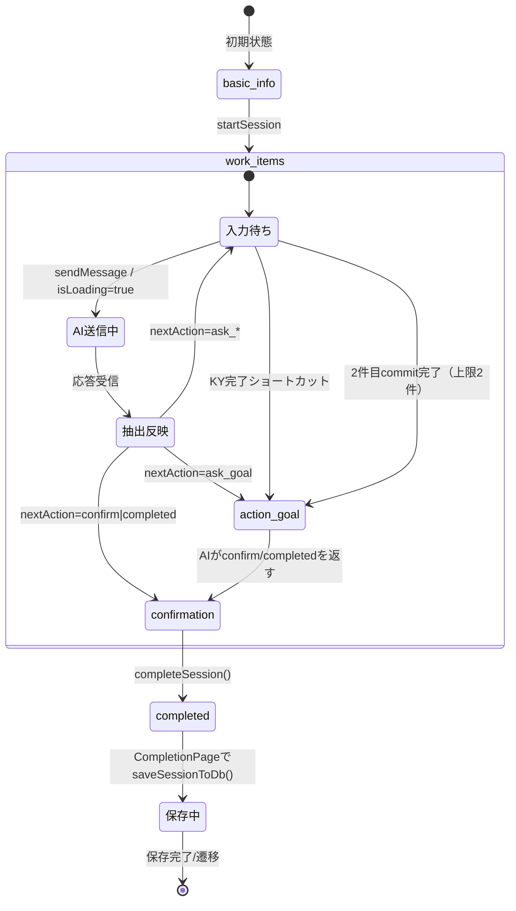

---

## エラー復旧フロー図

### Chat APIエラー時の復旧手順

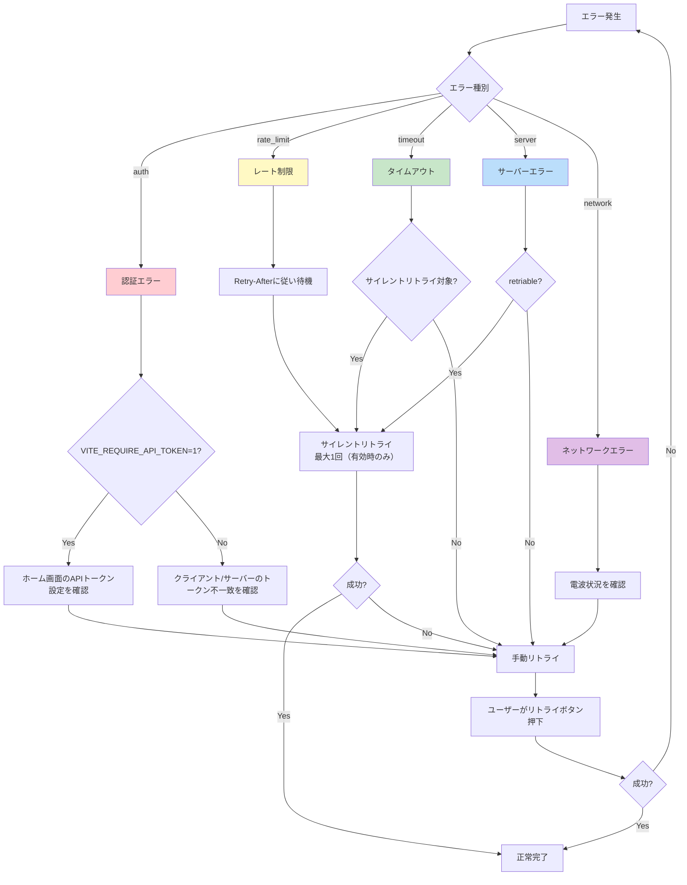

### フィードバックAPIエラー時の復旧手順

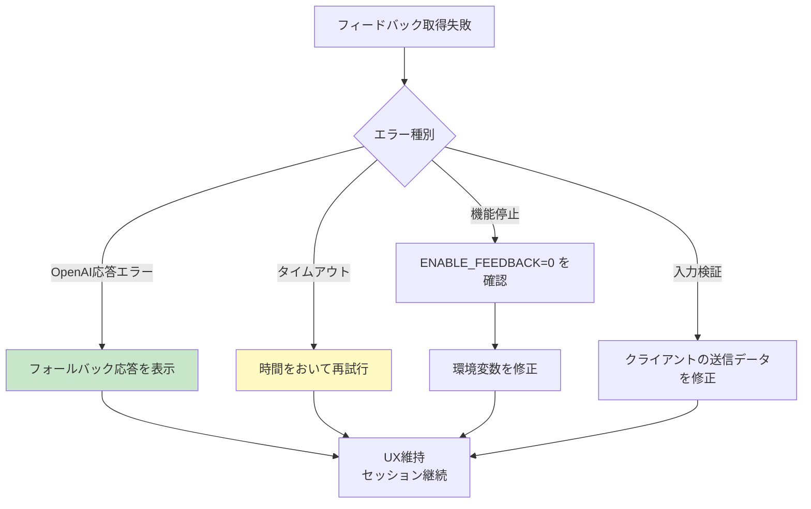

---

## Zodスキーマ型定義サンプル

### ChatRequestSchema

```typescript
// src/lib/schema.ts より抜粋

import { z } from 'zod'

// メッセージの最大長
export const USER_CONTENT_MAX_LENGTH = 1000
const ASSISTANT_CONTENT_MAX_LENGTH = 3000

// チャットメッセージスキーマ
export const ChatMessageSchema = z.discriminatedUnion('role', [
    z.object({
        role: z.literal('user'),
        content: z.string().max(USER_CONTENT_MAX_LENGTH),
    }),
    z.object({
        role: z.literal('assistant'),
        content: z.string().max(ASSISTANT_CONTENT_MAX_LENGTH),
    }),
])

// セッションコンテキストスキーマ
export const SessionContextSchema = z.object({
    userName: z.string().max(80),
    siteName: z.string().max(120),
    weather: z.string().max(60),
    workItemCount: z.number().int().min(0).max(1000),
    processPhase: z.string().max(80).optional(),
    healthCondition: z.string().max(80).optional(),
})

// チャットリクエストスキーマ
export const ChatRequestSchema = z.object({
    messages: z.array(ChatMessageSchema).min(1),
    sessionContext: SessionContextSchema.optional(),
    contextInjection: z.string().max(1200).optional(),
    conversationSummary: z.string().max(1200).optional(),
})
```

### ExtractedDataSchema（AI抽出データ）

```typescript
// src/lib/kySchemas.ts より抜粋

// 対策カテゴリ
export const CountermeasureCategorySchema = z.enum(['ppe', 'behavior', 'equipment'])

// 対策スキーマ
export const CountermeasureSchema = z.object({
    category: CountermeasureCategorySchema,  // ppe=保護具, behavior=行動, equipment=設備
    text: z.string().min(1),
})

// AI抽出データスキーマ
export const ExtractedDataSchema = z.object({
    workDescription: z.string().nullable().optional(),      // 作業内容
    hazardDescription: z.string().nullable().optional(),    // 危険内容
    riskLevel: z.union([z.literal(1), z.literal(2), z.literal(3), z.literal(4), z.literal(5)]).optional(),
    whyDangerous: z.array(z.string()).optional(),           // 危険の要因
    countermeasures: z.array(CountermeasureSchema).optional(),
    actionGoal: z.string().nullable().optional(),           // 行動目標
    nextAction: z.enum([
        'ask_work',           // 作業を聞く
        'ask_hazard',         // 危険を聞く
        'ask_why',            // 要因を聞く
        'ask_countermeasure', // 対策を聞く
        'ask_risk_level',     // 危険度を聞く
        'ask_more_work',      // 追加作業を確認
        'ask_goal',           // 行動目標を聞く
        'confirm',            // 最終確認
        'completed',          // 完了
    ]).optional(),
})
```

### FeedbackResponseSchema

```typescript
// src/lib/schema.ts より抜粋

export const FeedbackResponseSchema = z.object({
    praise: z.string().min(1).max(240),         // 良かった点
    tip: z.string().min(1).max(240),            // 改善ヒント
    supplements: z.array(z.object({
        risk: z.string().min(1).max(120),       // 補足リスク
        measure: z.string().min(1).max(120),    // 対策
    })).max(2),                                  // 最大2件
    polishedGoal: z.object({
        original: z.string().min(1).max(120),   // 元の目標
        polished: z.string().min(1).max(120),   // 整えた目標
    }).nullable(),
    meta: z.object({
        requestId: z.string().optional(),
        cached: z.boolean().optional(),
        validationFallback: z.boolean().optional(),
    }).optional(),
})
```

---

## トラブルシューティングFAQ

### 1. 「認証エラーです」と表示される

| 原因 | 対処法 |
|:--|:--|
| ホーム画面のAPIトークン未設定 | ホーム画面の「APIトークン設定」で保存し、再試行 |
| サーバー側 `API_TOKEN` と不一致 | 両方のトークンが同一か確認 |
| `REQUIRE_API_TOKEN=1` だがトークン未設定 | サーバー側 `API_TOKEN` を設定 |

### 2. 「混雑中です」と表示される（429エラー）

| 原因 | 対処法 |
|:--|:--|
| 1分間に30回以上のリクエスト | `Retry-After` に従い待機後に再送 |
| 連続送信 | 自動リトライ（最大1回・有効時のみ）を待つ |

### 3. AI応答が返ってこない（タイムアウト）

| 原因 | 対処法 |
|:--|:--|
| OpenAI側の遅延 | サイレントリトライ有効時は1回だけ自動再送。既定は手動リトライ |
| ネットワーク不安定 | 電波状況を確認し、手動リトライ |
| `OPENAI_TIMEOUT_MS` が短すぎる | 25000ms以上に設定 |

### 4. 音声入力ができない

| 原因 | 対処法 |
|:--|:--|
| マイク権限が拒否されている | ブラウザ設定でマイク許可を付与 |
| Web Speech API非対応ブラウザ | Chrome/Safariを使用 |
| HTTPS環境でない | `localhost` または `https://` でアクセス |

### 5. PDF出力が崩れる

| 原因 | 対処法 |
|:--|:--|
| 日本語フォント未読み込み | ページ読み込み後に再試行 |
| 長い文字列 | 自動折り返しを確認 |

### 6. ローカル開発でCORSエラー

| 原因 | 対処法 |
|:--|:--|
| オリジンが許可されていない | `ALLOWED_ORIGINS` に `http://localhost:5173` を追加 |
| `STRICT_CORS=1` が有効 | 開発時は `STRICT_CORS=0` に設定 |

### 7. フィードバックが表示されない

| 原因 | 対処法 |
|:--|:--|
| `ENABLE_FEEDBACK=0` | 環境変数を削除または `1` に設定 |
| OpenAI応答がフォールバック | 時間をおいて再試行 |

### 8. 履歴が保存されない

| 原因 | 対処法 |
|:--|:--|
| IndexedDB無効 | ブラウザのプライベートモードを解除 |
| ストレージ容量不足 | 古い履歴を削除 |

---

## コンポーネント依存関係図

### ページとフック/ストアの依存関係

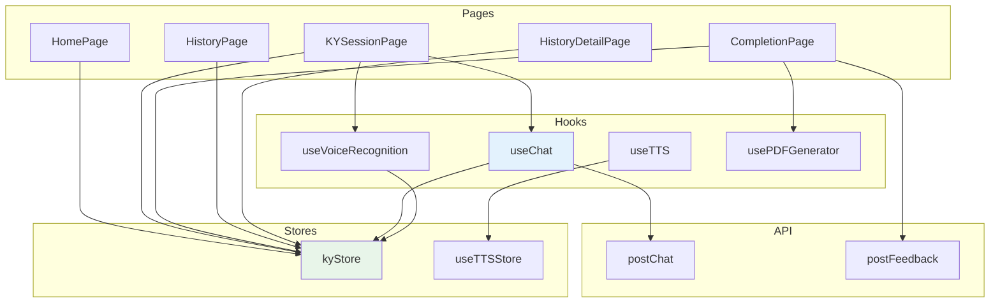

### コンポーネント階層

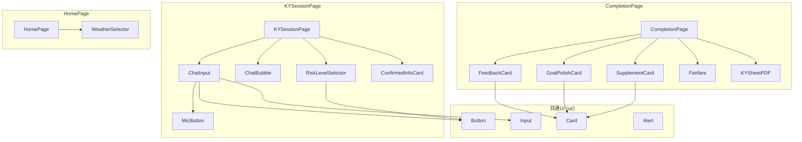

### ストアスライス構成

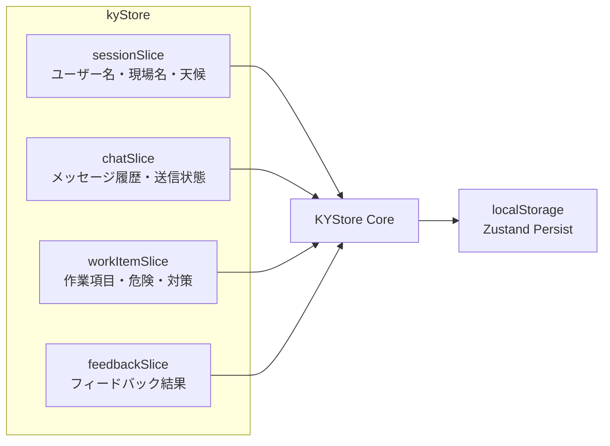

---

## プロンプト設計詳細

### soloKY.ts（一人KYセッション用）

| 項目 | 内容 |
|:--|:--|
| **ファイルサイズ** | 約8KB（120行） |
| **役割** | 作業者との対話を通じて危険因子を洗い出し、対策を決定するAIアシスタント |
| **対話フロー** | 4R法（4ラウンド法）に準拠 |

**フェーズ構成**:

| フェーズ | 目的 | nextAction |
|:--|:--|:--|
| 1. 現状把握 | 今日の作業内容を確認 | `ask_work` |
| 2. 本質追究 | 危険・要因・危険度を確認 | `ask_hazard` → `ask_why` → `ask_risk_level` |
| 3. 対策樹立 | 具体的な対策を決定 | `ask_countermeasure` |
| 4. 行動目標 | 今日の行動目標を設定 | `ask_more_work` → `ask_goal` → `confirm` → `completed` |

**テンプレートローテーション**:

| workItemCount | 質問の切り口 |
|:--|:--|
| 0（1つ目） | 標準の質問（「考えられる危険を教えてください」） |
| 1（2つ目） | 道具・環境視点（「使う道具や作業環境で考えられる危険は？」） |
| 2以上（3つ目以降） | 潜在リスク視点（「いつも通りで見過ごしているリスクは？」） |

**出力形式（JSON）**:

```json
{
  "reply": "ユーザーへの応答テキスト",
  "extracted": {
    "nextAction": "ask_work",
    "workDescription": "作業内容（判明時のみ）",
    "hazardDescription": "危険内容（判明時のみ）",
    "whyDangerous": ["危険因子"],
    "countermeasures": [
      { "category": "ppe", "text": "対策内容" }
    ],
    "riskLevel": 3,
    "actionGoal": "行動目標"
  }
}
```

---

### feedbackKY.ts（フィードバック生成用）

| 項目 | 内容 |
|:--|:--|
| **ファイルサイズ** | 約2KB（36行） |
| **役割** | KYセッション完了後のフィードバック（称賛・改善ヒント・補足リスク）を生成 |
| **トーン** | サンドイッチ法（Positive → Negative → Positive） |

**入力情報**:

- `context`: 作業場所・天候・工程・体調
- `extracted`: 特定されたリスク・対策・行動目標
- `chatDigest`: 会話の要約

**出力形式（JSON）**:

```json
{
  "praise": "良かった点の具体的コメント",
  "tip": "次回へのヒント（1つ。励ましで締める）",
  "supplements": [
    { "risk": "補足リスク", "measure": "簡潔な対策" }
  ],
  "polishedGoal": {
    "original": "元の目標",
    "polished": "ゼロ災で行こう、ヨシ！"
  }
}
```

**ルール**:

- 補足リスクは最大2件、ユーザーが挙げていない危険のみ
- 行動目標の添削は20文字程度、「ヨシ」を含める

---

## 環境別設定ガイド

### 開発環境（Development）

```bash
# .env.local
VITE_API_BASE_URL=/api
VITE_ENABLE_CONTEXT_INJECTION=1
VITE_ENABLE_RETRY_SILENT=0
VITE_TELEMETRY_ENABLED=0

# wrangler.toml (dev)
[vars]
OPENAI_API_KEY = "sk-..."
REQUIRE_API_TOKEN = "0"
STRICT_CORS = "0"
REQUIRE_RATE_LIMIT_KV = "0"
ENABLE_FEEDBACK = "1"
```

**特徴**:

- 認証不要（`REQUIRE_API_TOKEN=0`）
- CORS緩和（`STRICT_CORS=0`）
- レート制限はメモリフォールバック
- テレメトリ無効

---

### ステージング環境（Staging）

```bash
# .env.staging
VITE_API_BASE_URL=https://staging-api.example.com/api
VITE_REQUIRE_API_TOKEN=1
VITE_ENABLE_RETRY_SILENT=0
VITE_TELEMETRY_ENABLED=1
VITE_TELEMETRY_SAMPLE_RATE=1.0

# wrangler.toml (staging)
[vars]
OPENAI_API_KEY = "sk-..."
API_TOKEN = "staging-token-xxx"
REQUIRE_API_TOKEN = "1"
STRICT_CORS = "0"
REQUIRE_RATE_LIMIT_KV = "1"
ENABLE_FEEDBACK = "1"

[kv_namespaces]
RATE_LIMIT_KV = { binding = "RATE_LIMIT_KV", id = "..." }
FEEDBACK_KV = { binding = "FEEDBACK_KV", id = "..." }
```

**特徴**:

- 認証必須
- CORS緩和（テスト用オリジン許可）
- レート制限有効（KV使用）
- テレメトリ有効（全送信）
- ブラウザ実行時はホーム画面の「APIトークン設定」で `localStorage` に保存したトークンを使用

---

### 本番環境（Production）

```bash
# .env.production
VITE_API_BASE_URL=https://api.example.com/api
VITE_REQUIRE_API_TOKEN=1
VITE_ENABLE_RETRY_SILENT=0
VITE_TELEMETRY_ENABLED=1
VITE_TELEMETRY_SAMPLE_RATE=0.1

# wrangler.toml (production)
[vars]
OPENAI_API_KEY = "sk-..."
API_TOKEN = "production-token-xxx"
REQUIRE_API_TOKEN = "1"
STRICT_CORS = "1"
REQUIRE_RATE_LIMIT_KV = "1"
ENABLE_FEEDBACK = "1"
ENVIRONMENT = "production"

[kv_namespaces]
RATE_LIMIT_KV = { binding = "RATE_LIMIT_KV", id = "..." }
FEEDBACK_KV = { binding = "FEEDBACK_KV", id = "..." }

[[analytics_engine_datasets]]
binding = "ANALYTICS_DATASET"
dataset = "voice_ky_metrics"
```

**特徴**:

- 認証必須
- CORS厳格（`*.voice-ky-*.pages.dev` のみ）
- レート制限必須（KV必須）
- サイレントリトライは既定で無効（必要時のみ `VITE_ENABLE_RETRY_SILENT=1`）
- テレメトリ有効（10%サンプリング）
- Sentry/Analytics Engine連携
- ブラウザ実行時はホーム画面の「APIトークン設定」で `localStorage` に保存したトークンを使用

---

### 環境変数一覧表

| 変数名 | 開発 | ステージング | 本番 | 説明 |
|:--|:--:|:--:|:--:|:--|
| `VITE_API_TOKEN` | - | 任意 | 任意 | 実費テスト/事前チェック用途（ブラウザ常用はlocalStorage設定を利用） |
| `VITE_REQUIRE_API_TOKEN` | 0 | 1 | 1 | 認証必須フラグ |
| `VITE_ENABLE_RETRY_SILENT` | 0 | 0 | 0 | サイレントリトライ（1で明示有効） |
| `VITE_TELEMETRY_ENABLED` | 0 | 1 | 1 | テレメトリ送信 |
| `API_TOKEN` | - | ✓ | ✓ | サーバー認証トークン |
| `REQUIRE_API_TOKEN` | 0 | 1 | 1 | サーバー認証必須 |
| `STRICT_CORS` | 0 | 0 | 1 | CORS厳格モード |
| `REQUIRE_RATE_LIMIT_KV` | 0 | 1 | 1 | KV必須 |

---

## 追加リクエスト/レスポンス例

### Chat API - 作業項目の追加

**リクエスト例（2件目の作業）**:

```json
{
  "messages": [
    { "role": "user", "content": "今日は外壁の塗装作業をします" },
    { "role": "assistant", "content": "外壁塗装ですね。高所作業になりますか？" },
    { "role": "user", "content": "はい、2階部分の作業です" },
    { "role": "assistant", "content": "2階での作業ですね。考えられる危険を教えてください。" },
    { "role": "user", "content": "転落の危険があります" }
  ],
  "sessionContext": {
    "userName": "田中",
    "siteName": "A現場",
    "weather": "晴れ",
    "workItemCount": 1,
    "processPhase": "組み立て"
  },
  "contextInjection": "直近リスク: 足場からの転落(2回)、熱中症(1回)"
}
```

**レスポンス例**:

```json
{
  "reply": "転落の危険ですね。それが起きる具体的な状況や原因を教えてください。",
  "extracted": {
    "nextAction": "ask_why",
    "workDescription": "外壁の塗装作業（2階部分）",
    "hazardDescription": "転落"
  },
  "usage": {
    "totalTokens": 485
  },
  "meta": {
    "openai": {
      "requestCount": 1,
      "httpAttempts": 1,
      "durationMs": 1203
    },
    "parseRetry": {
      "attempted": false,
      "succeeded": false
    }
  }
}
```

### Feedback API - フィードバック取得

**リクエスト例**:

```json
{
  "sessionId": "550e8400-e29b-41d4-a716-446655440000",
  "clientId": "client-abc123",
  "context": {
    "work": "外壁塗装",
    "location": "A現場",
    "weather": "晴れ",
    "processPhase": "組み立て"
  },
  "extracted": {
    "risks": ["転落", "熱中症"],
    "measures": ["安全帯を二丁掛けで使用", "水分補給を1時間ごとに実施"],
    "actionGoal": "高所作業では必ず二丁掛けを実施する"
  },
  "chatDigest": "外壁塗装作業で転落と熱中症のリスクを確認。安全帯と水分補給の対策を設定。"
}
```

**レスポンス例**:

```json
{
  "praise": "高所作業での二丁掛けの徹底、素晴らしいですね！熱中症対策も忘れずに挙げられていて、安全意識の高さが伝わります。",
  "tip": "明日も同じ現場での作業が続くなら、足場の点検を最初に行う習慣をつけると更に安心です。今日も安全に頑張りましょう！",
  "supplements": [
    {
      "risk": "塗料缶の落下",
      "measure": "作業台に固定具を設置"
    }
  ],
  "polishedGoal": {
    "original": "高所作業では必ず二丁掛けを実施する",
    "polished": "二丁掛け徹底でゼロ災で行こう、ヨシ！"
  },
  "meta": {
    "requestId": "req-xyz789",
    "cached": false
  }
}
```

