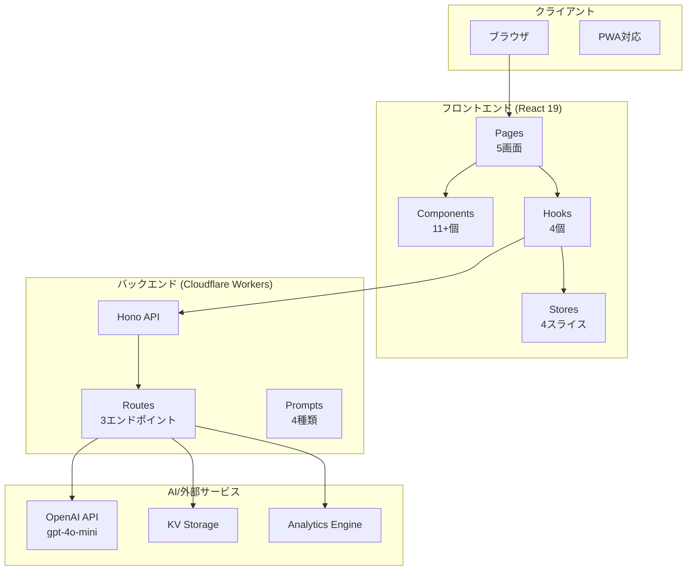
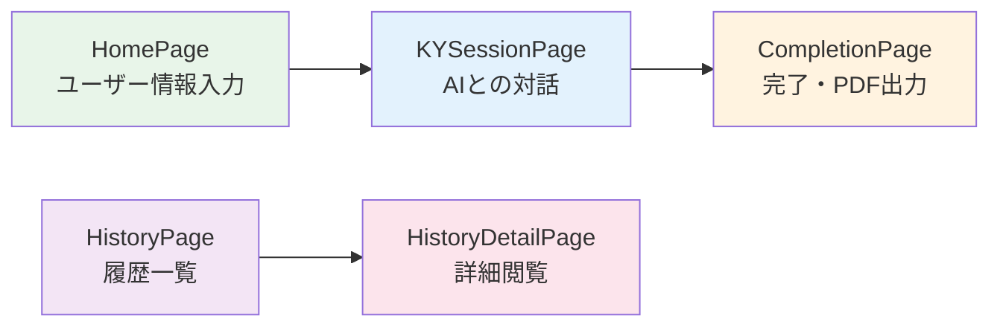
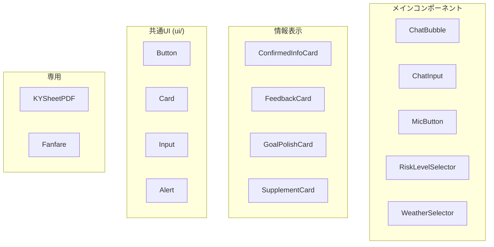
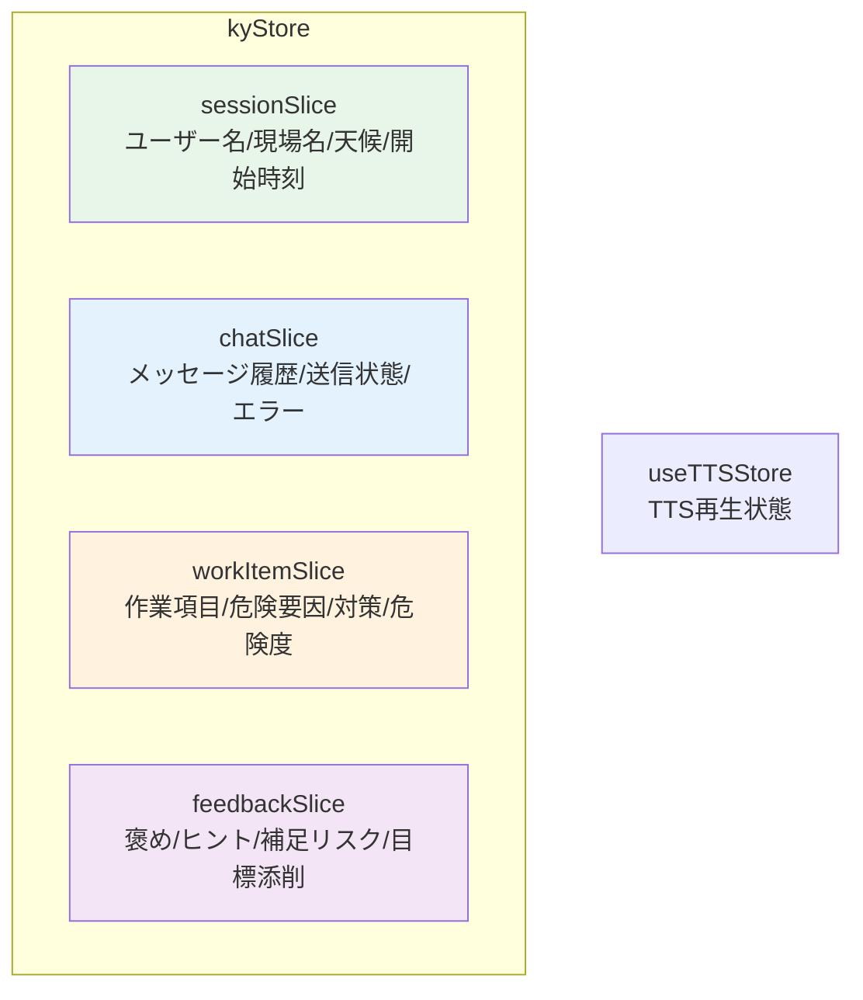
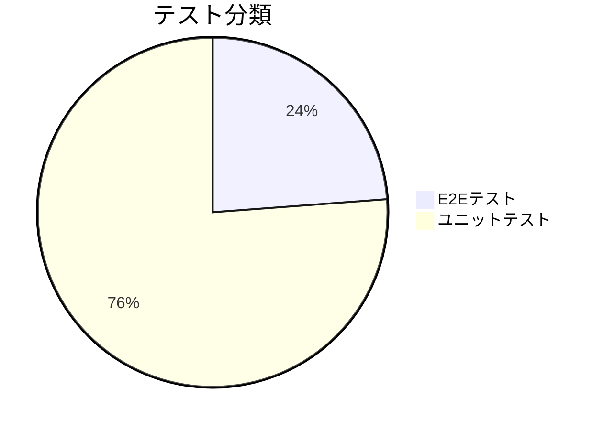
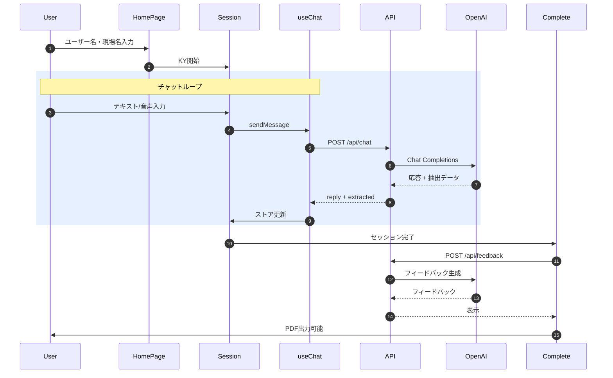
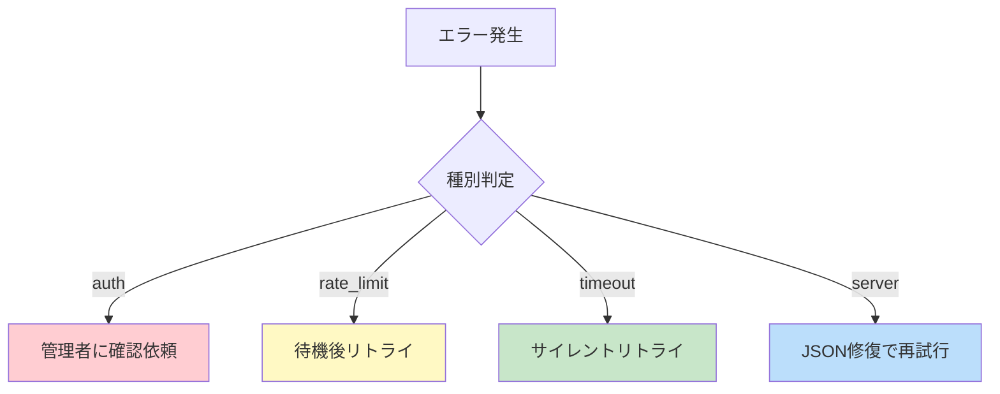
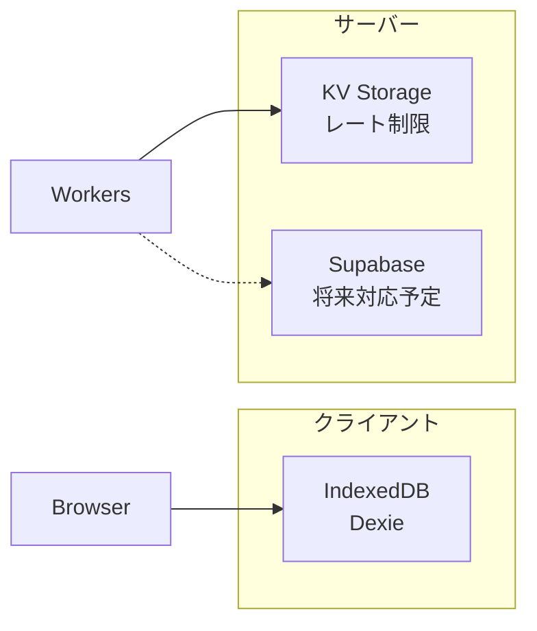

# v2フォルダ詳細レポート

**最終更新日**: 2026-02-08

---

## 目次

1. [概要と技術スタック](#概要と技術スタック)
2. [アーキテクチャ図](#アーキテクチャ図)
3. [フロントエンド詳細](#フロントエンドsrcの詳細)
4. [バックエンド詳細](#バックエンドworkersの詳細)
5. [テスト体制](#テストtestsの詳細)
6. [データフロー](#主要なデータフロー)
7. [運用情報](#セキュリティと運用)

---

## 概要と技術スタック

### プロジェクト構成図



### 技術スタック一覧

| 領域 | 技術 | バージョン/説明 |
|:----|------|----------------|
| フロントエンド | **React** | 19 + TypeScript |
| ビルド | **Vite** | 高速ビルドツール |
| スタイリング | **Tailwind CSS** | ユーティリティCSS |
| UIコンポーネント | **shadcn/ui** | UIコンポーネント |
| 状態管理 | **Zustand** | 状態管理 |
| 音声 | **Web Speech API** | 音声認識/読み上げ |
| PDF | **@react-pdf/renderer** | PDF生成 |
| バックエンド | **Hono** | Cloudflare Workers |
| AI | **OpenAI** | gpt-4o-mini |
| 永続化 | **IndexedDB (Dexie)** | ローカル永続化 |

---

## ディレクトリ構造

```text
apps/v2-modern/
│
├── src/                       ← フロントエンド本体
│   ├── components/            ← UIコンポーネント (11個 + サブ)
│   │   ├── ui/                ← 共通UI (Button, Card, Input...)
│   │   ├── pdf/               ← PDF関連 (KYSheetPDF)
│   │   └── fanfare/           ← 完了演出
│   ├── hooks/                 ← カスタムフック (4個)
│   ├── pages/                 ← ページ (5個 + debug)
│   ├── stores/                ← Zustandストア
│   │   └── slices/            ← 4スライス
│   ├── lib/                   ← ユーティリティ (14ファイル)
│   ├── types/                 ← 型定義
│   └── constants/             ← 定数
│
├── workers/                   ← バックエンド (Hono API)
│   ├── routes/                ← APIルート (3個)
│   ├── prompts/               ← AIプロンプト (4個)
│   ├── lib/                   ← ユーティリティ (2個)
│   ├── middleware/            ← ミドルウェア (1個)
│   └── observability/         ← ログ・監視 (2個)
│
├── tests/                     ← テスト
│   ├── e2e/                   ← E2Eテスト (5個)
│   ├── unit/                  ← ユニットテスト (16個)
│   └── integration/           ← 統合テスト
│
├── docs/                      ← ドキュメント
│   ├── 00_planning/           ← 計画・フェーズ管理
│   ├── 10_design/             ← 設計
│   ├── 20_manuals/            ← マニュアル
│   └── 30_reviews/            ← レビュー
│
├── scripts/                   ← 運用スクリプト
├── reports/                   ← テストレポート
└── public/                    ← 静的ファイル
```

---

## フロントエンド（src）の詳細

### ページ遷移フロー



### ページ一覧

| ページ | サイズ | 機能 |
|:------|:------:|------|
| **HomePage** | 12KB | ユーザー名・現場名・天候入力 |
| **KYSessionPage** | 11KB | チャットUI・音声入力・AI対話 |
| **CompletionPage** | 19KB | 完了画面・フィードバック・PDF |
| **HistoryPage** | 6KB | 過去KY履歴一覧 |
| **HistoryDetailPage** | 10KB | 履歴詳細閲覧 |

---

### コンポーネント構成



### カスタムフック

| フック | サイズ | 責務 |
|:------|:------:|------|
| **useChat** | 20KB | チャット制御・API呼び出し・エラー処理・リトライ |
| **usePDFGenerator** | 4KB | PDF生成・ダウンロード |
| **useTTS** | 5KB | 音声読み上げ制御 |
| **useVoiceRecognition** | 8KB | 音声認識制御 |

### 状態管理 (Zustand)



### ライブラリ (lib/)

| ファイル | 機能 |
|----------|------|
| `api.ts` | API呼び出し (postChat, postFeedback) |
| `apiBase.ts` | APIエラークラス |
| `db.ts` | IndexedDB永続化 (Dexie) |
| `schema.ts` | Zodスキーマ (API応答検証) |
| `kySchemas.ts` | KYデータ構造スキーマ |
| `contextUtils.ts` | 文脈注入 |
| `historyUtils.ts` | 履歴管理 |
| `exportUtils.ts` | エクスポート |
| `validation.ts` | 入力検証 |
| `clientId.ts` | クライアントID生成 |
| `dateUtils.ts` | 日付ユーティリティ |
| `riskLevelVisibility.ts` | 危険度表示制御 |
| `speechRecognitionErrors.ts` | 音声認識エラー処理 |

---

## バックエンド（workers）の詳細

### API構成図

```mermaid
graph LR
    subgraph "Cloudflare Workers"
        ENTRY[index.ts<br/>エントリポイント]
        
        subgraph "ミドルウェア"
            CORS[CORS]
            AUTH[認証]
            RL[レート制限]
            REQ[リクエストID]
        end
        
        subgraph "ルート"
            CHAT[/api/chat]
            FB[/api/feedback]
            MET[/api/metrics]
        end
    end
    
    OPENAI[OpenAI API]
    KV[KV Storage]
    AE[Analytics Engine]
    
    ENTRY --> CORS --> AUTH --> RL --> REQ
    REQ --> CHAT & FB & MET
    CHAT --> OPENAI
    FB --> OPENAI
    MET --> AE
    RL --> KV
```

### APIエンドポイント

| ルート | サイズ | 機能 |
|:------|:------:|------|
| **chat.ts** | 32KB | AI応答 + 抽出データ返却 |
| **feedback.ts** | 13KB | KY結果フィードバック生成 |
| **metrics.ts** | 2KB | イベント記録 |

### AIプロンプト

| プロンプト | サイズ | 用途 |
|:----------|:------:|------|
| **soloKY.ts** | 8KB | ソロKYセッション用 |
| **feedbackKY.ts** | 2KB | フィードバック生成用 |
| **supplementKY.ts** | 0.4KB | 追加リスク補足用 |
| **polishGoal.ts** | 0.4KB | 行動目標ブラッシュアップ用 |

### エラーコード

| コード | ステータス | 説明 |
|:------|:----------:|------|
| `AI_RESPONSE_INVALID_JSON` | 502 | JSONパース失敗 |
| `AI_RESPONSE_INVALID_SCHEMA` | 502 | スキーマ検証失敗 |
| `AI_UPSTREAM_ERROR` | 502/503 | OpenAI側エラー |

---

## テスト（tests）の詳細

### テストカバレッジ



### E2Eテスト (5件)

| テスト | 内容 |
|:------|------|
| **real-cost-scenario** | 実費テスト（本番API使用） |
| **ky-session-e2e** | KYセッションフルフロー |
| **live-ai-chat** | AIチャット機能 |
| **ios_compatibility** | iOS互換性 |
| **pdf-visual** | PDFビジュアル確認 |

### ユニットテスト (16件)

| 分類 | テストファイル |
|:----|---------------|
| API | api.chatError, apiBase |
| ストア | kyStore |
| コンポーネント | completionPage, micButton.errorClear |
| フック | useChat.retry |
| ユーティリティ | historyUtils, contextInjection, riskLevelVisibility, speechRecognitionErrors |
| バックエンド | rateLimit, openaiHttpError, logger, securityMode, metrics |
| スキーマ | schema |

---

## 主要なデータフロー



---

## エラーハンドリング

### Chat APIエラー



### 音声機能エラー

| エラー | 原因 | 対策 |
|:------|------|------|
| `not-allowed` | マイク権限拒否 | テキスト入力に誘導 |
| `audio-capture` | 音声取得失敗 | テキスト入力に誘導 |
| `end timeout` | onend未発火 | フォールバックタイムアウト |

---

## セキュリティと運用

### 環境変数

| 変数名 | 必須 | 説明 |
|:------|:----:|------|
| `OPENAI_API_KEY` | 必須 | OpenAI APIキー |
| `API_TOKEN` | 本番 | API認証トークン |
| `REQUIRE_API_TOKEN` | - | 1で常時必須化 |
| `STRICT_CORS` | - | 1で厳格CORS |
| `REQUIRE_RATE_LIMIT_KV` | - | 1でKV必須化 |

### 運用コマンド一覧

```bash
# 開発サーバー起動
npm run dev:all

# ビルド
npm run build

# デプロイ
npm run deploy:workers
npm run deploy:pages

# セキュリティ運用
npm run security:ops

# 実費テスト
npm run test:cost:ops

# レポート整理
npm run reports:prune
```

---

## 永続化と監視

### データ永続化



### 観測・監視

| 層 | ツール |
|:--|--------|
| **フロントエンド** | Sentry + Web Vitals + telemetry |
| **バックエンド** | 構造化ログ + Sentry + Analytics Engine |

---

## 統計サマリ

| カテゴリ | 数量 |
|:--------|:----:|
| ページ | 5 + debug |
| コンポーネント | 11 + サブ |
| カスタムフック | 4 |
| ストアスライス | 4 |
| APIルート | 3 |
| AIプロンプト | 4 |
| E2Eテスト | 5 |
| ユニットテスト | 16 |

---

## まとめ

v2は **フロントエンドのチャット体験・音声機能・PDF出力** と **バックエンドのAPI/エラー処理/セキュリティ** が一体化した構成です。

- **21件のテスト** で品質担保
- **4カテゴリのドキュメント** で知識管理
- **多層セキュリティ** で本番運用対応
- **音声/テキスト両対応** で現場での使いやすさを実現
