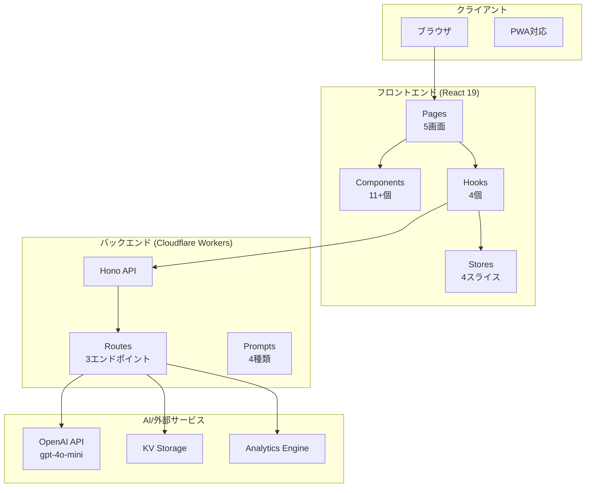
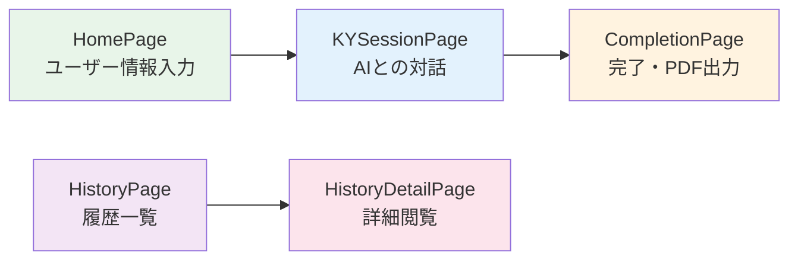
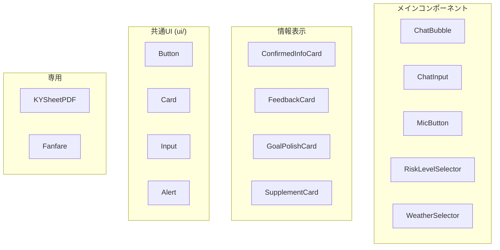
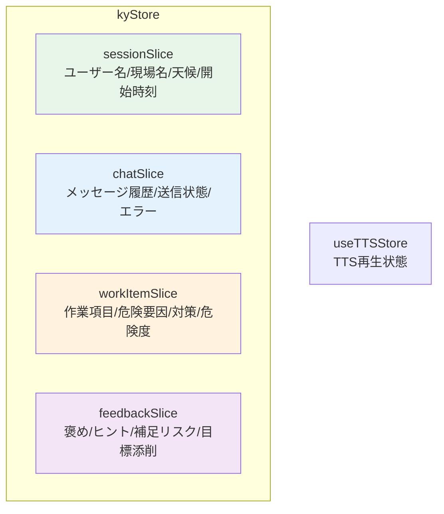
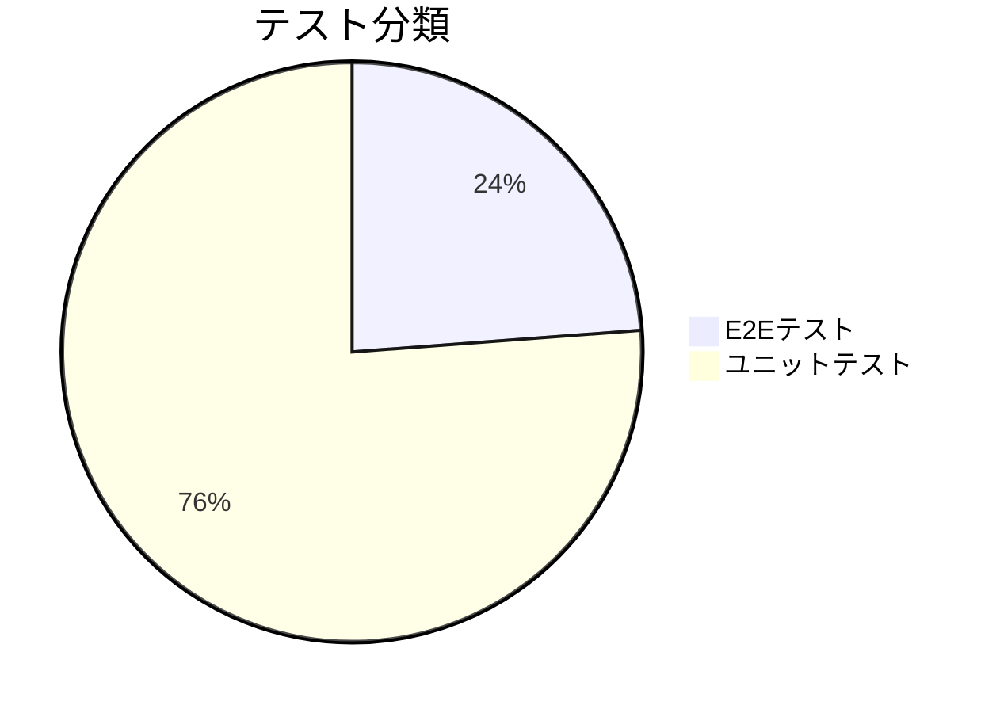
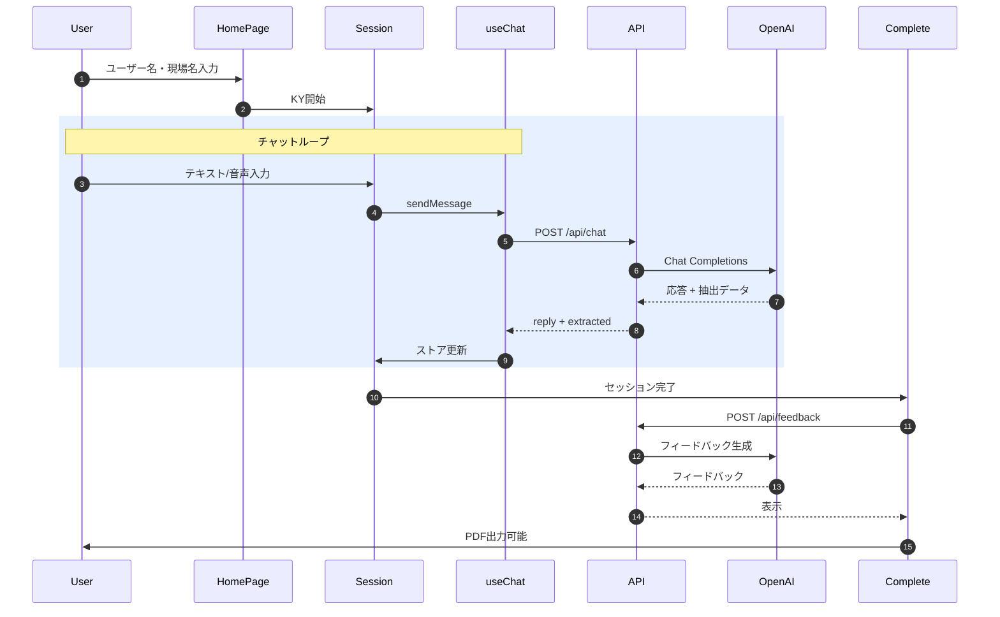
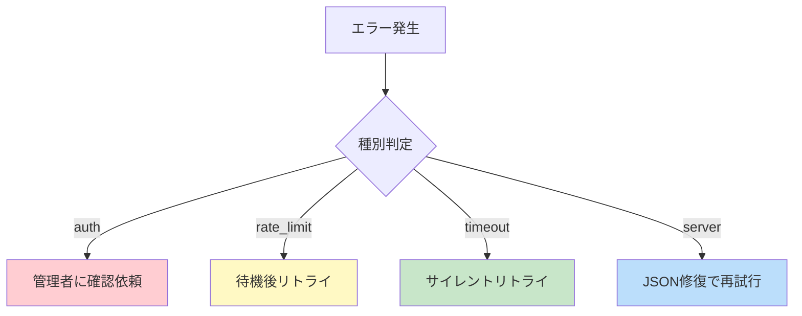
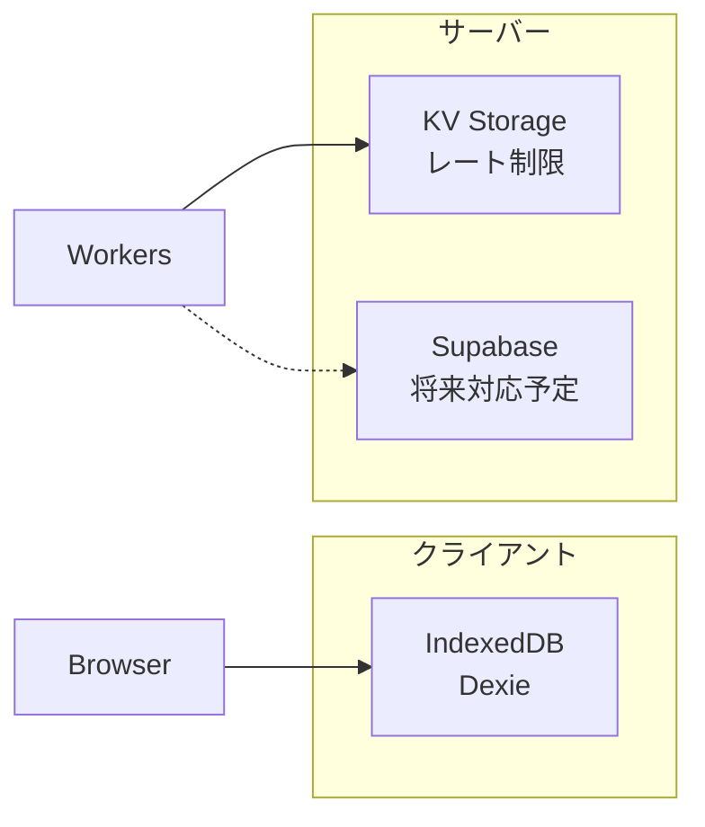

# v2フォルダ詳細レポート

**最終更新日**: 2026-02-09

---

## 目次

1. [概要と技術スタック](#概要と技術スタック)
2. [アーキテクチャ図](#アーキテクチャ図)
3. [フロントエンド詳細](#フロントエンドsrcの詳細)
4. [バックエンド詳細](#バックエンドworkersの詳細)
5. [テスト体制](#テストtestsの詳細)
6. [データフロー](#主要なデータフロー)
7. [KYデータモデル](#kyデータモデルドメイン定義)
8. [エラーハンドリング](#エラーハンドリング)
9. [運用情報](#セキュリティと運用)
10. [監視と統計](#永続化と監視)

---

## 概要と技術スタック

### プロジェクト構成図



### 技術スタック一覧

| 領域 | 技術 | バージョン/説明 |
|:----|------|----------------|
| フロントエンド | **React** | 19 + TypeScript |
| ビルド | **Vite** | 高速ビルドツール |
| スタイリング | **Tailwind CSS** | ユーティリティCSS |
| UIコンポーネント | **shadcn/ui** | UIコンポーネント |
| 状態管理 | **Zustand** | 状態管理 |
| 音声 | **Web Speech API** | 音声認識/読み上げ |
| PDF | **@react-pdf/renderer** | PDF生成 |
| バックエンド | **Hono** | Cloudflare Workers |
| AI | **OpenAI** | gpt-4o-mini |
| 永続化 | **IndexedDB (Dexie)** | ローカル永続化 |

---

## ディレクトリ構造

```text
apps/v2-modern/
│
├── src/                       ← フロントエンド本体
│   ├── components/            ← UIコンポーネント (11個 + サブ)
│   │   ├── ui/                ← 共通UI (Button, Card, Input...)
│   │   ├── pdf/               ← PDF関連 (KYSheetPDF)
│   │   └── fanfare/           ← 完了演出
│   ├── hooks/                 ← カスタムフック (4個)
│   ├── pages/                 ← ページ (5個 + debug)
│   ├── stores/                ← Zustandストア
│   │   └── slices/            ← 4スライス
│   ├── lib/                   ← ユーティリティ (14ファイル)
│   ├── types/                 ← 型定義
│   └── constants/             ← 定数
│
├── workers/                   ← バックエンド (Hono API)
│   ├── routes/                ← APIルート (3個)
│   ├── prompts/               ← AIプロンプト (4個)
│   ├── lib/                   ← ユーティリティ (2個)
│   ├── middleware/            ← ミドルウェア (1個)
│   └── observability/         ← ログ・監視 (2個)
│
├── tests/                     ← テスト
│   ├── e2e/                   ← E2Eテスト (5個)
│   ├── unit/                  ← ユニットテスト (16個)
│   └── integration/           ← 統合テスト
│
├── docs/                      ← ドキュメント
│   ├── 00_planning/           ← 計画・フェーズ管理
│   ├── 10_design/             ← 設計
│   ├── 20_manuals/            ← マニュアル
│   └── 30_reviews/            ← レビュー
│
├── scripts/                   ← 運用スクリプト
├── reports/                   ← テストレポート
└── public/                    ← 静的ファイル
```

---

## フロントエンド（src）の詳細

### ページ遷移フロー



### ページ一覧

| ページ | サイズ | 機能 |
|:------|:------:|------|
| **HomePage** | 12KB | ユーザー名・現場名・天候入力 |
| **KYSessionPage** | 11KB | チャットUI・音声入力・AI対話 |
| **CompletionPage** | 19KB | 完了画面・フィードバック・PDF |
| **HistoryPage** | 6KB | 過去KY履歴一覧 |
| **HistoryDetailPage** | 10KB | 履歴詳細閲覧 |

---

### コンポーネント構成



### カスタムフック

| フック | サイズ | 責務 |
|:------|:------:|------|
| **useChat** | 20KB | チャット制御・API呼び出し・エラー処理・リトライ |
| **usePDFGenerator** | 4KB | PDF生成・ダウンロード |
| **useTTS** | 5KB | 音声読み上げ制御 |
| **useVoiceRecognition** | 8KB | 音声認識制御 |

### 状態管理 (Zustand)



### ライブラリ (lib/)

| ファイル | 機能 |
|----------|------|
| `api.ts` | API呼び出し (postChat, postFeedback) |
| `apiBase.ts` | APIエラークラス |
| `db.ts` | IndexedDB永続化 (Dexie) |
| `schema.ts` | Zodスキーマ (API応答検証) |
| `kySchemas.ts` | KYデータ構造スキーマ |
| `contextUtils.ts` | 文脈注入 |
| `historyUtils.ts` | 履歴管理 |
| `exportUtils.ts` | エクスポート |
| `validation.ts` | 入力検証 |
| `clientId.ts` | クライアントID生成 |
| `dateUtils.ts` | 日付ユーティリティ |
| `riskLevelVisibility.ts` | 危険度表示制御 |
| `speechRecognitionErrors.ts` | 音声認識エラー処理 |

---

## バックエンド（workers）の詳細

### API構成図

```mermaid
graph LR
    subgraph "Cloudflare Workers"
        ENTRY[index.ts<br/>エントリポイント]
        
        subgraph "ミドルウェア"
            CORS[CORS]
            AUTH[認証]
            RL[レート制限]
            REQ[リクエストID]
        end
        
        subgraph "ルート"
            CHAT[/api/chat]
            FB[/api/feedback]
            MET[/api/metrics]
        end
    end
    
    OPENAI[OpenAI API]
    KV[KV Storage]
    AE[Analytics Engine]
    
    ENTRY --> CORS --> AUTH --> RL --> REQ
    REQ --> CHAT & FB & MET
    CHAT --> OPENAI
    FB --> OPENAI
    MET --> AE
    RL --> KV
```

### APIエンドポイント

| ルート | サイズ | 機能 |
|:------|:------:|------|
| **chat.ts** | 32KB | AI応答 + 抽出データ返却 |
| **feedback.ts** | 13KB | KY結果フィードバック生成 |
| **metrics.ts** | 2KB | イベント記録 |

### API契約（詳細）

#### Chat API (`POST /api/chat`)

**リクエスト**

| フィールド | 型 | 必須 | 説明 |
|:--|:--|:--:|:--|
| `messages` | `{ role: "user" \| "assistant", content: string }[]` | 必須 | 会話履歴。`user` の `content` は最大1000文字、履歴合計は約1万文字まで。 |
| `sessionContext` | object | 任意 | `userName` / `siteName` / `weather` / `workItemCount` / `processPhase` / `healthCondition` を含む。 |
| `contextInjection` | string | 任意 | 追加文脈（最大1200文字）。 |
| `conversationSummary` | string | 任意 | 会話サマリ（最大1200文字）。 |

**レスポンス（成功）**

| フィールド | 型 | 説明 |
|:--|:--|:--|
| `reply` | string | 画面に表示する返答文。 |
| `extracted` | object | 抽出データ（任意、空の可能性あり）。 |
| `usage.totalTokens` | number | OpenAI利用トークン数（参考）。 |
| `meta` | object | OpenAI呼び出し回数や再試行情報（運用観測用）。 |

**レスポンス（エラー）**

| フィールド | 型 | 説明 |
|:--|:--|:--|
| `error` | string | エラーメッセージ。 |
| `code` | string | エラーコード。 |
| `requestId` | string | 追跡用ID。 |
| `retriable` | boolean | 再試行可能か。 |
| `details` | object | バリデーション失敗などの詳細（任意）。 |

**例（成功）**

```json
{
  "reply": "作業内容を教えてください。",
  "extracted": {
    "nextAction": "ask_work"
  },
  "usage": {
    "totalTokens": 321
  },
  "meta": {
    "openai": {
      "requestCount": 1,
      "httpAttempts": 1,
      "durationMs": 850
    },
    "parseRetry": {
      "attempted": false,
      "succeeded": false
    }
  }
}
```

**例（エラー）**

```json
{
  "error": "AIからの応答が不正な形式です。再試行してください。",
  "code": "AI_RESPONSE_INVALID_JSON",
  "requestId": "xxx",
  "retriable": true
}
```

#### Feedback API (`POST /api/feedback`)

**リクエスト**

| フィールド | 型 | 必須 | 説明 |
|:--|:--|:--:|:--|
| `sessionId` | string | 必須 | セッションID（8〜128文字）。 |
| `clientId` | string | 必須 | クライアントID（8〜128文字）。 |
| `context` | object | 任意 | `work` / `location` / `weather` / `processPhase` / `healthCondition` を含む。 |
| `extracted` | object | 任意 | `risks` / `measures` / `actionGoal` を含む。 |
| `chatDigest` | string | 任意 | 会話要約（最大1200文字）。 |

**レスポンス（成功）**

| フィールド | 型 | 説明 |
|:--|:--|:--|
| `praise` | string | 良かった点。 |
| `tip` | string | 改善のヒント。 |
| `supplements` | `{ risk: string, measure: string }[]` | 補足リスク（最大2件）。 |
| `polishedGoal` | `{ original: string, polished: string } \| null` | 行動目標の添削提案。 |
| `meta` | object | `requestId` / `cached` / `validationFallback` 等。 |

**レスポンス（エラー）**

| フィールド | 型 | 説明 |
|:--|:--|:--|
| `error.code` | string | エラーコード。 |
| `error.message` | string | エラーメッセージ。 |
| `error.retriable` | boolean | 再試行可能か。 |
| `error.requestId` | string | 追跡用ID。 |

#### Metrics API (`POST /api/metrics`)

**リクエスト**

| フィールド | 型 | 必須 | 説明 |
|:--|:--|:--:|:--|
| `event` | string | 必須 | `session_start` / `session_complete` / `input_length` / `web_vital` / `chat_error` / `retry_clicked` / `retry_waiting` / `retry_succeeded` / `retry_failed` |
| `timestamp` | string | 任意 | ISO 8601。未指定ならサーバー側で付与。 |
| `sessionId` | string | 任意 | セッションID。 |
| `value` | number | 任意 | 数値指標。 |
| `data` | object | 任意 | 追加情報（文字列/数値/真偽/nullのみ）。 |

**レスポンス**

```json
{ "ok": true }
```

### AIプロンプト

| プロンプト | サイズ | 用途 |
|:----------|:------:|------|
| **soloKY.ts** | 8KB | ソロKYセッション用 |
| **feedbackKY.ts** | 2KB | フィードバック生成用 |
| **supplementKY.ts** | 0.4KB | 追加リスク補足用 |
| **polishGoal.ts** | 0.4KB | 行動目標ブラッシュアップ用 |

### エラーコード

| コード | ステータス | 説明 |
|:------|:----------:|------|
| `AI_RESPONSE_INVALID_JSON` | 502 | JSONパース失敗 |
| `AI_RESPONSE_INVALID_SCHEMA` | 502 | スキーマ検証失敗 |
| `AI_UPSTREAM_ERROR` | 502/503 | OpenAI側エラー |
| `AI_TIMEOUT` | 504 | OpenAI応答タイムアウト |
| `BANNED_WORD` | 400 | 禁止語が含まれる |
| `INPUT_TOO_LARGE` | 400 | メッセージ総量が上限超過 |
| `VALIDATION_ERROR` | 400 | リクエストスキーマ不一致 |
| `AUTH_REQUIRED` | 401 | 認証トークン未指定 |
| `AUTH_INVALID` | 401 | 認証トークン不一致 |
| `AUTH_CONFIG_MISSING` | 503 | 認証設定不足（本番要件に未達） |

---

## テスト（tests）の詳細

### テストカバレッジ



### E2Eテスト (5件)

| テスト | 内容 |
|:------|------|
| **real-cost-scenario** | 実費テスト（本番API使用） |
| **ky-session-e2e** | KYセッションフルフロー |
| **live-ai-chat** | AIチャット機能 |
| **ios_compatibility** | iOS互換性 |
| **pdf-visual** | PDFビジュアル確認 |

### ユニットテスト (16件)

| 分類 | テストファイル |
|:----|---------------|
| API | api.chatError, apiBase |
| ストア | kyStore |
| コンポーネント | completionPage, micButton.errorClear |
| フック | useChat.retry |
| ユーティリティ | historyUtils, contextInjection, riskLevelVisibility, speechRecognitionErrors |
| バックエンド | rateLimit, openaiHttpError, logger, securityMode, metrics |
| スキーマ | schema |

---

## 主要なデータフロー



---

## KYデータモデル（ドメイン定義）

### 抽出データ（AIが返す要素）

| フィールド | 型 | 説明 |
|:--|:--|:--|
| `workDescription` | string | 作業内容。 |
| `hazardDescription` | string | 危険内容。 |
| `riskLevel` | 1〜5 | 危険度。 |
| `whyDangerous` | string[] | 危険の理由。 |
| `countermeasures` | `{ category: "ppe" \| "behavior" \| "equipment", text: string }[]` | 対策。 |
| `actionGoal` | string | 行動目標。 |
| `nextAction` | `"ask_work" \| "ask_hazard" \| "ask_why" \| "ask_countermeasure" \| "ask_risk_level" \| "ask_more_work" \| "ask_goal" \| "confirm" \| "completed"` | 次に尋ねる内容。 |

### 作業項目（WorkItem）

| フィールド | 型 | 説明 |
|:--|:--|:--|
| `id` | string (uuid) | 作業項目ID。 |
| `workDescription` | string | 作業内容。 |
| `hazardDescription` | string | 危険内容。 |
| `riskLevel` | 1〜5 | 危険度。 |
| `whyDangerous` | string[] | 危険の理由。 |
| `countermeasures` | Countermeasure[] | 対策一覧。 |

### セッション（SoloKYSession）

| フィールド | 型 | 説明 |
|:--|:--|:--|
| `id` | string (uuid) | セッションID。 |
| `userName` / `siteName` / `weather` | string | 基本情報。 |
| `temperature` | number \| null | 気温。 |
| `processPhase` | string \| null | 作業工程。 |
| `healthCondition` | string \| null | 体調。 |
| `workStartTime` / `workEndTime` | string (ISO 8601) | 作業開始/終了時刻。 |
| `createdAt` | string (ISO 8601) | セッション作成日時。 |
| `environmentRisk` | string \| null | 環境リスク。 |
| `workItems` | WorkItem[] | 作業項目一覧。 |
| `actionGoal` | string \| null | 行動目標。 |
| `pointingConfirmed` | boolean \| null | 指差し確認。 |
| `allMeasuresImplemented` | boolean \| null | 対策実施確認。 |
| `hadNearMiss` | boolean \| null | ヒヤリハット。 |
| `nearMissNote` | string \| null | ヒヤリハット備考。 |
| `completedAt` | string (ISO 8601) \| null | 完了日時。 |

---

## エラーハンドリング

### Chat APIエラー



### 音声機能エラー

| エラー | 原因 | 対策 |
|:------|------|------|
| `not-allowed` | マイク権限拒否 | テキスト入力に誘導 |
| `audio-capture` | 音声取得失敗 | テキスト入力に誘導 |
| `end timeout` | onend未発火 | フォールバックタイムアウト |

### Chat APIの主な原因と対策（詳細）

| 区分 | 主な原因 | 対策 |
|:--|:--|:--|
| 入力検証 | 禁止語、文字数超過、スキーマ不一致 | 入力内容の明示エラー表示、文字数制限ガイド、バリデーション修正。 |
| 認証 | トークン未設定/不一致、設定不足 | `Authorization: Bearer <token>` を確認し、本番では `API_TOKEN` と `REQUIRE_API_TOKEN` を有効化。 |
| レート制限 | 1分あたり30回を超過 | `Retry-After` に従い待機して再試行。 |
| OpenAI応答 | JSON破損、スキーマ不一致 | JSON修復→再生成の順に再試行し、失敗時は再送案内。 |
| 通信・タイムアウト | ネットワーク障害、上流タイムアウト | 通信状態を案内し、再試行（必要なら待機）を促す。 |
| サーバー内部 | 予期しない例外 | 監視ログと `requestId` を用いて原因追跡、再現条件を特定。 |

### Feedback APIの主な原因と対策（詳細）

| 区分 | 主な原因 | 対策 |
|:--|:--|:--|
| 入力検証 | スキーマ不一致 | クライアントの送信データを確認し修正。 |
| キャッシュ/保存 | KVのJSONパース失敗 | キャッシュを無効化し再作成、KVデータの破損有無を確認。 |
| OpenAI応答 | JSONパース/スキーマ失敗 | フォールバック応答を返し、時間をおいて再試行。 |
| タイムアウト | OpenAIの応答遅延 | タイムアウトを調整し、再試行の案内を追加。 |
| サーバー内部 | 予期しない例外 | エラーログを確認し、`requestId` で追跡。 |

---

## セキュリティと運用

### 環境変数

| 変数名 | 必須 | 説明 |
|:------|:----:|------|
| `OPENAI_API_KEY` | 必須 | OpenAI APIキー |
| `API_TOKEN` | 本番 | API認証トークン |
| `REQUIRE_API_TOKEN` | - | 1で常時必須化 |
| `STRICT_CORS` | - | 1で厳格CORS |
| `REQUIRE_RATE_LIMIT_KV` | - | 1でKV必須化 |

### 認証・レート制限の運用詳細

| 項目 | 内容 |
|:--|:--|
| 認証方式 | `Authorization: Bearer <token>`。サーバー側 `API_TOKEN` と一致させる。 |
| 認証必須条件 | `REQUIRE_API_TOKEN=1` もしくは本番環境判定で必須化。 |
| レート制限 | 1分あたり30回（全API）。 |
| `Retry-After` | 429時に秒数を返却。クライアントは待機後に再試行。 |
| 代替ストア | KVが無い場合はメモリフォールバック（開発用途）。 |
| KV必須 | `REQUIRE_RATE_LIMIT_KV=1` もしくは本番環境判定で必須化。 |

### 運用コマンド一覧

```bash
# 開発サーバー起動
npm run dev:all

# ビルド
npm run build

# デプロイ
npm run deploy:workers
npm run deploy:pages

# セキュリティ運用
npm run security:ops

# 実費テスト
npm run test:cost:ops

# レポート整理
npm run reports:prune
```

---

## 永続化と監視

### データ永続化



### 観測・監視

| 層 | ツール |
|:--|--------|
| **フロントエンド** | Sentry + Web Vitals + telemetry |
| **バックエンド** | 構造化ログ + Sentry + Analytics Engine |

### ログとメトリクスの設計詳細

| 項目 | 内容 |
|:--|:--|
| 構造化ログ | `timestamp` / `level` / `service` / `message` / `reqId` / `status` / `latencyMs` を基本に出力。 |
| 機密情報マスク | `authorization` / `api_key` / `password` などは `[redacted]` に置換。メール・電話番号・長い番号もマスク。 |
| 代表的な計測 | API応答時間、再試行回数、`chat_error` や `retry_*` の件数。 |
| 監視の対策 | 失敗率上昇時はレート制限/上流障害を疑い、`requestId` で追跡する。 |

---

## 統計サマリ

| カテゴリ | 数量 |
|:--------|:----:|
| ページ | 5 + debug |
| コンポーネント | 11 + サブ |
| カスタムフック | 4 |
| ストアスライス | 4 |
| APIルート | 3 |
| AIプロンプト | 4 |
| E2Eテスト | 5 |
| ユニットテスト | 16 |

---

## まとめ

v2は **フロントエンドのチャット体験・音声機能・PDF出力** と **バックエンドのAPI/エラー処理/セキュリティ** が一体化した構成です。

- **21件のテスト** で品質担保
- **4カテゴリのドキュメント** で知識管理
- **多層セキュリティ** で本番運用対応
- **音声/テキスト両対応** で現場での使いやすさを実現
