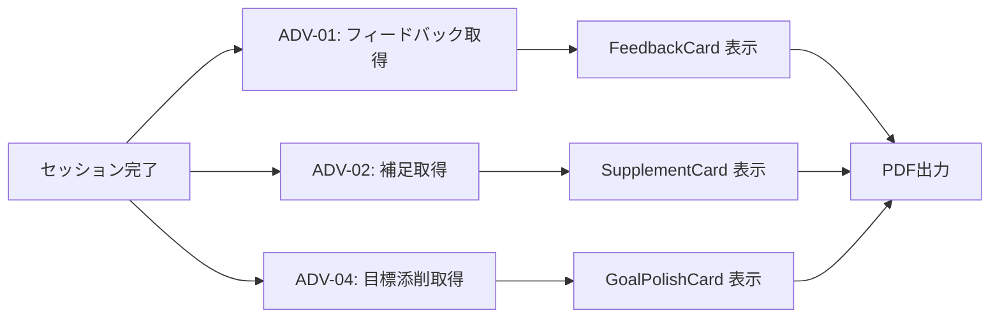

# Phase 2.6 実装計画（事後フィードバック・補強）

- 作成日: 2026-02-02
- 作成者: Antigravity
- 更新日: 2026-02-03
- 対象資料: Phase2.6_Decision_Matrix.md

---

## 1. 目的と完了条件

**目的**

- KYセッション完了後に、実施内容の「質」を評価してユーザーの成長を促す。
- AIが足りない視点を補足して安全性を担保する。

**完了条件**

- ユーザーが自分のKYの良い点を認識できる（ADV-01）。
- ユーザーが見落とした重大な危険が記録として補完される（ADV-02）。
- 行動目標がキレのあるフレーズに改善される（ADV-04）。

---

## 2. 対象範囲

**採用（実装対象）**

- ADV-01: KY品質フィードバック & アドバイス
- ADV-02: 危険・対策のAI自動補足
- ADV-04: 行動目標のブラッシュアップ

**対象外（今回保留）**

- ADV-03: 類似災害事例の提示（RAG/データ準備が必要なため）

---

## 3. 共通方針

- **減点法は使用しない**: ユーザーのモチベーション維持のため、「褒めて伸ばす」アプローチを徹底する。
- **サンドイッチ法 (PNP)**: ポジティブ → 改善点 → ポジティブ の順でフィードバックを構成する。
- **自己効力感の向上**: 「あなたはリスクを見つける能力がある」と信じさせるメッセージを送る。
- **データ最小化/PII配慮**: 会話履歴は必要部分のみ要約し、個人情報はマスクして送信・保存する。
- **権限・セッション検証**: `sessionId` の所有者確認をサーバー側で行い、クライアント送信値を信頼しない。
- **出力検証とフォールバック**: JSONスキーマに合致しない場合は安全な定型文/空配列で返す。
- **障害時の劣化**: API失敗・タイムアウト時は該当セクションを非表示にしてUIを崩さない。
- **AI補足は控えめに**: 人間の主体性を阻害しないよう、補足項目は1~2件に絞る。
- **オプトアウト可能**: フィードバック機能はユーザーがスキップできる設計にする。

---

## 4. 実装計画（詳細）

### 4.1 前提条件

**必要な情報**

- セッション中に収集された `extracted` データ（危険、対策、行動目標）
- 当日の作業内容・場所（コンテキスト）
- 会話履歴（KYセッションのやりとり）

**実装場所**

- `CompletionPage.tsx` の表示直前、または完了画面内に統合

**共通API仕様**

- `POST /api/feedback` の単一呼び出しで `praise/tip/supplements/polishedGoal` を返す（未実施機能は `null` / 空配列 / 省略可）。
- `sessionId` はサーバー側で検証し、サーバーが保持するセッションデータを正とする。
- 明示的なタイムアウトとリトライ（最大1回）を設定し、失敗時は空の結果を返す。

---

### 4.2 ADV-01: KY品質フィードバック & アドバイス (実装済)

**概要**

セッション完了時に、ユーザーのKY内容を分析し、良かった点と成長のヒントを提示する。

**実装内容 (Reflected)**

1. **統合プロンプトの作成** (`workers/prompts/feedbackKY.ts`) ✅
    - 単一のプロンプトで ADV-01, 02, 04 を一括生成し、コストとレイテンシを削減。
    - 出力: `{ praise, tip, supplements, polishedGoal }`

2. **API エンドポイント追加** (`workers/routes/feedback.ts`) ✅
    - POST `/api/feedback`
    - 単一リクエストで全要素を返却。

3. **UI コンポーネント作成** (`src/components/FeedbackCard.tsx`) ✅
    - 「👏 今日のよかったところ」「💡 次回へのヒント」を表示。

4. **Store への統合** (`useKYStore`) ✅
    - `feedback` (praise, tip) を状態管理。

5. **バックエンド共通化 (Refactoring)** (`workers/lib/openai.ts`) ✅
    - OpenAI API 呼び出しロジックを `fetchOpenAICompletion` に共通化。
    - `chat.ts` と `feedback.ts` の重複コードを排除。

---

### 4.3 ADV-02: 危険・対策のAI自動補足 (実装済)

**概要**

ユーザーが挙げた危険・対策に加え、AIが見落としがちな項目を補足提示する。

**実装内容 (Reflected)**

1. **統合プロンプト利用** (`workers/prompts/feedbackKY.ts`) ✅
    - 共通プロンプト内で `supplements` 配列を生成。
    - 条件: ユーザーが挙げていない危険のみ提案（最大2件）。

2. **重複判定ロジック** (`workers/routes/feedback.ts`) ✅
    - 正規化と部分一致による重複排除を実装済。

3. **UI コンポーネント作成** (`src/components/SupplementCard.tsx`) ✅
    - `CompletionPage` にて `FeedbackCard` の下に表示。

---

### 4.4 ADV-04: 行動目標のブラッシュアップ (実装済)

**概要**

ユーザーが決めた行動目標を、現場で唱えやすいフレーズにAIが添削提案する。

**実装内容 (Reflected)**

1. **統合プロンプト利用** (`workers/prompts/feedbackKY.ts`) ✅
    - 共通プロンプト内で `polishedGoal` オブジェクトを生成。
    - ルール: 「～ヨシ！」形式、20文字以内。

2. **UI コンポーネント作成** (`src/components/GoalPolishCard.tsx`) ✅
    - Before/After 形式で提案を表示。
    - 採用ボタンで `polishedActionGoal` を更新。

**受け入れ条件**

- 添削提案が表示される
- ユーザーが元の目標を維持することも可能
- 採用した場合はPDFに反映
- 添削が不適切な場合は提案を表示しない

---

## 5. ロールアウト計画

**ステップ**

1. ローカル環境でプロンプト開発・テスト
2. ステージング環境でUIテスト
3. 本番へ反映（環境変数でON/OFF可能）

**検証シナリオ**

- ADV-01: フィードバックが必ずポジティブであること
- ADV-02: 補足がユーザーの回答と重複しないこと
- ADV-04: 添削後のフレーズがリズム良くなっていること
- APIタイムアウト/失敗時にUIが崩れないこと
- 0件補足のときにセクションが表示されないこと
- 出力スキーマ不整合時に安全な定型文へフォールバックできること
- セッション不一致/認可エラー時にデータが返らないこと

**ロールバック**

- 環境変数 `ENABLE_FEEDBACK=0` でAPI処理も停止（空レスポンス）
- クライアントはAPI呼び出しをスキップし、完了画面から該当UIを非表示

---

## 6. 依存関係と優先順位

**実装優先順位**

1. **ADV-01** (フィードバック): ユーザー体験の核心
2. **ADV-04** (目標添削): 低コストで効果大
3. **ADV-02** (AI補足): 安全性担保（やや複雑）

---

## 7. リスクと対策

| リスク | 対策 |
| :--- | :--- |
| 会話履歴に個人情報が含まれ外部送信される | 送信前にマスク/要約、保存期間を短くしログを最小化 |
| セッションIDなりすましで他人のデータ参照 | サーバー側で所有者検証、認可エラー時は空返し |
| モデル出力が想定フォーマット外 | JSONスキーマ検証 + フォールバック |
| フィードバックがネガティブに聞こえる | プロンプトで「減点法禁止」を明示、レビューで確認 |
| AI補足への依存 | 補足は「参考情報」と明記、ユーザーの主体性を強調 |
| 添削が余計なお世話 | 「採用しない」選択肢を常に提示 |
| API呼び出し増加によるコスト | 単一呼び出し化 + 短文出力 + キャッシュの併用 |

---

## 9. 想定されるデメリットと対策 (Strict Review)

| リスク/デメリット | 詳細 | 対策 |
| :--- | :--- | :--- |
| **パターナリズム (押し付けがましさ)** | ADV-01 で「褒められる」ことが、熟練者にとっては「子供扱い」と感じられ、不快感を与える。 | フィードバックのトーンを「評価者」ではなく「パートナー/事務局」とする。「さすがです」「完璧です」より「〜という視点が鋭いです」と事実ベースにする。 |
| **主体性の喪失** | ADV-02, ADV-04 でAIが先回りしすぎると、ユーザーが「考えなくなる」。 | 補足や添削は常に「提案」の形をとり、ユーザーが「採用しない」選択肢を一番押しやすい位置に置く。 |
| **リズムの形骸化** | ADV-04 で語呂が良いだけの「中身のない指差し呼称」が量産される。 | 添削時に元の意味（安全動作）が損なわれていないか検証するロジック（またはプロンプト指示）を強化する。 |
| **ノイズ過多** | 完了画面で情報量が多すぎ、本当に重要な「作業開始」ボタンへの動線が阻害される。 | フィードバック全体をアコーディオン（開閉式）にし、デフォルトでは要約のみ見せるUIデザインにする。 |

---

## 8. 将来拡張

- **ADV-03 (類似災害事例)**: RAG基盤構築後に再検討
- **成長履歴の可視化**: 過去のフィードバックを蓄積し、スキル成長を可視化
- **チーム向け集計**: 管理者がチーム全体のKY品質を俯瞰できるダッシュボード
