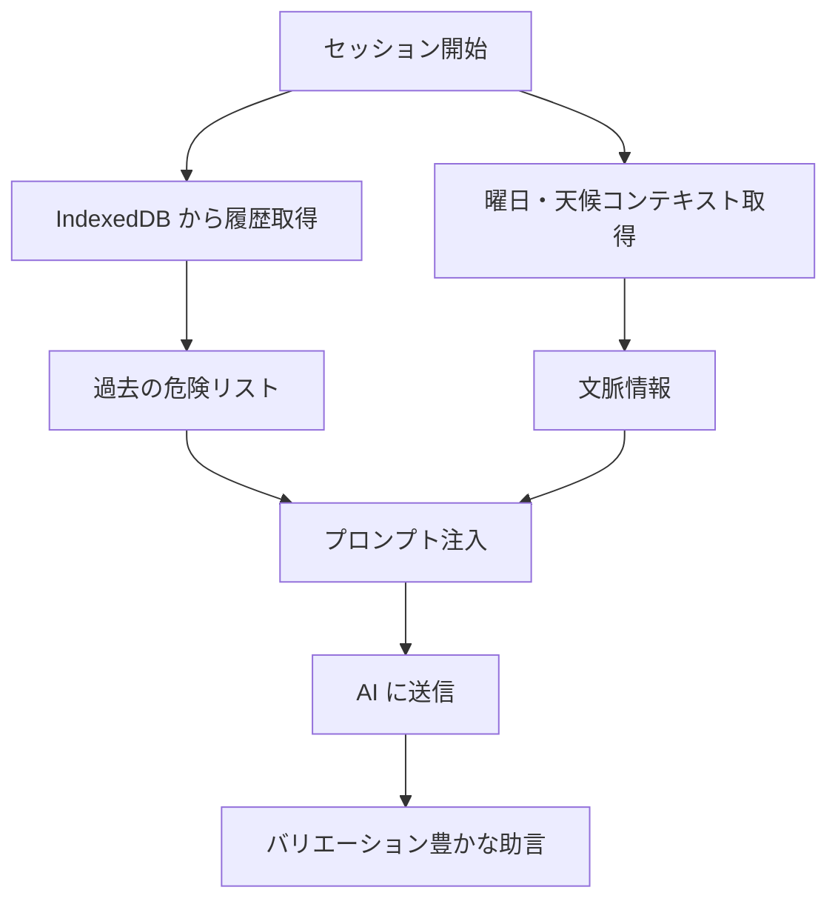

# Phase 2.7 実装計画（コンテキスト注入・ナレッジ循環）

- 作成日: 2026-02-03
- 作成者: Antigravity
- 対象資料: Phase2.7_Context_Decision_Matrix.md

---

## 1. 目的と完了条件

**目的**

- Phase 2.3 で蓄積された履歴データを活用し、AIが「毎回同じ助言」をしないようにする。
- 過去の危険情報を再利用し、ナレッジの循環を実現する。

**完了条件**

- 「毎回同じ助言」が抑制される（バリエーションが増える）。
- 過去のヒヤリハットがAIの助言に反映される。
- 天候・曜日に応じた危険が強調される。

---

## 2. 対象範囲

**採用（実装対象）**

- CTX-01: 過去ヒヤリハット参照
- CTX-02: 昨日の指摘参照
- CTX-04: 天候・曜日の文脈強化

**対象外（今回保留）**

- CTX-03: 簡易RAG（効果検証後に判断）
- CTX-05: 現場固有ナレッジ登録（Phase 3.0 に統合検討）

**前提条件**

- Phase 2.3 (History) が実装済みであること
- IndexedDB (Dexie) にKYセッション履歴が保存されていること

---

## 3. 共通方針

- **ローカルファースト**: 履歴データはデバイス内 (IndexedDB) から取得する。
- **プライバシー配慮**: サーバーに履歴を送信しない。プロンプト注入はクライアントサイドで行う。
- **軽量実装**: RAGのような複雑な検索は行わず、直近N件の履歴を単純に参照する。
- **フォールバック**: 履歴がない場合でも正常に動作する。

---

## 4. 実装計画（詳細）

### 4.1 前提条件と依存関係

**必要なデータ構造**

```typescript
// 既存の SessionRecord (Dexie)
interface SessionRecord {
  id: string
  date: string
  workDescription: string
  location?: string
  risks: Array<{ risk: string; measure: string }>
  actionGoal: string
  status: 'completed' | 'cancelled'
}
```

**必要な機能**

- `getRecentSessions(days: number)`: 直近N日間のセッションを取得
- `getHiyariHattoItems()`: ヒヤリハットとしてマークされた項目を取得

---

### 4.2 CTX-01: 過去ヒヤリハット参照

**概要**

過去のKYセッションで記録された危険情報を参照し、AIプロンプトに注入する。

**タスク**

1. **履歴取得ユーティリティ拡張** (`src/lib/historyUtils.ts`)
   - `getPastRisks(limit: number)`: 過去の危険項目をN件取得
   - **類似性判定（簡易版）**: RAGなしのため、現場名・作業内容（正規表現/部分一致）で簡易フィルタリングする。
   - **データ保持と制限**: プロンプト溢れを防ぐため、1件あたり50文字×最大5件(=250文字)程度に要約・制限して注入する。

2. **データ保持ポリシー策定**
   - IndexedDB内のデータは、プライバシーとパフォーマンスの観点から「90日経過後に自動削除」または「上限100件」等のローテーションを導入する。

3. **プロンプト注入ロジック** (`src/hooks/useChat.ts`)
   - セッション開始時に過去の危険を取得
   - システムプロンプトに「過去に挙げられた危険」として注入

4. **プロンプト修正** (`workers/prompts/soloKY.ts`)
   - `pastRisks` パラメータを受け取る形式に拡張
   - 「以下は過去のKYで挙げられた危険です。参考にしつつ、新しい視点も加えてください」

**プロンプト注入例**

```
【過去のKYで挙げられた危険（参考）】
- 足場の3段目で転落の危険（2026-02-01）
- クレーン吊り荷下での作業（2026-01-30）

上記は過去の事例です。これらに引っ張られすぎず、今日の現場の状況をよく見て、新しい危険がないか考えてください。
```

**成果物**

- `historyUtils.ts` (ユーティリティ, Retention/Limit機能付き)
- `soloKY.ts` 修正 (プロンプト)
- `useChat.ts` 修正 (注入ロジック)

**受け入れ条件**

- 2回目以降のセッションで、過去の危険が参照される
- AIが「毎回同じ質問」を繰り返さない
- 大量の履歴があってもプロンプトエラー（トークンオーバー）にならない

---

### 4.3 CTX-02: 昨日の指摘参照

**概要**

直近（昨日〜3日以内）に同じ現場で指摘された危険を優先的に表示する。

**タスク**

1. **履歴取得ユーティリティ拡張** (`src/lib/historyUtils.ts`)
   - `getRecentRisks(days: 3)`: 直近3日間の危険を取得
   - 優先度: 日付が新しい順

2. **UI強調表示** (`src/components/RecentRiskBadge.tsx`)
   - 「⚠️ 昨日も指摘されました」バッジ
   - 完了画面やPDFで表示

3. **プロンプト注入強化**
   - 「昨日も挙げられた危険」として特別に強調
   - 「連日同じ危険が挙がっています。特に注意してください」

**成果物**

- `historyUtils.ts` 拡張
- `RecentRiskBadge.tsx` (UI)

**受け入れ条件**

- 連日同じ危険が挙がった場合、UIで強調される
- AIが「昨日も指摘されましたね」と言及する

---

### 4.4 CTX-04: 天候・曜日の文脈強化

**概要**

天候（雨・強風等）や曜日（週明け・金曜等）に応じた危険を強調する。

**タスク**

1. **コンテキスト取得** (`src/lib/contextUtils.ts`)
   - `getDayContext()`: 曜日に応じた注意点を返す
     - 月曜: 「休み明けで注意力低下」
     - 金曜: 「週末前の疲労蓄積」
   - `getWeatherContext(weather: string)`: 天候に応じた注意点を返す
     - 雨: 「滑りやすい」「視界不良」
     - 強風: 「飛散物」「高所作業注意」

2. **プロンプト注入** (`workers/prompts/soloKY.ts`)
   - `dayContext` / `weatherContext` パラメータ追加
   - 「今日は月曜日です。週明けは注意力が低下しがちです」

3. **天候入力UI** (`src/components/WeatherSelector.tsx`)
   - セッション開始時に天候を選択（任意）
   - 選択肢: 晴れ / 曇り / 雨 / 強風 / 猛暑 / 厳寒

**プロンプト注入例**

```
【今日のコンテキスト】
- 曜日: 月曜日（週明け。注意力が低下しがちです）
- 天候: 雨（滑りやすい、視界不良に注意）

上記を踏まえて、今日の作業における危険を考えてください。
```

**成果物**

- `contextUtils.ts` (ユーティリティ)
- `WeatherSelector.tsx` (UI)
- `soloKY.ts` 修正

**受け入れ条件**

- 天候を選択すると、AIの助言に反映される
- 曜日に応じた注意喚起がある

---

## 5. データフロー



---

## 6. ロールアウト計画

**ステップ**

1. ローカル環境で履歴取得ロジック開発・テスト
2. プロンプト注入の効果検証（Dry Run）
3. 本番へ反映

**検証シナリオ**

- CTX-01: 2回目以降のセッションで過去の危険が参照されること
- CTX-02: 連日同じ危険が挙がった場合に強調されること
- CTX-04: 天候/曜日に応じたAI助言が変化すること

**ロールバック**

- 環境変数 `ENABLE_CONTEXT_INJECTION=0` で無効化
- 履歴参照をスキップし、従来のプロンプトにフォールバック

---

## 9. 想定されるデメリットと対策 (Strict Review)

| リスク/デメリット | 詳細 | 対策 |
| :--- | :--- | :--- |
| **アンカリング (Anchoring)** | 過去の危険リストが提示されることで、思考がそこに固定され、目の前の「新しい危険」を見落とす現象。 | プロンプトで「過去は参考です。重要なのは『今の現場』です」と強く指示する。UIでも「過去のデータ」と明示する。 |
| **コンテキストの不一致** | 3ヶ月前の「熱中症注意」が冬に表示されるなど、季節や環境の変化についていけない。 | **期間フィルタ**（例：直近1ヶ月または昨年の同月）を導入する。単純な直近取得だけでなく、季節性を考慮する。 |
| **オオカミ少年効果 (Wolf-Boy Effect)** | CTX-02 (昨日の指摘) で毎日同じ警告が出ると、ユーザーが慣れてしまい無視するようになる。 | 警告は「3日連続まで」とするか、内容に変化がない場合は表示を控えるロジックを検討する。 |
| **ステレオタイプ化と信頼低下** | CTX-04 で「月曜だから...」と毎回言われると、「AIは適当な占い」だと思われ信頼を失う。 | **ランダム性**を持たせたり、ユーザーが「今日は調子が良い」と否定できる対話オプションを用意する。 |

---

## 8. 将来拡張

- **CTX-03 (簡易RAG)**: ベクトル検索による類似危険の検索
- **CTX-05 (現場固有ナレッジ)**: 現場マスターデータとの連携
- **チーム共有**: 同一現場で別ユーザーが挙げた危険も参照
