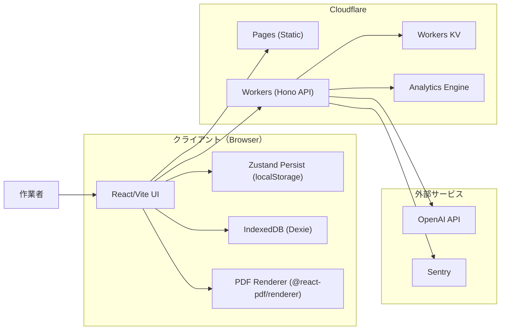
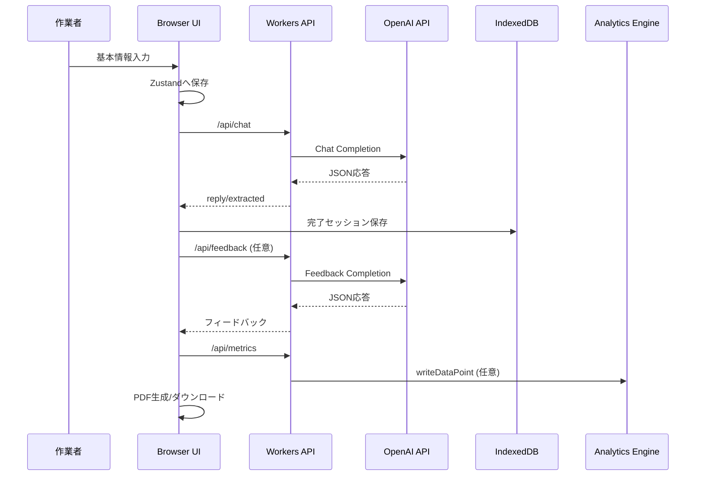
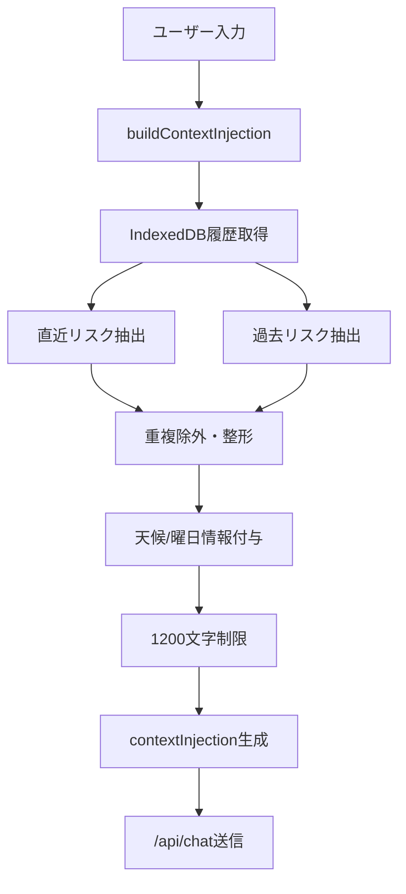
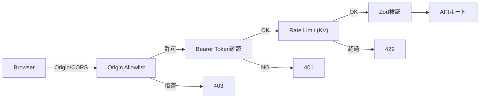

# システムアーキテクチャ設計書（Phase 2.1-2.8）

**対象**: Voice KY Assistant v2-modern（Phase 2.1-2.8）  
**目的**: 全体構成・責務・データフロー・運用境界を明確化する  
**更新日**: 2026-02-03

---

## 1. 参照資料

- `../ARCHITECTURE.md`
- `../00_planning/03_Phase2_Roadmap.md`
- `../00_planning/04_要件定義書_SRS.md`

---

## 2. 全体構成（論理アーキテクチャ）

```mermaid
graph TD
  User[作業者] --> Browser[クライアントUI<br/>(React/Vite)]
  Browser --> Pages[Cloudflare Pages<br/>(静的配信)]
  Browser --> Workers[Cloudflare Workers<br/>(Hono API)]

  Workers --> OpenAI[OpenAI API]
  Workers --> KV[Workers KV<br/>(Rate Limit / Feedback Cache)]
  Workers --> AE[Analytics Engine<br/>(Metrics)]
  Workers --> Sentry[Sentry / Logs]

  Browser --> LocalStorage[Zustand Persist<br/>(localStorage)]
  Browser --> IndexedDB[IndexedDB<br/>(Dexie.js)]
  Browser --> PDF[@react-pdf/renderer]
```

### 2.1 デプロイメント構成図（詳細）



### 2.2 時系列データフロー（俯瞰）



### 2.3 コンテキスト注入フロー



### 2.4 セキュリティ境界



---

## 3. コンポーネント責務

| コンポーネント | 責務 |
| :--- | :--- |
| **クライアントUI** | 基本情報入力、対話表示、危険度選択、完了画面、PDF生成 |
| **Zustand Persist** | 進行中セッション・UI状態の保持（localStorage） |
| **IndexedDB (Dexie)** | 完了セッションの履歴保存・検索・エクスポート |
| **Workers API** | `/api/chat` `/api/feedback` `/api/metrics` の提供、認証、レート制限 |
| **Workers KV** | レート制限カウンタ、フィードバックキャッシュ |
| **Analytics Engine** | KPIイベント保存（未設定時はログ） |
| **Sentry / Logs** | 例外・構造化ログの収集 |
| **OpenAI API** | チャット応答、フィードバック生成 |

---

## 4. 主要データフロー

1. **起動**: Browser が Pages から静的アセットを取得
2. **セッション開始**: 基本情報を Zustand に保存
3. **対話**: Browser → Workers `/api/chat` → OpenAI → Browser
4. **履歴保存**: 完了時に IndexedDB へ保存
5. **フィードバック**: 完了時に `/api/feedback` を任意で呼び出し
6. **KPI**: `/api/metrics` にイベント送信
7. **PDF生成**: ブラウザ内でPDF作成

---

## 5. セキュリティ境界

- **Origin Allowlist**: 許可オリジン以外は 403
- **レート制限**: 1分あたり30回（KV利用）
- **APIトークン**: `API_TOKEN` が設定されている場合は Bearer 必須
- **入力検証**: Zodでリクエスト・レスポンスを検証

---

## 6. 非機能設計の要点

- **性能**: 非ストリーミングJSON応答。入力トークン削減が最重要
- **安定性**: JSON破損時はフォールバック応答
- **可観測性**: 主要イベントを `/api/metrics` へ送信
- **プライバシー**: 履歴はクライアント内（IndexedDB）に留める

---

## 7. 現状未使用の拡張枠

- `SUPABASE_URL` / `SUPABASE_ANON_KEY`
- `WEATHER_API_BASE_URL`

現状のコードでは未使用。将来拡張用の枠として保持。

---

## 8. 関連ドキュメント

- `../10_design/02_Feature_Design_Phase2.md`
- `../10_design/03_API_Design.md`
- `../10_design/04_Data_Model_Design.md`
- `../10_design/05_Conversation_UX_Design.md`

