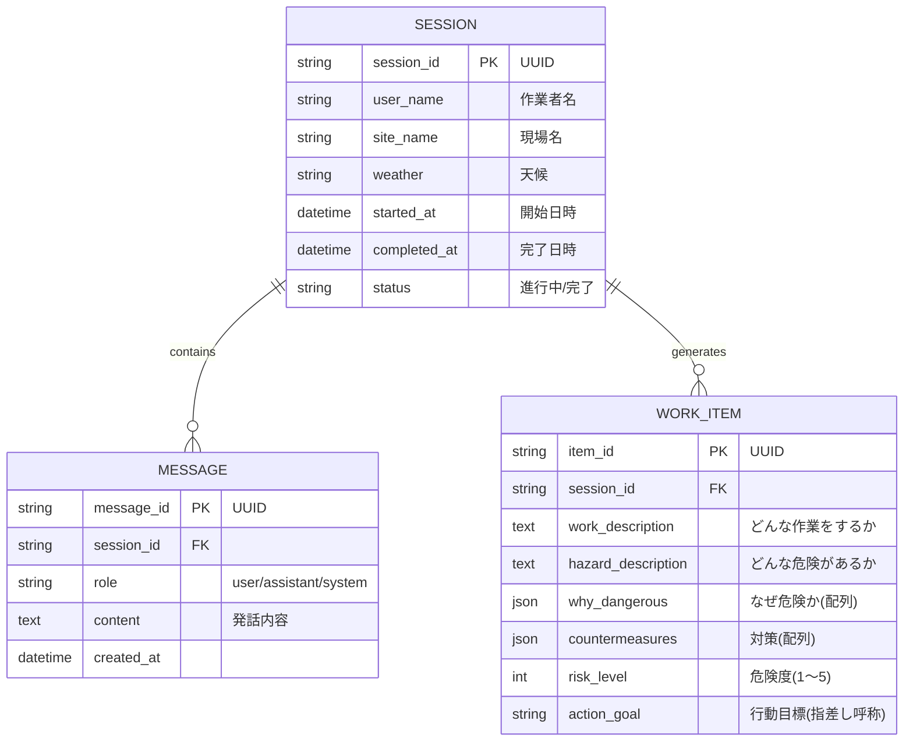

# システム設計書 (System Design Document)
更新日: 2026-02-25（AIプロバイダ構成・通信方式・データモデル記述を現行実装へ更新）

## 1. システムアーキテクチャ (System Architecture)

本システムは、高い可用性と低遅延を実現するため、エッジコンピューティングを活用したモダンな構成を採用しています。

```mermaid
graph TD
    User[📱 作業員 (User)] -->|HTTPS / Voice| CF[☁️ Cloudflare Pages (Frontend)]
    CF -->|HTTPS (JSON)| Workers[⚡ Cloudflare Workers (Backend)]
    
    subgraph Frontend [React SPA]
        UI[Components (UI)]
        Store[Zustand (State)]
        VoiceHook[useVoiceRecognition]
        APIClient[fetch API Client]
    end
    
    subgraph Backend [Hono API]
        Router[Router / Validator]
        Logic[Business Logic]
        Prompt[System Prompts]
        AIProvider[🤖 OpenAI / Gemini API]
    end
    
    CF --- Frontend
    Workers --- Backend
    
    Backend -->|Chat Completion| AIProvider
    Frontend -->|Client-side Generation| PDF[📄 PDF Renderer]
```

---

## 2. データモデル (Data Model / ER Diagram)

現在はクライアントサイド主導のストア管理ですが、論理的なデータモデルは以下の通りです。
将来的なデータベース(Supabase等)移行時もこの構造をベースとします。



---

## 3. コンポーネント設計 (Component Design)

### 3.1 フロントエンド (Frontend)

* **Store (Zustand)**
  * `kyStore`: KY活動全体のステート管理（セッション、メッセージ履歴、現在の作業項目）。
  * `useTTSStore`: 音声合成の状態管理。
* **Hooks**
  * `useVoiceRecognition`: Web Speech APIラッパー。音声認識の開始/停止、エラーハンドリング。
  * `useChat`: fetch APIクライアントを用いたAPI通信と、応答データのストア反映。
  * `useTTS`: ブラウザ標準の読み上げ機能ラッパー。
* **UI Components**
  * `ChatInterface`: メイン画面。チャットログと入力エリア。
  * `MicButton`: 音声入力の制御ボタン。状態に応じたアニメーション。

### 3.2 バックエンド (Backend)

* **Framework**: Hono (Cloudflare Workers)
* **Communication**: fetch + Zodスキーマ検証
  * フロントエンドは `src/lib/api.ts` のfetch実装を利用し、`src/lib/schema.ts` で入出力を型検証。
* **Middleware**
  * `zValidator`: Zodスキーマによるリクエストバリデーション。
  * `cors`: クロスオリジンリソース共有設定。
* **Routes**
  * `POST /api/chat`: チャット応答生成。

---

## 4. セキュリティ設計 (Security Design)

* **API通信**: 全て HTTPS (TLS) で暗号化。
* **認証**:
  * 現状: `Bearer` トークンによる簡易認証（環境変数 `API_TOKEN`）。
  * 将来: IDaaS (Auth0 / Supabase Auth) 連携を想定。
* **バリデーション**:
  * Zod により、API入り口ですべての入力値を厳格にチェック。不正なデータ構造や悪意あるペイロードを排除。
* **データ保護**:
  * Web Speech API (音声認識) はブラウザ/OSのセキュリティモデルに依存。
  * OpenAI API利用時は、データが学習に使われない設定（Zero Data Retentionポリシー適用対象）を確認して利用。

---

## 5. 技術スタック詳細 (Tech Stack)

| 領域 | 技術要素 | 選定理由 |
| :--- | :--- | :--- |
| **Language** | TypeScript | 型安全性による品質担保、開発効率向上 |
| **Frontend** | React, Vite, Tailwind CSS | モダンな開発体験、エコシステムの充実、スタイリング効率 |
| **State** | Zustand | Reduxより軽量で、Context APIより高機能。ボイラープレートが少ない |
| **Backend** | Cloudflare Workers (Hono) | 低レイテンシ、安価な運用コスト、API実装の単純性 |
| **Validation** | Zod | TypeScriptとの親和性が高く、ランタイムチェックが可能 |
| **AI/LLM** | OpenAI API / Gemini API（OpenAI互換） | `AI_PROVIDER` で切替可能。可用性とコスト最適化を両立 |
| **PDF** | @react-pdf/renderer | ReactコンポーネントとしてPDFを定義・生成できる |
