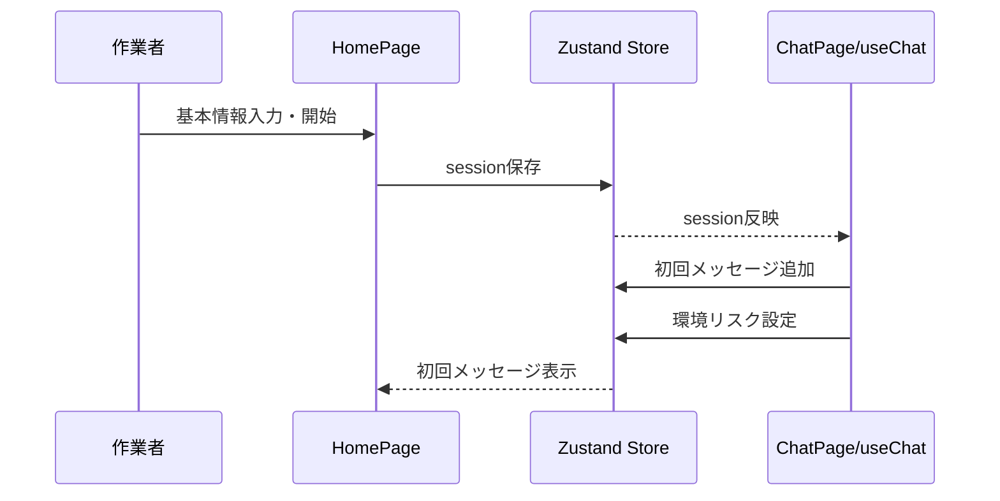
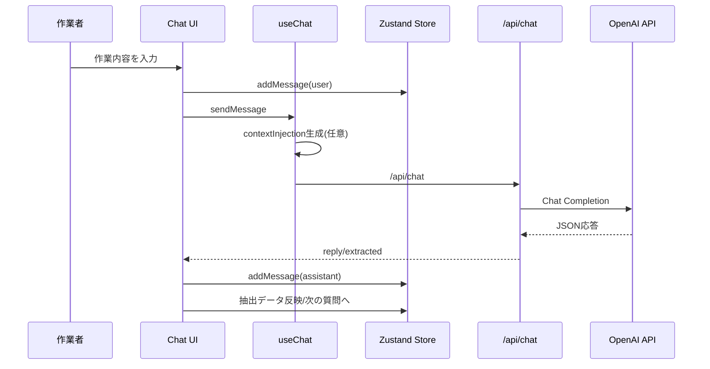
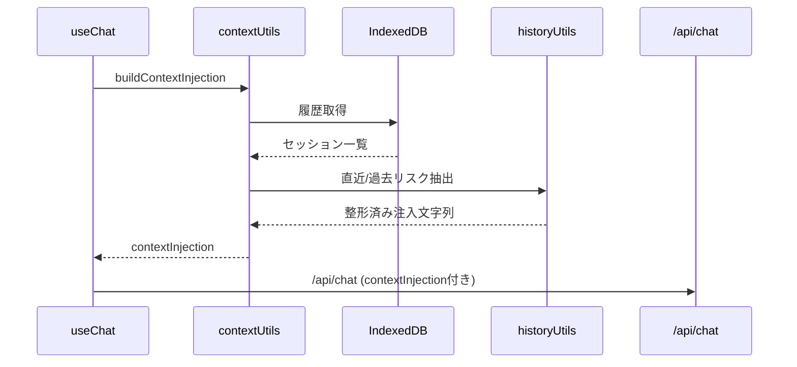
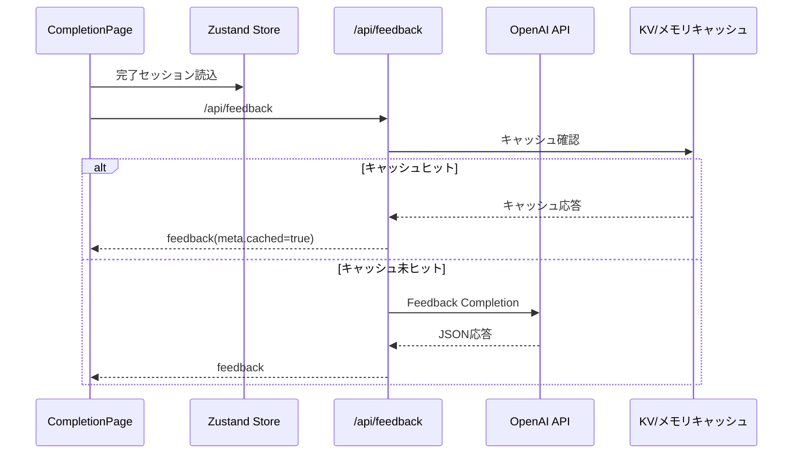
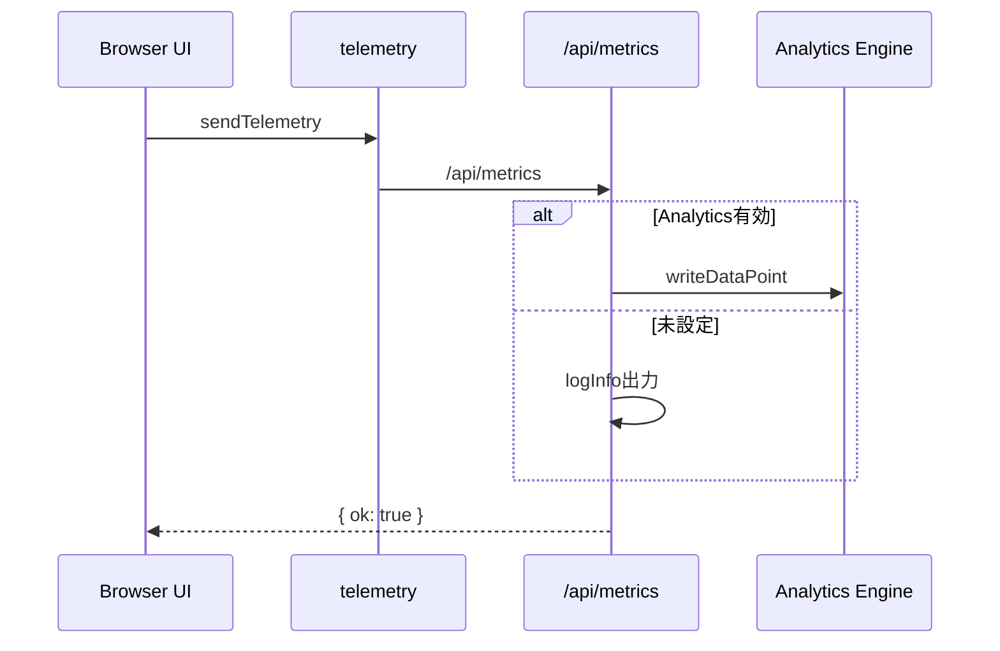
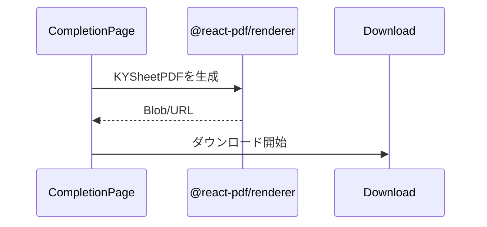

# 対話UX設計（v2-modern）

**目的**: 対話の質と自己決定感を両立し、形骸化を防ぐ  
**更新日**: 2026-02-07

---

## 1. 対話フロー（4フェーズ）

1. 現状把握（作業内容を聞く）
2. 本質追究（危険と要因を聞く）
3. 対策樹立（具体策を聞く）
4. 行動目標設定（最後に目標を決める）

---

## 2. nextAction 状態遷移

| 現在 | nextAction | 次の状態 |
|---|---|---|
| 開始 | ask_work | 作業入力 |
| 作業入力後 | ask_hazard | 危険入力 |
| 危険入力後 | ask_why | 要因入力 |
| 要因入力後 | ask_risk_level | 危険度入力 |
| 危険度入力後 | ask_countermeasure | 対策入力 |
| 対策入力後 | ask_more_work | 追加作業確認 |
| 追加作業あり | ask_work | 作業入力へ戻る |
| 追加作業なし | ask_goal | 行動目標入力 |
| 行動目標後 | confirm | 完了確認 |
| 確認完了 | completed | 終了 |

---

## 3. 質問のローテーション

- 完了済み作業数（`currentWorkItemCount`）に応じて質問の切り口を変える
- 1件目: 標準質問
- 2件目: 道具・環境視点
- 3件目以降: 慣れによる見落とし視点

---

## 4. 例外ケースの処理

- 先に対策が出た場合は「危険の確認」に戻す
- 先に行動目標が出た場合は「作業内容の確認」に戻す
- 「なぜ」という表現は避け、「どのような状況で」「何が原因で」を使う

---

## 5. UIとの対応

| UX要素 | 役割 | 実装 |
|---|---|---|
| チャットUI | 対話の基本画面 | `ChatBubble` / `ChatInput` |
| 危険度選択 | 1〜5の危険度入力 | `RiskLevelSelector` |
| 環境リスク表示 | 天候由来の注意 | `KYSessionPage` 上部アラート |
| 完了画面 | 目標表示・PDF出力 | `CompletionPage` |

### 音声入力（マイク）エラーのUX

- エラーはマイクボタン直下に**1行**で表示し、入力欄を圧迫しない（固定領域 + 省略）。
- エラーが出ても、入力欄に**1文字でも入力**したらエラー表示を消す。
- 致命エラー（`not-allowed` / `audio-capture` / `service-not-allowed`）は認識を停止し、エラー連打を抑止する。

---

## 6. コンテキスト注入の扱い

- 過去危険・直近危険・ヒヤリハット・曜日/天候をまとめて注入
- 参考情報であり、現場を最優先するようプロンプトで明示
- 注入が無い場合は通常フローで進行

---

## 7. 完了後の体験

- 行動目標カードを表示
- 直近の繰り返し危険を表示
- フィードバックカードは任意で表示
- PDFダウンロードを提供

---

## 8. ユースケース別シーケンス図

### UC-01 セッション開始

### UC-02 作業登録ループ

### UC-03 コンテキスト注入

### UC-04 フィードバック生成

### UC-05 KPI送信

### UC-06 PDF生成

---

## 9. KPI（UX指標）

- 会話ターン数
- エラー発生数
- フィードバック表示率
- PDFダウンロード率
