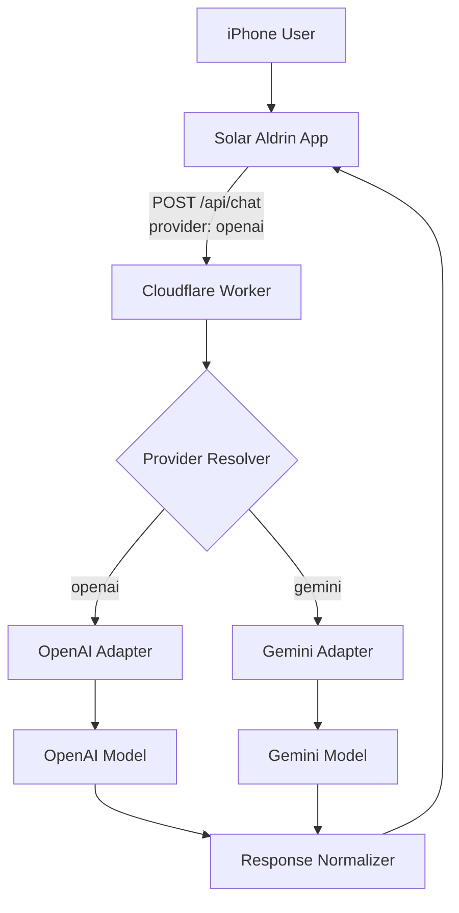

# iPhoneでのOpenAI / Gemini 両対応テスト環境構築の検討（改訂版）

更新日: 2026-02-11  
更新者: Codex (GPT-5)

## 0. 本改訂で修正した点

1. **実装パスの不整合を修正**  
   既存コードは `workers/lib/openai.ts` / `workers/routes/chat.ts` 構成のため、`workers/lib/llm/*` 前提の記述を現行構成に合わせました。
2. **Gemini接続方式を見直し**  
   初期実装は Google GenAI SDK 直結ではなく、まず **Gemini の OpenAI 互換エンドポイント**を使う方針に変更しました（既存 `fetch` ロジック再利用で低リスク）。
3. **プロバイダ指定方式を修正**  
   `X-Model-Provider` ヘッダー前提を見直し、初期版は `POST /api/chat` の JSON ボディに `provider` を追加する方式を推奨します（CORS/プリフライト影響を最小化）。
4. **モデル名の固定を廃止**  
   `gpt-4o-mini` / `gemini-xxx` の固定記述を避け、環境変数で切替可能な前提に修正しました。
5. **Structured Outputs互換リスクを明示**  
   OpenAI側は `response_format: json_schema` を利用中のため、Gemini側は互換性検証後に `json_schema` または `json_object + サーバー検証` を選択する運用を追加しました。

## 1. 目的

- **比較検証**: iPhone実機で対話体験（速度/精度/UX）をA/B比較し、運用上の採用可否を判断する。
- **可用性向上**: OpenAI障害時に Gemini へフォールバック可能な構成を準備する。

## 2. 推奨アーキテクチャ（現行コード準拠）

### 実装原則

1. **Adapter Pattern**  
   既存の `fetchOpenAICompletion` を共通化し、`openai` / `gemini` を同一インターフェースで扱う。
2. **サーバー側正規化**  
   返却スキーマ（`reply` / `extracted`）は Workers 側で統一し、フロントは provider差分を意識しない。
3. **観測可能性の確保**  
   `provider`, `model`, `durationMs`, `httpAttempts`, `errorCode` をログ/メトリクスへ必須付与する。

## 3. 接続方式の選択（改訂）

### 推奨: Phase 1 は OpenAI互換経路で開始

- Gemini 側を `https://generativelanguage.googleapis.com/v1beta/openai/` 経由で呼び出す。  
- 既存 `chat.completions` ベースの実装を再利用でき、導入差分が小さい。  
- 比較検証（A/B）を最短で開始できる。

### 代替: 直接SDK方式（Phase 2以降）

- 検証後に必要なら Google GenAI SDK へ移行する。  
- 導入初期はバンドルサイズ増加・実装差分拡大のため優先度を下げる。

## 4. QA観点（必須）

1. **回帰保証**  
   `provider=openai` で既存 E2E / unit / integration が全通過すること。
2. **互換性検証**  
   `provider=gemini` で `AI_RESPONSE_INVALID_JSON` / `AI_RESPONSE_INVALID_SCHEMA` の増加有無を定量確認。
3. **モバイル実機検証**  
   iPhone実機で 4G/5G/Wi-Fi 条件を分け、体感遅延と失敗率を比較する。
4. **失敗時のUX**  
   Gemini固有エラー時も既存の再試行導線（silent/manual retry）が壊れないこと。

## 5. リスクと対策（改訂）

1. **Structured Outputs差異**
   - リスク: provider間で `json_schema` 追従度が異なる可能性。
   - 対策: 返却JSONを必ずサーバー側でZod検証し、失敗時は既存エラーコードへ正規化。
2. **モデル仕様変更**
   - リスク: モデル名や挙動が更新される。
   - 対策: `OPENAI_MODEL_CHAT` / `GEMINI_MODEL_CHAT` を環境変数化。
3. **可観測性不足**
   - リスク: 「速い/遅い」「高品質/低品質」が主観評価で終わる。
   - 対策: provider別メトリクス収集を先行実装。

## 6. 実装計画ドキュメント

詳細な工程・影響ファイル・受け入れ基準は以下に分離しました。  
`apps/v2-modern/docs/20_phases/Phase2.11_DualApi_Implementation_Plan.md`

## 参考（公式）

- OpenAI Chat Completions Overview  
  https://developers.openai.com/api/reference/chat-completions/overview/
- OpenAI Structured Outputs Guide  
  https://platform.openai.com/docs/guides/structured-outputs
- Gemini OpenAI Compatibility（Google）  
  https://ai.google.dev/gemini-api/docs/openai
