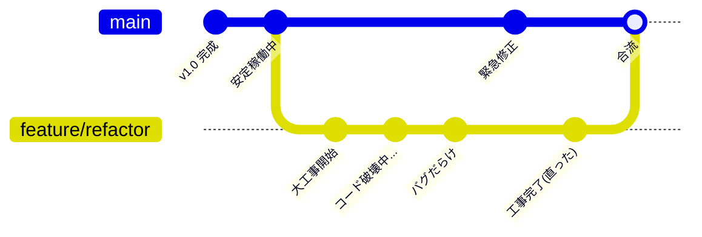

# 🔰 【学習資料】Gitの「ブランチ」とは？

「ブランチを切る」という言葉のイメージと、なぜそれが必要なのかを図解します。

## 1. ブランチ (Branch) のイメージ

ブランチとは、**「歴史のパラレルワールド」** を作る機能です。

### 🌳 図解：RPGのセーブデータで例える

* **Mainブランチ (主人公の世界)**:
  * 誰もが遊ぶ「本番のセーブデータ」。
  * ここで実験をしてバグらせると、ゲームが進行不能になってしまいます。
* **Featureブランチ (実験の世界)**:
  * 「ボス戦の前で別のセーブデータを作る」のと同じです。
  * この世界でどれだけ破壊的な実験（装備を全部捨てるとか）をしても、**Mainブランチ（本番データ）には1ミリも影響しません。**

### 実際の開発フロー

1. **`main`**: 常に「動く状態」を保つ。
2. **`feature/xxx`**: ここで「工事」をする。工事中は動かなくてOK。
3. **Merge (マージ)**: 工事が終わって「完璧に動く」ことが確認できたら、`main` に変更を取り込む（合流させる）。

## 2. 今回やること

### 現状 (Main)

* **状態**: Phase 2.1 が完了し、安定して動いている。
* **リスク**: ここで「Store分割」や「JSON構造化」などの**大手術**を直接行うと、アプリが一時的に動かなくなる（ビルドエラーなど）リスクがある。

### 作戦

1. **ブランチ作成**: `refactor/phase2x-structure` というパラレルワールドを作る。
2. **移動**: その世界に移動する。
3. **手術**: 思う存分、コードを書き換える。
    * もし失敗しても、`main` に戻れば元の平和な世界がある。
4. **検証**: 手術が成功したことを確認する。
5. **合流**: `main` にマージする。

---

## 3. 基本コマンド集

| コマンド | 意味 | RPGで言うと |
| :--- | :--- | :--- |
| `git checkout -b <名前>` | 新しいブランチを作って移動する | 新しいセーブデータを作ってロードする |
| `git checkout <名前>` | 既存のブランチに移動する | 別のセーブデータをロードする |
| `git branch` | 今いるブランチを確認する | 今どのセーブデータか確認する |
| `git merge <名前>` | 別のブランチの変更を取り込む | クリアデータを本番データに統合する |
