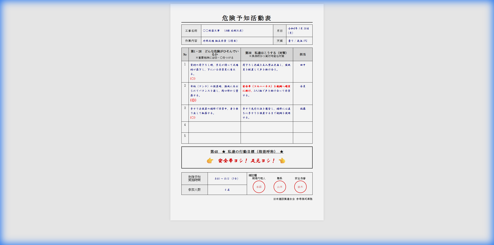

# 危険予知活動表（KY活動表）サンプル

## 📋 出典・根拠

| 項目 | 内容 |
|------|------|
| **基本フレームワーク** | 厚生労働省「危険予知訓練（KYT）4ラウンド法」 |
| **参考資料** | 中央労働災害防止協会（中災防）KYT基礎4ラウンド法 |
| **法的根拠** | 労働安全衛生法 第59条（安全衛生教育）、第60条（職長教育） |
| **業界基準** | 建設業労働災害防止協会（建災防）推奨様式 |

---

## �️ 完成イメージ

> **💡 ポイント**
>
> - **手書き風フォント**で現場のリアリティを再現
> - **指差呼称（チーム行動目標）**を大きく配置
> - **確認印欄**で承認フローを可視化

*HTMLソースコード: [ky_sheet_mockup.html](ky_sheet_mockup.html)*

---

## �📝 危険予知活動表（足場設置作業）

### 基本情報

| 項目 | 記入内容 |
|------|--------|
| 工事名称 | ○○新築工事　（A棟 北側工区） |
| 作業内容 | **外部足場 組立作業（3層目）** |
| 月日 | 令和8年 1月 20日 (月) |
| 天候 | 曇り / 気温 5℃ |

---

### ⚠️ 危険のポイント（第1・2R）と対策（第3R）

| No. | 危険のポイント | 重要度 | 私達はこうする（対策） | 担当 |
|-----|----------------|--------|------------------------|------|
| 1 | 資材の荷下ろし時、手元が滑って足場材が落下し、下にいる作業員に当たる。 | ○ | 荷下ろし区域を立入禁止区画し、監視員を配置して声を掛け合う。 | 田中 |
| 2 | 布板（アンチ）の設置時、強風にあおられてバランスを崩し、開口部から墜落する。 | **◎** | **安全帯（フルハーネス）を親綱へ確実に掛け**、2人1組で声を掛け合って作業する。 | 全員 |
| 3 | 手すり未設置の端部で作業中、身を乗り出して転落する。 | ○ | 手すり先行工法を遵守し、端部には直ちに手すりを設置するまで親綱を使用する。 | 佐藤 |

---

### 🎯 私達の行動目標（指差呼称）

> **安全帯ヨシ！ 足元ヨシ！**

#### ☝️ 指差し呼称項目

| 場面 | 呼称 |
|------|------|
| 安全帯フック掛け時 | 「安全帯、ヨシ！」 |
| 足場板設置前 | 「足元、ヨシ！」 |
| 作業開始前 | 「下方確認、ヨシ！」 |
| 昇降時 | 「三点支持、ヨシ！」 |

---

### リスクアセスメント評価（オプション）

| No. | 危険 | 重篤度(A) | 可能性(B) | リスク(A×B) | 優先度 |
|-----|------|-----------|-----------|-------------|--------|
| 3 | 墜落 | 3 | 3 | 9 | 高 |
| 1 | 落下物 | 2 | 2 | 4 | 中 |
| 4 | 転落 | 3 | 2 | 6 | 中 |

**評価基準**

- 重篤度(A): 1=軽傷、2=中程度、3=重傷・死亡
- 可能性(B): 1=稀、2=時々、3=頻繁
- リスク: 1-2=低、3-4=中、6-9=高

---

### 確認欄

| 役職 | 氏名 | 確認サイン |
|------|------|------------|
| 作業責任者 | | |
| 職長 | | |
| 現場代理人 | | |

---

## 📌 足場設置作業の典型的な危険要素（参考）

### 墜落・転落

- [ ] 安全帯未使用
- [ ] 手すり未設置
- [ ] 足場板のずれ・隙間
- [ ] 昇降設備の不備

### 落下・飛来

- [ ] 資材の固定不良
- [ ] 工具の落下
- [ ] 強風による飛散

### 倒壊・崩壊

- [ ] 壁つなぎ不足
- [ ] 根がらみ未設置
- [ ] 地盤の不安定

### その他

- [ ] 電線への接触
- [ ] 第三者の立入り
- [ ] 熱中症（夏季）
- [ ] 凍結（冬季）

---

## 📚 参考リンク

1. [厚生労働省 - 危険予知訓練（KYT）](https://www.mhlw.go.jp/)
2. [中央労働災害防止協会 - KYT基礎4ラウンド法](https://www.jisha.or.jp/)
3. [建設業労働災害防止協会](https://www.kensaibou.or.jp/)
4. [中小建設業特別教育協会 - KYTイラストシート](https://www.tokubetu.or.jp/)
