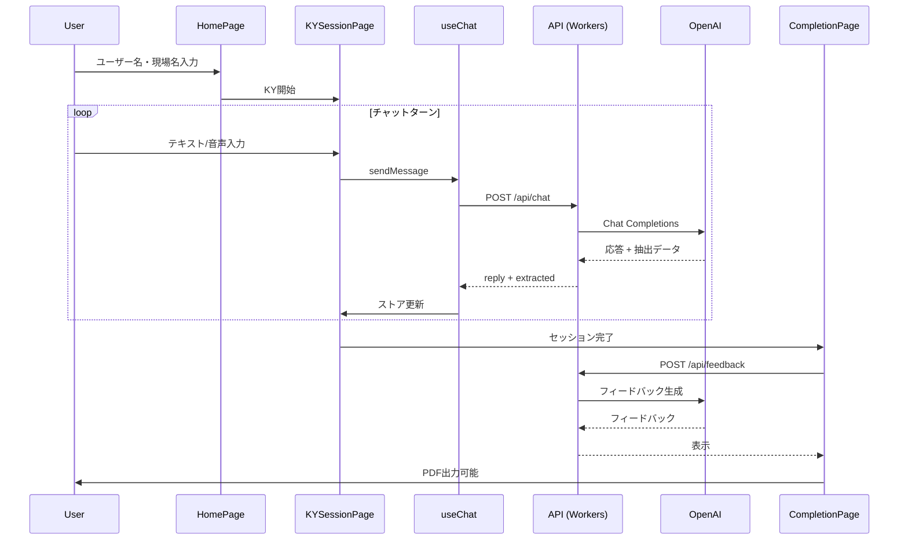

# v2フォルダ詳細レポート

**最終更新日**: 2026-02-08

## 目的と対象

本レポートは、`apps/v2-modern` にあるv2アプリのフォルダ構成と中身を、フロントエンド・バックエンドの主要コードを中心に詳しく説明するものです。

---

## v2フォルダの全体構成（概要）

`apps/v2-modern` は、フロントエンド（`src`）、バックエンド（`workers`）、テスト（`tests`）、静的ファイル（`public`）、ドキュメント（`docs`）、スクリプト（`scripts`）、レポート（`reports`）などで構成されています。

### 技術スタック

| 領域 | 技術 |
|------|------|
| フロントエンド | React 19 + TypeScript + Vite + React Router |
| UI | Tailwind CSS + shadcn/ui + Lucide Icons |
| 状態管理 | Zustand |
| 音声 | Web Speech API（認識/読み上げ） |
| PDF | @react-pdf/renderer |
| バックエンド | Hono（Cloudflare Workers） |
| AI | OpenAI Chat Completions API（gpt-4o-mini） |
| 永続化 | IndexedDB（Dexie）/ KV（レート制限用） |

### ディレクトリ構造

```text
apps/v2-modern/
├── src/                    # フロントエンド本体
│   ├── components/         # UIコンポーネント (11個 + ui/pdf/fanfare)
│   ├── hooks/              # カスタムフック (4個)
│   ├── pages/              # ページコンポーネント (5個 + debug)
│   ├── stores/             # Zustandストア (slices: 4個)
│   ├── types/              # TypeScript型定義
│   ├── lib/                # API / ユーティリティ (14ファイル)
│   └── constants/          # 定数定義
├── workers/                # Hono API (Cloudflare Workers)
│   ├── routes/             # APIルート (3個)
│   ├── prompts/            # AIプロンプト (4個)
│   ├── lib/                # ユーティリティ (2個)
│   ├── middleware/         # ミドルウェア (1個)
│   └── observability/      # ログ・監視 (2個)
├── tests/                  # テスト
│   ├── e2e/                # E2Eテスト (5個)
│   ├── unit/               # ユニットテスト (16個)
│   └── integration/        # 統合テスト
├── docs/                   # ドキュメント
│   ├── 00_planning/        # 計画・フェーズ管理
│   ├── 10_design/          # 設計ドキュメント
│   ├── 20_manuals/         # マニュアル
│   └── 30_reviews/         # レビュー記録
├── scripts/                # 運用スクリプト
│   └── security/           # セキュリティ関連
├── reports/                # テストレポート
├── experiments/            # 実験用コード
└── public/                 # 静的ファイル
```

---

## フロントエンド（src）の詳細

### 1. エントリポイントとルーティング

| ファイル | 役割 |
|----------|------|
| `main.tsx` | Sentry・Web Vitalsの初期化、Appの描画 |
| `App.tsx` | React Routerによるルーティング定義 |

**ルーティング構成:**

- `/` → HomePage（トップ画面）
- `/session` → KYSessionPage（KYセッション進行）
- `/complete` → CompletionPage（完了画面）
- `/history` → HistoryPage（履歴一覧）
- `/history/:id` → HistoryDetailPage（履歴詳細）
- `/debug/pdf` → PDFDebugPage（PDF確認用）

### 2. 主要ページ（pages）

| ページ | ファイルサイズ | 役割 |
|--------|---------------|------|
| HomePage | 12KB | ユーザー名・現場名・天候の入力、KY開始 |
| KYSessionPage | 11KB | チャットUI、音声入力、AIとの対話 |
| CompletionPage | 19KB | KY完了画面、フィードバック表示、PDF出力 |
| HistoryPage | 6KB | 過去のKY履歴一覧 |
| HistoryDetailPage | 10KB | 履歴の詳細閲覧 |

### 3. コンポーネント（components）

#### メインコンポーネント

| コンポーネント | 役割 |
|---------------|------|
| ChatBubble | チャットメッセージの吹き出し表示 |
| ChatInput | メッセージ入力欄 |
| MicButton | 音声入力ボタン（状態表示付き） |
| RiskLevelSelector | 危険度選択UI |
| WeatherSelector | 天候選択UI |
| ConfirmedInfoCard | 確定した作業情報の表示 |
| FeedbackCard | AIフィードバック表示 |
| FeedbackSkeletonCard | フィードバック読込中スケルトン |
| GoalPolishCard | 行動目標ブラッシュアップ提案 |
| SupplementCard | 追加リスク補足表示 |
| RecentRiskBadge | 最近のリスクバッジ |

#### サブディレクトリ

| ディレクトリ | 内容 |
|-------------|------|
| `ui/` | 共通UIコンポーネント（Button, Card, Input, Textarea, Alert） |
| `pdf/` | PDF生成コンポーネント（KYSheetPDF） |
| `fanfare/` | 完了演出コンポーネント |

### 4. カスタムフック（hooks）

| フック | サイズ | 役割 |
|--------|-------|------|
| useChat | 20KB | チャット制御の中心ロジック。API呼び出し、エラー正規化、リトライ処理 |
| usePDFGenerator | 4KB | @react-pdf/rendererを使ったPDF生成・ダウンロード |
| useTTS | 5KB | Web Speech APIによる音声読み上げ制御 |
| useVoiceRecognition | 8KB | Web Speech APIによる音声認識制御 |

### 5. 状態管理（stores）

**Zustandストア構成** (`kyStore.ts` で統合):

| スライス | 役割 |
|----------|------|
| sessionSlice | セッション情報（ユーザー名、現場名、天候、開始時刻など） |
| chatSlice | メッセージ履歴、送信状態、エラー状態 |
| workItemSlice | 作業項目（危険要因、対策、危険度など） |
| feedbackSlice | AIフィードバック（褒め、ヒント、補足リスク、行動目標添削） |

**その他のストア:**

- `useTTSStore` - TTS再生状態

### 6. ライブラリ（lib）

| ファイル | 役割 |
|----------|------|
| api.ts | postChat, postFeedback などのAPI呼び出し |
| apiBase.ts | APIエラークラス定義 |
| db.ts | IndexedDB（Dexie）によるローカル永続化 |
| schema.ts | Zodスキーマ定義（API応答検証） |
| kySchemas.ts | KYデータ構造のZodスキーマ |
| contextUtils.ts | 文脈注入ユーティリティ |
| historyUtils.ts | 履歴管理ユーティリティ |
| exportUtils.ts | エクスポート機能 |
| validation.ts | 入力検証 |
| clientId.ts | クライアントID生成 |
| dateUtils.ts | 日付ユーティリティ |
| riskLevelVisibility.ts | 危険度表示制御 |
| speechRecognitionErrors.ts | 音声認識エラーハンドリング |
| utils.ts | 汎用ユーティリティ |

**サブディレクトリ:**

- `chat/` - チャット関連ユーティリティ
- `observability/` - Sentry, telemetry, webVitals

### 7. 型定義（types）

| ファイル | 役割 |
|----------|------|
| ky.ts | KYセッション、作業項目、危険要因などの型定義 |
| speech.d.ts | Web Speech API型拡張 |

### 8. 定数（constants）

| ファイル | 役割 |
|----------|------|
| ky.ts | KY関連の定数（デフォルト値、制限値など） |

---

## バックエンド（workers）の詳細

### 1. 入口と共通処理（index.ts）

- Honoアプリのエントリポイント
- CORS設定（開発用/本番用の切り替え）
- API認証（`API_TOKEN`）
- レート制限
- リクエストID付与
- Sentry連携

### 2. APIルート（routes）

| ルート | ファイルサイズ | 役割 |
|--------|---------------|------|
| chat.ts | 32KB | `/api/chat` - OpenAI APIを呼び出し、AI応答と抽出データを返却 |
| feedback.ts | 13KB | `/api/feedback` - KY結果に対するフィードバック生成 |
| metrics.ts | 2KB | `/api/metrics` - イベント記録（Analytics Engine連携） |

**chat.ts の特記事項:**

- 入力文字数制限、禁止語フィルタ
- 会話履歴の制限
- JSON修復プロンプトによる再試行
- 観測用メタ情報（トークン数、リトライ情報など）

**エラーコード:**

| コード | ステータス | 説明 |
|--------|-----------|------|
| AI_RESPONSE_INVALID_JSON | 502 | JSONパース失敗 |
| AI_RESPONSE_INVALID_SCHEMA | 502 | スキーマ検証失敗 |
| AI_UPSTREAM_ERROR | 502/503 | OpenAI側エラー |

### 3. AIプロンプト（prompts）

| ファイル | サイズ | 役割 |
|----------|-------|------|
| soloKY.ts | 8KB | ソロKYセッション用システムプロンプト |
| feedbackKY.ts | 2KB | フィードバック生成用プロンプト |
| supplementKY.ts | 0.4KB | 追加リスク補足用プロンプト |
| polishGoal.ts | 0.4KB | 行動目標ブラッシュアップ用プロンプト |

### 4. ミドルウェア（middleware）

| ファイル | 役割 |
|----------|------|
| rateLimit.ts | KV Storageを使ったレート制限 |

### 5. 観測・ログ（observability）

| ファイル | 役割 |
|----------|------|
| logger.ts | 構造化ログ出力 |
| sentry.ts | Sentryエラー報告設定 |

### 6. ライブラリ（lib）

| ファイル | 役割 |
|----------|------|
| openai.ts | OpenAI API呼び出しラッパー（リトライ、タイムアウト処理） |
| securityMode.ts | セキュリティモード判定 |

---

## テスト（tests）の詳細

### E2Eテスト（tests/e2e）

| ファイル | 役割 |
|----------|------|
| real-cost-scenario.spec.ts | 実費テスト（本番API使用、レポート生成） |
| ky-session-e2e.spec.ts | KYセッションのフルフロー |
| live-ai-chat.spec.ts | AIチャット機能 |
| ios_compatibility.spec.ts | iOS互換性 |
| pdf-visual.spec.ts | PDFビジュアル確認 |

### ユニットテスト（tests/unit）

| 分類 | テストファイル |
|------|---------------|
| API | api.chatError.test.ts, apiBase.test.ts |
| ストア | kyStore.test.ts |
| コンポーネント | completionPage.test.tsx, micButton.errorClear.test.tsx |
| フック | useChat.retry.test.tsx |
| ユーティリティ | historyUtils.test.ts, contextInjection.test.ts, riskLevelVisibility.test.ts, speechRecognitionErrors.test.ts |
| バックエンド | rateLimit.test.ts, openaiHttpError.test.ts, logger.test.ts, securityMode.test.ts, metrics.test.ts |
| スキーマ | schema.test.ts |

---

## ドキュメント（docs）の詳細

### ディレクトリ構成

| ディレクトリ | 内容 |
|-------------|------|
| 00_planning/ | フェーズ計画、機能カタログ、ロードマップ |
| 10_design/ | 設計ドキュメント |
| 20_manuals/ | 運用マニュアル |
| 30_reviews/ | レビュー記録 |

### 主要ドキュメント

| ファイル | 役割 |
|----------|------|
| ARCHITECTURE.md | アーキテクチャ概要 |
| PHASE2_SETUP.md | Phase 2セットアップガイド |
| feature_overview_for_users.md | ユーザー向け機能概要 |
| test_inventory.md | テスト一覧 |
| refactoring_plan.md | リファクタリング計画 |
| refactoring_review.md | リファクタリングレビュー |

---

## スクリプト（scripts）の詳細

| ファイル | 役割 |
|----------|------|
| generate_perf_summary.mjs | 性能サマリレポート生成 |
| prune_real_cost_reports.mjs | 実費テストレポート整理 |
| phase22_perf_bench.mjs | Phase 2.2 性能ベンチマーク |
| start_iphone_test.ps1 | iPhoneテスト起動 |
| fix_links.ps1 | リンク修正 |
| rename_docs.ps1 | ドキュメントリネーム |

### セキュリティスクリプト（scripts/security）

セキュリティ運用の自動化スクリプト群

---

## 主要なデータフロー



---

## エラーハンドリング

### 1. Chat APIのエラー

| エラー種別 | 原因 | 対策 |
|-----------|------|------|
| auth | 認証エラー | 管理者にAPIトークン設定を確認 |
| rate_limit | レート制限 | 待機後リトライ |
| timeout | タイムアウト | サイレントリトライ |
| server | サーバーエラー | JSON修復プロンプトで再試行 |

### 2. 音声機能のエラー

| エラー種別 | 原因 | 対策 |
|-----------|------|------|
| not-allowed | マイク権限拒否 | テキスト入力に誘導 |
| audio-capture | 音声取得失敗 | テキスト入力に誘導 |
| end タイムアウト | onend未発火 | フォールバックタイムアウト |

---

## セキュリティと運用

### 環境変数

| 変数名 | 必須 | 説明 |
|--------|------|------|
| OPENAI_API_KEY | ✅ | OpenAI APIキー |
| API_TOKEN | 本番 | API認証トークン |
| REQUIRE_API_TOKEN | - | 1で常時必須化 |
| STRICT_CORS | - | 1で厳格CORS |
| REQUIRE_RATE_LIMIT_KV | - | 1でKV必須化 |

### 運用コマンド

```bash
# 開発サーバー起動
npm run dev:all

# ビルド
npm run build

# デプロイ
npm run deploy:workers
npm run deploy:pages

# セキュリティ運用
npm run security:ops

# 実費テスト
npm run test:cost:ops

# レポート整理
npm run reports:prune
```

---

## 補足情報

### 永続化

- **ローカル**: IndexedDB（Dexie）でセッション履歴を保存
- **サーバー**: KV Storageでレート制限状態を管理
- **将来対応予定**: Supabase認証/データ永続化

### 観測・監視

- **フロントエンド**: Sentry + Web Vitals + telemetry
- **バックエンド**: 構造化ログ + Sentry + Analytics Engine

---

## 最後に

v2は、フロントエンドのチャット体験・音声機能・PDF出力と、バックエンドのAPI/エラー処理/セキュリティが一体化した構成です。テストは16のユニットテストと5のE2Eテストで品質を担保し、ドキュメントは計画・設計・マニュアル・レビューの4カテゴリで整理されています。
