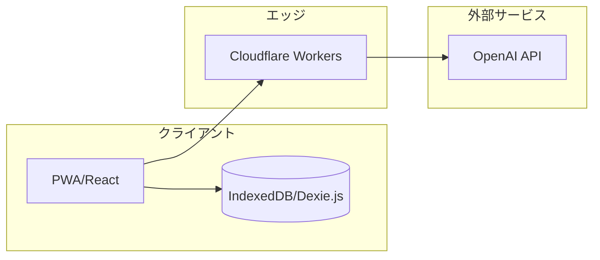

# スケール課題と対応策レポート

## 1. 目的

本レポートは、Voice KY Assistant（Phase 2 Modern）を利用人数が増加する前提でスケールさせる際の**ボトルネック**と**技術的懸念**を洗い出し、**対応策**と**概算費用**を提示するものです。

---

## 2. エグゼクティブサマリー

> [!IMPORTANT]
> **現在のアプリ構成で、変更なしに同時利用できるのは概ね10〜30人程度が現実的な上限です。**
> 100人以上の同時利用には、インフラ増強とアーキテクチャ改修が必須となります。

| 同時利用規模 | 実現可能性 | 主な変更点 | 推定月額費用 |
|:---:|:---|:---|:---:|
| **〜10人** | ✅ 現行構成でOK | 変更不要 | 〜¥5,000 |
| **〜30人** | ⚠️ 限界ラインに近い | 監視と最適化を推奨 | ¥5,000〜¥15,000 |
| **100人** | 🔧 改修必要 | 有料プラン移行、キュー導入、サーバーDB検討 | ¥20,000〜¥50,000 |
| **500人** | 🔧🔧 中規模改修 | APIティア引き上げ、サーバーDB導入、非同期処理 | ¥100,000〜¥200,000 |
| **1000人** | 🔧🔧🔧 大規模改修 | マルチDB構成、キャッシュ層、認証基盤 | ¥300,000〜¥500,000+ |

---

## 3. 現在のアプリ実力分析

### 3.1 現行アーキテクチャの概要



> [!NOTE]
> **現在の実装状況（Phase 2時点）:**
>
> - **データ保存**: クライアント側の**IndexedDB（Dexie.js）のみ**
> - **サーバー側DB**: **未実装**（D1/R2はPhase 3で導入予定）
> - **Workers**: AIプロキシとして機能。レート制限実装済み。

### 3.2 各層の技術的制約

| 層 | サービス | 主要な制約 | 現行プラン |
|:---|:---|:---|:---|
| **クライアントDB** | IndexedDB（Dexie.js） | 端末ローカルのみ、端末間同期なし | - |
| **エッジ処理** | Cloudflare Workers | Free: 10万req/日、Paid: 1,000万req/月 | Free（想定） |
| **サーバーDB** | **未実装** | 現在は存在しない（将来D1導入予定） | - |
| **ストレージ** | **未実装** | 現在は存在しない（将来R2導入予定） | - |
| **AI推論** | OpenAI API | Tier1: 500RPM、Tier2: 5,000RPM | Tier1（想定） |

### 3.3 1回のKYセッションで発生する負荷

| 項目 | 内容 | 負荷量 |
|:---|:---|:---|
| AI API呼び出し | 対話3〜6往復 × プロンプト＋応答 | 3〜6リクエスト、約2,000〜5,000トークン |
| Workers実行 | AI呼び出しのプロキシ | 5〜10リクエスト、各10〜50ms |
| IndexedDB保存 | セッション保存（クライアント側） | ローカル処理のみ |

### 3.4 現行構成での同時利用限界

**前提条件:**

- 1セッション = 5分間で完了
- 1セッションあたり AI 5リクエスト、Workers 8リクエスト

| 同時ユーザー | AI RPM | Workers 負荷 | 評価 |
|:---:|:---:|:---:|:---|
| 5人 | 5 RPM | 8 req/min | ✅ 余裕あり |
| 10人 | 10 RPM | 16 req/min | ✅ Free枠内 |
| 30人 | 30 RPM | 48 req/min | ⚠️ 限界に近い |
| 50人 | 50 RPM | 80 req/min | ❌ Free枠を超過する可能性 |
| 100人 | 100 RPM | 160 req/min | ❌ 確実に超過、遅延・エラー発生 |

> [!NOTE]
> レート制限（30回/分）が実装されたため、30人以上で同時アクセスが集中した場合は、一部ユーザーに待機（429エラー）が発生します。

---

## 4. 利用規模別の必要変更と対応策

### 4.1 同時利用100人規模

> [!WARNING]
> **現行構成のままでは対応不可**。有料プラン移行とアーキテクチャ改修が必須です。

#### 4.1.1 発生する問題

| 層 | 問題 | 影響 |
|:---|:---|:---|
| Workers | Free枠（10万req/日）を超過 | リクエスト拒否 |
| OpenAI | Tier1（500RPM）を超過 | 429エラー多発 |
| データ同期 | 端末間でデータ共有できない | 運用上の制約 |

#### 4.1.2 必要な対応

| 対応項目 | 内容 | 工数目安 | 費用目安 |
|:---|:---|:---:|:---:|
| **Workers有料化** | $5/月プランに移行（1,000万req/月） | 1時間 | ¥750/月 |
| **OpenAI Tier引き上げ** | $50以上の支払い実績でTier2（5,000RPM）へ | 即時 | 従量課金 |
| **リクエストキュー** | AI呼び出しを非同期キューで制御 | 2〜3日 | 実装コスト |
| **レート制限強化** | ユーザー単位で1分あたりの上限を設定 | - | ✅ 実装済み |
| **サーバーDB検討** | D1導入でデータ共有を可能に（オプション） | 1〜2週間 | 設計・実装コスト |

#### 4.1.3 推定月額費用

```
Workers:        ¥750
OpenAI:         100人 × 20回/月 × ¥5 = ¥10,000
監視:           ¥2,000〜¥5,000
────────────────────────────────
合計:           ¥13,000〜¥16,000/月
```

---

### 4.2 同時利用500人規模

> [!CAUTION]
> **中規模の改修が必要**。サーバー側DBの導入が必須です。

#### 4.2.1 発生する問題

| 層 | 問題 | 影響 |
|:---|:---|:---|
| IndexedDB | 端末ローカルのみでは組織運用が困難 | データ分散 |
| OpenAI | Tier2でも500×5=2,500RPMでピーク時に超過 | エラー多発 |
| Workers | CPU時間の累積で料金増加 | コスト増 |
| 運用 | 障害影響が全ユーザーに波及 | 信頼性低下 |

#### 4.2.2 必要な対応

| 対応項目 | 内容 | 工数目安 | 費用目安 |
|:---|:---|:---:|:---:|
| **D1（サーバーDB）導入** | セッションデータをサーバー側に保存 | 1〜2週間 | ¥500〜¥5,000/月 |
| **R2（ストレージ）導入** | PDF/画像をクラウドに保存 | 1週間 | ¥500〜¥2,000/月 |
| **OpenAI Tier3+** | $200支払い実績でTier3へ（5,000RPM、4M TPM） | 即時 | 従量課金 |
| **非同期処理基盤** | Cloudflare Queuesまたは外部MQを導入 | 1週間 | ¥3,000〜/月 |
| **キャッシュ層** | 定型プロンプト/レスポンスのキャッシュ | 3〜5日 | 実装コスト |
| **監視ダッシュボード** | Grafana等で可視化 | 2〜3日 | ¥5,000〜/月 |

#### 4.2.3 推定月額費用

```
Workers:        ¥3,000〜¥10,000
OpenAI:         500人 × 20回/月 × ¥5 = ¥50,000
D1/R2:          ¥1,000〜¥7,000
Queues/MQ:      ¥3,000〜¥5,000
監視:           ¥5,000〜¥10,000
────────────────────────────────
合計:           ¥62,000〜¥82,000/月
```

---

### 4.3 同時利用1000人規模

> [!CAUTION]
> **大規模なアーキテクチャ刷新が必要**。エンタープライズ向けの設計パターンを採用する必要があります。

#### 4.3.1 発生する問題

| 層 | 問題 | 影響 |
|:---|:---|:---|
| D1 | シングルスレッド限界（100QPS超で遅延） | 深刻な遅延 |
| OpenAI | Tier3でもピーク時に超過の可能性 | サービス停止リスク |
| Workers | 同時実行数の管理が複雑化 | 運用負荷増大 |
| 認証 | APIキー管理が煩雑に | セキュリティリスク |

#### 4.3.2 必要な対応

| 対応項目 | 内容 | 工数目安 | 費用目安 |
|:---|:---|:---:|:---:|
| **D1シャーディング** | 現場/部署単位で複数DBに分割 | 2〜4週間 | 構成による |
| **専用認証基盤** | Auth0/Clerk等の導入 | 1〜2週間 | ¥10,000〜/月 |
| **OpenAI Tier4/5** | $1,000+支払いでTier5（30,000RPM）へ | 即時 | 従量課金 |
| **代替LLM検討** | Azure OpenAI/Anthropic等の併用 | 2〜3週間 | 従量課金 |
| **Durable Objects** | ステートフルな処理にDurable Objectsを活用 | 2〜4週間 | ¥10,000〜/月 |
| **SLA/サポート契約** | Cloudflare Enterpriseの検討 | 営業交渉 | ¥100,000+/月 |

#### 4.3.3 推定月額費用

```
Workers (Pro+):  ¥15,000〜¥30,000
OpenAI:          1000人 × 20回/月 × ¥5 = ¥100,000
D1/R2/DO:        ¥20,000〜¥50,000
認証:            ¥10,000〜¥30,000
監視/APM:        ¥15,000〜¥30,000
サポート:        ¥50,000〜¥100,000
────────────────────────────────
合計:            ¥210,000〜¥340,000/月
```

---

## 5. 主要ボトルネックと技術懸念（層別整理）

### 5.1 クライアント（PWA・音声・PDF生成・IndexedDB）

| ボトルネック | 技術懸念 | 対応策 | 概算費用 |
|---|---|---|---|
| 音声認識の失敗率 | 騒音環境・端末差・ブラウザ差で精度が落ち、再入力が増える | 音声失敗時のテキスト入力導線を強化、音声再入力ボタンを目立たせる | 追加費用なし（UI改善） |
| PDF生成の端末負荷 | 低スペック端末でPDF生成が重くなり操作が止まる | 大きな画像の圧縮、必要最低限のフォント使用、生成中の進捗表示 | 追加費用なし（実装コスト） |
| ネットワーク断 | PWAの通信不安定で入力が消失 | ローカル保存（IndexedDB）と再送キュー ※実装済み | 追加費用なし |
| 端末間同期なし | IndexedDBは端末ローカルのため、複数端末でデータ共有不可 | サーバーDB（D1）導入で解決（将来施策） | D1導入コスト |

---

### 5.2 エッジ（Cloudflare Workers / BFF）

| ボトルネック | 技術懸念 | 対応策 | 概算費用 |
|---|---|---|---|
| 同時リクエスト増加 | Workersの実行時間・同時実行数の上限に近づく | リクエストの分割、AI処理の非同期化、レート制限強化 | Workersのプラン増強（数千〜数万円/月の範囲で増加） |
| レイテンシ増加 | AI呼び出し待ちでユーザー体感が悪化 | ストリーミング応答、キャッシュ（定型プロンプト部分） | 追加費用は小（キャッシュ運用分） |
| 認証・権限制御 | フェーズ拡大でロール増加、認可漏れが事故に直結 | JWTなど標準的な認証導入、BFFで権限チェック | 追加費用なし（実装コスト） |

---

### 5.3 データ（現在: IndexedDBのみ / 将来: D1/R2）

| ボトルネック | 技術懸念 | 対応策 | 概算費用 |
|---|---|---|---|
| **【現在】端末ローカル限定** | IndexedDBは端末間でデータ共有できない | Phase 3以降でD1（サーバーDB）を導入 | D1導入コスト |
| **【将来】D1書き込み集中** | SQLite特性上、書き込み集中に弱い（シングルスレッド） | 書き込みバッチ化、レコード分割、書き込み頻度削減 | D1のプラン増強 |
| **【将来】エクスポート負荷** | Phase 3で大量CSV/Excel生成が発生 | バックグラウンドジョブ化、ダウンロード用R2に出力 | R2ストレージ・転送分が増加 |
| **【将来】監査ログ増加** | Phase 3以降の監査ログ記録量が増える | ログ保持期間の制御、圧縮、古いログのアーカイブ | ストレージ費用の増加 |

---

### 5.4 AI（OpenAI API）

| ボトルネック | 技術懸念 | 対応策 | 概算費用 |
|---|---|---|---|
| APIレート制限 | 同時利用増でレート上限に達する | 事前キュー、リトライ戦略、ピーク平準化 | 追加費用なし（設計コスト） |
| コストの急増 | 1回のKYに複数リクエストが発生 | プロンプト圧縮、会話履歴の要約、トークン削減 | 直接費用を抑制（数割削減が狙える） |
| 品質の一貫性 | ユーザー増加でプロンプト逸脱が増える | システムプロンプトの固定化、バリデーション強化 | 追加費用なし（実装コスト） |
| ベンダーロック | OpenAI障害時にサービス停止 | 代替LLM（Azure OpenAI、Claude等）の併用準備 | 追加の従量課金 |

---

### 5.5 運用・監視

| ボトルネック | 技術懸念 | 対応策 | 概算費用 |
|---|---|---|---|
| 障害検知の遅れ | RTO 4時間以内目標に未達 | メトリクス/ログ監視、アラート通知 | 監視サービス費用（月数千〜数万円） |
| 不正利用 | APIキー流出・リクエスト爆発 | APIキー管理、レート制限、監査ログ | 運用コスト（人件費） |
| スケール判断 | いつ増強すべきか分からない | 利用量ダッシュボード、アラート閾値設定 | 実装コスト + 監視費用 |

---

## 6. 対応策の優先順位（スケール段階別ロードマップ）

### 6.1 Phase 2完了〜30人規模（優先度: 最高）

現行構成を最大限活用するための最適化。

| No | 対応項目 | 効果 | 工数 |
|:---:|:---|:---|:---:|
| 1 | AIトークン最適化（履歴要約・定型文削減） | コスト削減、RPM余裕確保 | 2〜3日 |
| 2 | レート制限の実装（ユーザー単位） | 過負荷防止 | ✅ 実装済み |
| 3 | IndexedDB保存の活用徹底 | 通信断対策 ※概ね実装済み | - |
| 4 | 監視アラートの設定（Workers Analytics） | 障害検知 | 数時間 |

### 6.2 30人〜100人規模（優先度: 高）

有料プラン移行と基本的なスケール対応。

| No | 対応項目 | 効果 | 工数 |
|:---:|:---|:---|:---:|
| 1 | Workers有料プランへ移行 | リクエスト上限撤廃 | 1時間 |
| 2 | OpenAI Tier2へ移行（$50支払い） | RPM 10倍に | 即時 |
| 3 | リクエストキューの導入 | ピーク平準化 | 2〜3日 |
| 4 | サーバーDB検討開始（D1設計） | 端末間同期の準備 | 設計1週間 |

### 6.3 100人〜500人規模（優先度: 中）

サーバー側インフラの本格導入。

| No | 対応項目 | 効果 | 工数 |
|:---:|:---|:---|:---:|
| 1 | D1（サーバーDB）導入 | データ共有・永続化 | 1〜2週間 |
| 2 | R2（ストレージ）導入 | PDF/画像のクラウド保存 | 1週間 |
| 3 | 非同期処理基盤（Cloudflare Queues） | 処理分離 | 1週間 |
| 4 | キャッシュ層の導入 | 重複処理削減 | 3〜5日 |
| 5 | 監視ダッシュボード構築 | 可視化 | 2〜3日 |

### 6.4 500人〜1000人規模（優先度: 低 ※将来検討）

エンタープライズレベルの対応。

| No | 対応項目 | 効果 | 工数 |
|:---:|:---|:---|:---:|
| 1 | D1シャーディング | DB負荷分散 | 2〜4週間 |
| 2 | 専用認証基盤（Auth0等） | セキュリティ強化 | 1〜2週間 |
| 3 | マルチLLM対応（Azure/Claude併用） | 可用性向上 | 2〜3週間 |
| 4 | Enterprise契約検討 | SLA保証 | 営業交渉 |

---

## 7. 費用モデル（まとめ）

### 7.1 1回のKY作成あたりのコスト構成

| 項目 | 概算構成 | コスト傾向 |
|---|---|---|
| AI API | プロンプト + 応答のトークン量 | **最も大きい（70〜80%）** |
| Workers実行 | リクエスト数と実行時間 | 小〜中 |
| IndexedDB | クライアント側のため費用なし | なし |
| **【将来】D1/R2** | サーバー保存時に発生 | 小〜中 |

**目標コスト**: 1回あたり平均5円以下（要件目標）。

### 7.2 月間コスト概算表

| 利用人数 | KY回数/月 | AI費用 | インフラ費用 | 監視・運用 | 合計目安 |
|:---:|:---:|:---:|:---:|:---:|:---:|
| 10人 | 200回 | ¥1,000 | ¥0〜¥750 | ¥0 | **¥1,000〜¥2,000** |
| 30人 | 600回 | ¥3,000 | ¥750 | ¥2,000 | **¥5,000〜¥8,000** |
| 100人 | 2,000回 | ¥10,000 | ¥3,000 | ¥5,000 | **¥15,000〜¥20,000** |
| 500人 | 10,000回 | ¥50,000 | ¥15,000 | ¥15,000 | **¥70,000〜¥90,000** |
| 1000人 | 20,000回 | ¥100,000 | ¥50,000 | ¥50,000 | **¥180,000〜¥280,000** |

> [!TIP]
> **コスト最適化のポイント**: AI費用が全体の50%以上を占めるため、**トークン削減**が最もROIの高い施策です。

---

## 8. まとめ

### 8.1 現状評価

| 項目 | 評価 |
|:---|:---|
| 現行構成での対応可能人数 | **同時10〜30人**（登録50〜100人程度） |
| 最大のボトルネック | **OpenAI APIのレート制限** |
| 現在のデータ保存 | **クライアント側IndexedDBのみ**（端末間同期なし） |
| サーバーDB（D1/R2） | **未実装**（Phase 3以降で導入予定） |
| 最もコスト影響が大きい要素 | **AI API利用料**（全体の70〜80%） |

### 8.2 スケール段階別の必要工数サマリー

| 規模 | 変更規模 | 必要工数 | 主な対応 |
|:---|:---|:---:|:---|
| 〜30人 | 最小限 | 数日 | 最適化、監視設定 |
| 100人 | 小規模改修 | 1〜2週間 | 有料化、キュー、D1設計開始 |
| 500人 | 中規模改修 | 1〜2ヶ月 | D1/R2導入、非同期基盤 |
| 1000人 | 大規模刷新 | 2〜3ヶ月 | 認証基盤、マルチLLM、シャーディング |

### 8.3 推奨アクション

1. **即時対応**: トークン使用量の実測と1回あたりの実コスト計測
2. **短期対応**: レート制限の実装、監視アラートの設定
3. **中期対応**: 負荷試験（同時50〜100相当）の実施
4. **長期検討**: 100人超の運用が視野に入った時点でD1導入を設計開始

---

## 9. 付録: 技術的制約の詳細データ

### A. Cloudflare Workers 制約

| 項目 | Free | Paid ($5/月) |
|:---|:---|:---|
| リクエスト数 | 10万/日 | 1,000万/月（超過: $0.30/百万） |
| CPU時間/リクエスト | 10ms | 50ms |
| CPU時間/月 | - | 3,000万ms（超過: $0.02/百万ms） |

### B. Cloudflare D1 制約（将来導入時の参考）

| 項目 | Free | Paid |
|:---|:---|:---|
| DB容量 | 500MB | 10GB/DB |
| DB数上限 | 10 | 50,000 |
| 同時接続 | 6/Worker | 6/Worker |
| スループット | 1クエリ1ms時で最大1,000QPS | 同左 |

### C. OpenAI API レート制限

| Tier | 条件 | RPM | TPM |
|:---|:---|:---:|:---:|
| Tier 1 | デフォルト | 500 | 200,000 |
| Tier 2 | $50+支払い、7日+ | 5,000 | 2,000,000 |
| Tier 3 | $200+支払い、14日+ | 5,000 | 4,000,000 |
| Tier 4 | $500+支払い、21日+ | 10,000 | 10,000,000 |
| Tier 5 | $1,000+支払い、30日+ | 30,000 | 150,000,000 |

---

*最終更新: 2026-02-06*
